# 桥接层

ArcartXSuite 通过桥接层统一对接外部插件和 ArcartX 客户端 MOD。桥接分为两大类：**ArcartX 原生桥接**（由 `BridgeLifecycleManager` 管理）和 **全局桥接**（由 `GlobalBridgeFactory` 管理）。

## 桥接架构总览

```mermaid
graph TB
    subgraph BridgeLifecycleManager
        PB["ArcartXPacketBridge<br/>UI 注册/发包"]
        CB["ArcartXClientBridge<br/>客户端桥接"]
        IB["ArcartXItemStackBridge<br/>物品桥接"]
        PrB["ArcartXPropBridge<br/>按键/道具"]
        WTB["ArcartXWorldTextureService<br/>世界贴图"]
        TACZ["TaczCombatBridge<br/>TACZ 战斗（可选）"]
    end

    subgraph GlobalBridgeFactory
        ISR["DefaultItemSourceRegistry<br/>物品来源"]
        CBM["CurrencyBridgeManager<br/>货币池"]
        ABR["DefaultAttributeBridgeRegistry<br/>属性桥接"]
        ARB["DefaultAriaBridge<br/>脚本桥接"]
        RONDO["DefaultRondoBridge<br/>Rondo 经济"]
        VIN["DefaultVanillaItemNameBridge<br/>原版物品名"]
        CM["ContentModeratorImpl<br/>内容审核"]
        ATS["AccountTypeServiceImpl<br/>账号识别"]
    end

    subgraph 外部插件
        AP["AttributePlus"]
        CA["CraneAttribute"]
        ML["MythicLib"]
        SYM["Symphony"]
        MM["MythicMobs"]
        NI["NeigeItems"]
        MMO["MMOItems"]
        OV["Overture"]
        V["Vault"]
        PP["PlayerPoints"]
    end

    subgraph ArcartX
        AX["ArcartX 客户端 MOD"]
    end

    PB --> AX
    CB --> AX
    IB --> AX
    PrB --> AX
    WTB --> AX
    TACZ --> AX

    ABR --> AP
    ABR --> CA
    ABR --> ML
    ABR --> SYM
    ISR --> MM
    ISR --> NI
    ISR --> MMO
    ISR --> OV
    CBM --> V
    CBM --> PP
```



## ArcartX 原生桥接

由 `BridgeLifecycleManager` 集中管理生命周期，在宿主启动阶段 2 初始化。模块通过 `ModuleContext` 获取 API 接口。

### ArcartXPacketBridge

桥接 ArcartX 客户端 MOD 的 UI 注册、数据包收发与回调管理。

| 方法 | 说明 |
|------|------|
| `registerOrReloadUi(uiId, file)` | 注册或重载 UI（幂等安全，先 reload 后 register） |
| `unregisterUi(uiId)` | 注销 UI |
| `openUi(player, uiId)` | 打开 UI |
| `closeUi(player, uiId)` | 关闭 UI |
| `sendPacket(player, uiId, handler, payload)` | 发送数据包到客户端 |
| `isUiOpen(player, uiId)` | 检查 UI 是否已打开 |

初始化时通过 `ArcartXAPI.getUIRegistry()` 和 `ArcartXAPI.getEntityManager()` 获取 ArcartX 核心 API。若 ArcartX 客户端 MOD 未安装，初始化失败会直接禁用整个插件。

### ArcartXClientBridge

客户端桥接，提供客户端连接状态查询等能力。

### ArcartXItemStackBridge

物品桥接，处理 ArcartX 客户端的物品显示与交互。

### ArcartXPropBridge

按键/道具桥接，管理全局按键绑定和快捷道具栏。

### ArcartXWorldTextureService

世界文字贴图桥接，用于在游戏世界中渲染文字贴图。

### TaczCombatBridge（可选）

TACZ 战斗桥接，通过 `tryInitialize` 尝试创建，TACZ 未安装时返回 null。

## 属性桥接

`DefaultAttributeBridgeRegistry` 是宿主维护的全局属性桥接注册表，持有所有外部属性插件桥接。

### 支持的属性插件

| 桥接 | 插件 | 说明 |
|------|------|------|
| `DefaultAttributePlusBridge` | AttributePlus | 属性来源 + 伤害来源 |
| `DefaultCraneAttributeBridge` | CraneAttribute | 属性来源 + 伤害来源 + 治疗来源 |
| `DefaultMythicLibBridge` | MythicLib | 属性来源 + 伤害来源 |
| `DefaultSymphonyBridge` | Symphony | 属性来源 + 伤害来源 |

### 安全创建

所有桥接通过 `safeCreate` 创建，插件未安装时捕获 `NoClassDefFoundError` 返回 null，不影响其他桥接：

```java
private <T> T safeCreate(Supplier<T> supplier, String name) {
    try {
        return supplier.get();
    } catch (NoClassDefFoundError e) {
        logger.warning(name + " 桥接类加载失败（插件未安装?）: " + e.getMessage());
        return null;
    }
}
```

### 开关控制

通过 `config.yml` 的 `attribute-bridges` 节控制各属性插件是否启用：

```yaml
attribute-bridges:
  attributeplus: true
  craneattribute: true
  mythiclib: true
  symphony: true
```

### 伤害分发

`AttributeDamageDispatcher` 统一分发伤害和治疗事件到已注册的监听器，支持注册/注销 `AttributeDamageListener` 和 `AttributeHealListener`。

## 物品桥接

`DefaultItemSourceRegistry` 是宿主维护的全局物品来源注册表。

### 支持的物品插件

| 桥接 | 插件 | 识别方法 |
|------|------|----------|
| `MythicItemBridge` | MythicMobs | `mythicItemId(itemStack)` |
| `NeigeItemsBridge` | NeigeItems | `neigeItemId(itemStack)` |
| `OvertureItemBridge` | Overture | `overtureItemId(itemStack)` |
| `MmoItemsBridge` | MMOItems | `mmoItemId(itemStack)` |

### 统一物品匹配

`ItemMatcherSupport` 整合所有物品来源的识别能力，提供统一的物品匹配接口：

```java
itemMatcherSupport = new ItemMatcherSupport(
    itemSourceRegistry::mythicItemId,
    itemSourceRegistry::neigeItemId,
    itemSourceRegistry::overtureItemId
);
```

### 原版物品中文名

`DefaultVanillaItemNameBridge` 解析原版物品的中文名称，支持自定义显示名、附魔书子类型、药水子类型的识别，通过 Material 静态表映射。

## 经济桥接

`CurrencyBridgeManager` 是全局货币池，支持多种经济后端。

### 货币定义

货币在 `config.yml` 的 `currencies` 节定义（dynamicSection）：

```yaml
currencies:
  money:
    enabled: true
    provider: vault
    display-name: 金币
    scale: 2
    balance-placeholder: "%vault_eco_balance%"
    withdraw-command: "eco take <player> <amount>"
    deposit-command: "eco give <player> <amount>"
    rounding: DOWN
  points:
    enabled: true
    provider: playerpoints
    display-name: 点券
    scale: 0
```

### 支持的 Provider

| Provider | 插件 |
|----------|------|
| `vault` | Vault |
| `playerpoints` | PlayerPoints |
| `xconomy` | XConomy |
| 自定义 | 通过命令存取 |

默认提供 `money`（Vault）和 `points`（PlayerPoints）两个货币，用户可自定义任意数量。

### 事件总线集成

货币桥接与事件总线集成，发布 `axs.currency.spent` 和 `axs.currency.earned` 事件，供其他模块监听消费/获取行为。

### Rondo 经济桥接

`DefaultRondoBridge` 桥接 Rondo 经济系统，提供额外的经济能力。

## 脚本桥接

`DefaultAriaBridge` 桥接 Aria 脚本引擎，供模块执行脚本表达式。`DefaultScriptConditionEvaluator` 基于 Aria 桥接和 PlaceholderAPI 解析器，提供统一的条件评估能力。

## 内容审核桥接

`ContentModeratorImpl` 提供内容审核能力，用于过滤敏感内容（如聊天、物品名等）。

## 账号识别桥接

`AccountTypeServiceImpl` 统一识别玩家账号类型（微软/LittleSkin/离线），供聊天签名绕过等场景按玩家类型精准处理。

## API 接口化

所有桥接均通过 `axs-api` 中的接口暴露给模块：

| API 接口 | 桥接实现 |
|----------|----------|
| `PacketBridgeAPI` | `ArcartXPacketBridge` |
| `ClientBridgeAPI` | `ArcartXClientBridge` |
| `ItemBridgeAPI` | `ArcartXItemStackBridge` |
| `PropBridgeAPI` | `ArcartXPropBridge` |
| `AttributeBridgeRegistry` | `DefaultAttributeBridgeRegistry` |
| `ItemSourceRegistry` | `DefaultItemSourceRegistry` |
| `CurrencyBridgeManager` | `CurrencyBridgeManager` |
| `AriaBridge` | `DefaultAriaBridge` |

> 模块禁止直接引用 `xuanmo.arcartxsuite.bridge.*` 实现类，否则混淆后可能无法加载。
