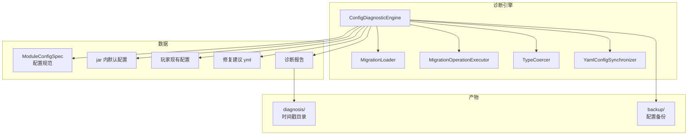
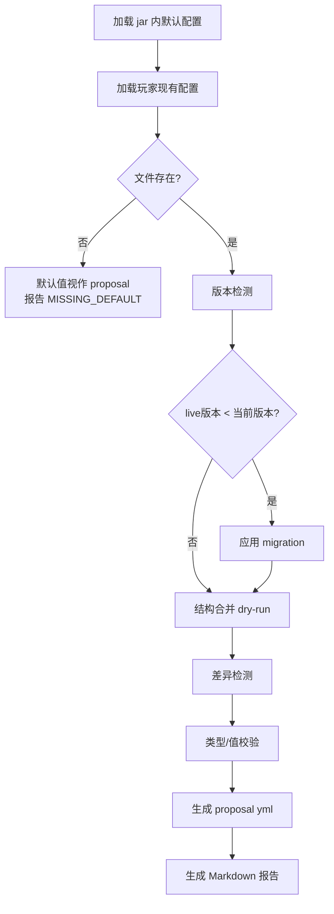

# 配置智能诊断

ArcartXSuite 内置配置智能诊断引擎（`ConfigDiagnosticEngine`），在不修改玩家原配置文件的前提下，对宿主和所有模块的配置进行版本检测、结构合并、类型校验和自动修复建议。

## 架构总览



## 诊断流程

`ConfigDiagnosticEngine.diagnose()` 对单个 `ModuleConfigSpec` 跑完整流程，**任何阶段都不会动玩家原 yml 文件**：



### 阶段详解

#### 1. 加载默认配置

从模块 jar 内读取默认配置资源（通过 `resourceOpener`，支持外部模块的 ClassLoader）。

#### 2. 加载现有配置

加载玩家 `data/&lt;moduleId>/config.yml`，若文件不存在则直接把默认值视作 proposal。

#### 3. 版本检测与迁移

比较 `liveVersion` 和 `currentVersion`：

- `liveVersion &lt; currentVersion` 且有 migration 目录 → 应用迁移操作
- `liveVersion &lt; currentVersion` 但无 migration → 仅升级版本号字段

#### 4. 结构合并 dry-run

`YamlConfigSynchronizer.merge()` 在 live 副本上执行结构合并：

- **新增路径**（jar 默认有但玩家没有）→ 报告 `MISSING_DEFAULT`（INFO）
- **废弃路径**（玩家有但 jar 默认没有）→ 报告 `OBSOLETE_KEY`（WARN）
- **modules 节特殊处理**：用户可自由配置任意模块开关，不对 `modules.*` 路径生成 `OBSOLETE_KEY`

#### 5. 类型/值校验

按 `ValidationRule` 列表校验每个字段：

| 校验项 | 说明 |
|--------|------|
| 必填字段 | `required=true` 且值为 null → ERROR |
| 类型匹配 | 值类型与 `ValueType` 不匹配 → 尝试自动转换 |
| 范围校验 | Number 值超出 `min`/`max` → WARN |

类型不匹配时，`TypeCoercer` 尝试自动转换（如 `"12"` → `12`），转换成功报告 `TYPE_MISMATCH`（WARN），转换失败报告 `TYPE_MISMATCH`（ERROR）。

#### 6. 生成产物

- **proposal yml**：修复后的完整配置（写入 `diagnosis/&lt;时间戳>/` 目录）
- **Markdown 报告**：人类可读的诊断报告

## 配置规范 ModuleConfigSpec

每个模块通过 `AXSModule.configSpecs()` 声明其配置规范：

```java
public List<ModuleConfigSpec> configSpecs() {
    return List.of(ModuleConfigSpec.basic(
        "mymodule",
        new ConfigSyncSpec("config.yml", "config.yml",
            SyncPolicy.builder()
                .dynamicSection("currencies")
                .build()
        )
    ));
}
```

### ConfigSyncSpec

| 字段 | 说明 |
|------|------|
| `resourcePath` | jar 内默认配置资源路径 |
| `targetRelativePath` | 玩家配置文件相对路径 |
| `policy` | 同步策略（含动态节声明） |

### SyncPolicy

`SyncPolicy` 声明哪些配置节是动态的（用户可自由扩展），不对这些节做废弃键检测：

```java
SyncPolicy.builder()
    .dynamicSection("currencies")   // 货币节动态
    .dynamicSection("keybinds")     // 按键节动态
    .build()
```

### ValidationRule

```java
ValidationRule.of("settings.refresh-interval-ticks", ValueType.INTEGER)
    .required(true)
    .min(1)
    .max(3600)
```

## 版本迁移

模块可通过 migration 文件声明版本间的配置迁移操作。

### MigrationLoader

从 jar 内 `migrationFolder` 目录加载迁移描述符，按版本号排序：

```java
List<ConfigMigrationDescriptor> descriptors = MigrationLoader.loadAll(
    spec.ownerId(), spec.migrationFolder(), cl, resourceOpener);
```

### 迁移执行

按版本号顺序应用迁移操作，仅执行 `fromVersion` 与当前版本匹配的迁移：

```java
for (ConfigMigrationDescriptor descriptor : descriptors) {
    if (descriptor.fromVersion() != currentVersion) continue;
    for (MigrationOperation op : descriptor.operations()) {
        MigrationOperationExecutor.execute(live, op);
    }
    currentVersion = descriptor.toVersion();
}
```

## 诊断报告

### ConfigIssue

每条诊断问题包含：

| 字段 | 说明 |
|------|------|
| `ownerId` | 配置所有者（模块 ID 或 `axs-core`） |
| `resourcePath` | 资源路径 |
| `path` | 配置路径 |
| `kind` | 问题类型 |
| `severity` | 严重级别 |
| `oldValue` | 旧值 |
| `newValue` | 新值 |
| `message` | 描述信息 |
| `changeSource` | 变更来源 |

### ConfigIssueKind

| 类型 | 说明 |
|------|------|
| `MISSING_DEFAULT` | 缺失默认键 |
| `OBSOLETE_KEY` | 废弃键 |
| `VERSION_UPGRADE` | 版本升级 |
| `TYPE_MISMATCH` | 类型不匹配 |
| `VALUE_OUT_OF_RANGE` | 值超出范围 |
| `MIGRATION_FAILED` | 迁移失败 |

### ConfigIssueSeverity

| 级别 | 说明 |
|------|------|
| `INFO` | 信息提示 |
| `WARN` | 警告 |
| `ERROR` | 错误 |

### ChangeSource

| 来源 | 说明 |
|------|------|
| `JAR_NEW` | jar 新增字段 |
| `USER_DEPRECATED` | 用户保留的废弃字段 |

## 诊断时机

| 时机 | 写盘 | 说明 |
|------|------|------|
| 模块加载前 | 否 | `registerModuleConfigSpecs` 立即跑诊断（dry-run） |
| 宿主启动末尾 | 否 | `runConfigDiagnosis(null, false)` 全量诊断，仅控制台摘要 |
| 手动诊断命令 | 是 | `runConfigDiagnosis(ownerId, true)` 写 proposal 和 Markdown |

## 产物目录

```
plugins/ArcartX-Suite/
├── diagnosis/
│   └── 2026-07-31_12-00-00/       按时间戳分目录
│       ├── axs-core.config.yml.proposal.yml
│       ├── axs-core.config.yml.report.md
│       └── <moduleId>.config.yml.proposal.yml
└── backup/                        配置备份
```

## 保留期清理

`RetentionCleaner` 在宿主启动时清理过期的诊断和备份目录：

| 配置 | 默认值 | 说明 |
|------|--------|------|
| 诊断保留期 | 7 天 | 超过 7 天的 diagnosis 目录删除 |
| 备份保留期 | 60 天 | 超过 60 天的 backup 目录删除 |
| 最大保留数 | 5 | 每类最多保留 5 个目录 |

## 宿主配置诊断

宿主自身的 `config.yml` 也作为一个 `ModuleConfigSpec` 参与诊断：

```java
hostConfigSpecs.add(ModuleConfigSpec.basic(
    "axs-core",
    new ConfigSyncSpec("config.yml", "config.yml",
        SyncPolicy.builder()
            .dynamicSection("currencies")
            .dynamicSection("keybinds")
            .build()
    )
));
```

`currencies` 和 `keybinds` 节声明为动态节，用户可自由扩展，不做废弃键检测。
