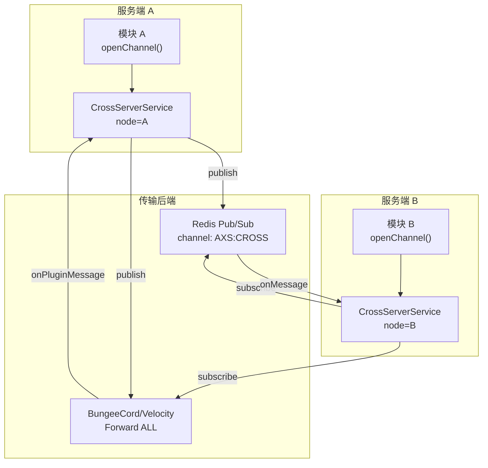
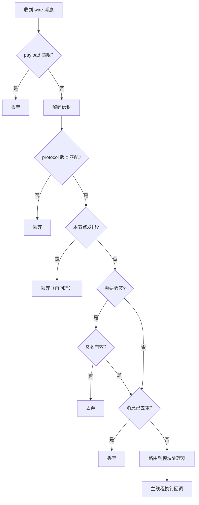

# 跨服通信

ArcartXSuite 提供统一的跨服通信 SDK（`CrossServerService`），支持 Redis 与 Proxy 插件消息双后端，通过 HMAC 签名信封按频道发布/订阅消息，并路由到对应模块的处理器。

## 架构总览



## 双后端设计

`CrossServerService` 同时支持两种传输后端，可独立启用或同时启用：

| 后端 | 配置节 | 特点 |
|------|--------|------|
| Redis | `cross-server.redis` | 低延迟、高吞吐、独立中间件 |
| Proxy | `cross-server.proxy` | 无需额外中间件、依赖代理端插件消息通道 |

Redis 不可用时自动降级到 PluginMessage 通道。两者可同时启用以实现冗余。

## 配置

跨服配置位于宿主 `config.yml` 的 `cross-server` 节：

```yaml
cross-server:
  node-id: "survival-1"           # 当前节点 ID（用于消息去重和来源标识）

  redis:
    enabled: true
    host: 127.0.0.1
    port: 6379
    password: ""
    database: 0
    channel: "AXS:CROSS"           # Pub/Sub 频道名
    connect-timeout-ms: 5000

  proxy:
    enabled: false
    messenger-channel: "AXS_CROSS" # BungeeCord 子通道名
    forward-target: "ALL"         # 转发目标（ALL 或指定服务器名）

  signature:
    enabled: true                 # 是否签名
    secret: "<共享密钥>"            # HMAC-SHA256 密钥
    verify: true                  # 是否验证入站签名

  dedupe-ttl-ms: 60000            # 消息去重 TTL
  max-payload-chars: 524288       # 最大 payload 字节数（512KB）
```

## 消息信封

跨服消息使用 `CrossServerEnvelope` 信封格式封装，通过 Gson 编解码：

```java
public record CrossServerEnvelope(
    int protocol,       // 协议版本（当前为 1）
    String module,      // 目标模块 ID
    String nodeId,      // 发送节点 ID
    String messageId,   // 消息唯一 ID（UUID）
    long timestamp,     // 发送时间戳
    String payload,     // 消息载荷（字符串）
    String signature    // HMAC-SHA256 签名
)
```

### 编解码

```java
// 编码：信封 → JSON 字符串
String wire = CrossServerEnvelopeCodec.encode(envelope);

// 解码：JSON 字符串 → 信封
CrossServerEnvelope envelope = CrossServerEnvelopeCodec.decode(wire);
```

解码时校验信封非空且 `module` 字段存在，否则抛出 `IllegalArgumentException`。

## HMAC 签名

`CrossServerSigner` 使用 HMAC-SHA256 对信封关键字段签名，防止跨服消息被伪造。

### 签名载荷

```
axs-cross-envelope-v1
<protocol>
<module>
<nodeId>
<messageId>
<timestamp>
<payload>
```

### 签名与验证

```java
// 签名
String signature = CrossServerSigner.sign(envelope, secretBytes);

// 验证（常量时间比较，防止时序攻击）
boolean valid = CrossServerSigner.verify(envelope, signatureHex, secretBytes);
```

### Fail-Closed 策略

签名启用但密钥为空时，**拒绝发送**（fail-closed），防止无签名裸奔被中间人伪造：

```java
if (configuration.shouldSign() && configuration.signatureSecret().isBlank()) {
    logger.warning("[CrossServer] signature.enabled=true 但 secret 为空，跨服消息发送已被禁用");
    return;
}
```

## 通道与消息广播

### 模块注册通道

模块通过 `ModuleContext.crossServer()` 获取 `CrossServerAPI`，调用 `openChannel` 注册通道：

```java
CrossServerChannel channel = crossServer.openChannel(
    "mymodule",                    // 模块 ID
    CrossServerChannelConfig.builder()
        .enabled(true)
        .redisEnabled(true)
        .proxyEnabled(false)
        .build(),
    delivery -> {
        // 收到跨服消息的回调
        String payload = delivery.payload();
        String fromNode = delivery.sourceNodeId();
        handleCrossServerMessage(payload);
    }
);
```

### 发布消息

```java
channel.publish("hello-from-node-A");
```

发布时自动构建信封（含 UUID messageId 和时间戳），签名后通过配置的后端发送。

### 消息路由

入站消息处理流程：



### 消息去重

`CrossServerDedupe` 基于 `messageId` 进行去重，TTL 默认 60 秒，防止 Redis 和 Proxy 双后端同时收到同一消息导致重复处理。

## Proxy 后端实现

Proxy 后端使用 BungeeCord 的 `Forward` 子通道转发消息：

```
BungeeCord → Forward → <forward-target> → <messenger-channel> → payload
```

消息通过在线玩家作为载体发送（`player.sendPluginMessage`），最多尝试 3 个不同的在线玩家。Proxy 负载超过 `Short.MAX_VALUE`（32767 字节）时跳过 Proxy 仅走 Redis。

代理端需安装 `proxy/` 目录下的 BungeeCord 或 Velocity 插件以转发消息。

## Redis 后端实现

Redis 后端使用 Jedis 连接池和 Pub/Sub 机制：

- **连接池**：`JedisPool`，支持密码和 database 选择
- **订阅**：独立守护线程 `AXS-CrossServer-Redis`，订阅断开后 3 秒自动重试
- **发布**：通过 `jedis.publish(channel, wire)` 发布消息

Redis 连接池也可供宿主内部选主服务使用（`getJedisPoolInternal()`）。

## API 接口

| 方法 | 说明 |
|------|------|
| `nodeId()` | 当前节点 ID |
| `openChannel(moduleId, config, consumer)` | 打开通道，返回 `CrossServerChannel` |
| `isRedisAvailable()` | Redis 后端是否可用 |
| `getJedisPoolInternal()` | 获取 Redis 连接池（内部使用） |

`CrossServerChannel` 接口：

| 方法 | 说明 |
|------|------|
| `moduleId()` | 模块 ID |
| `isActive()` | 通道是否活跃（至少一个后端可用） |
| `publish(payload)` | 发布消息 |
| `close()` | 关闭通道 |
