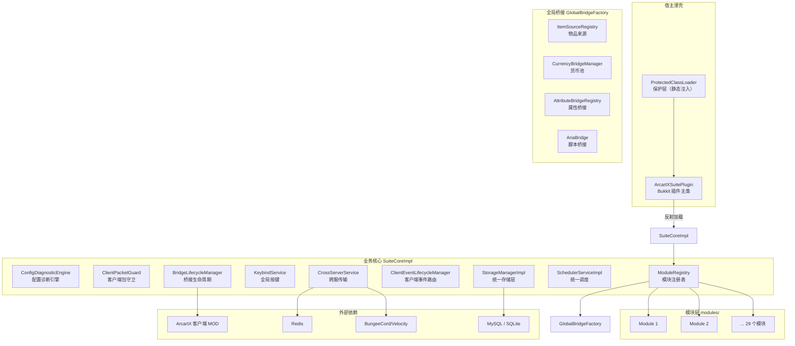
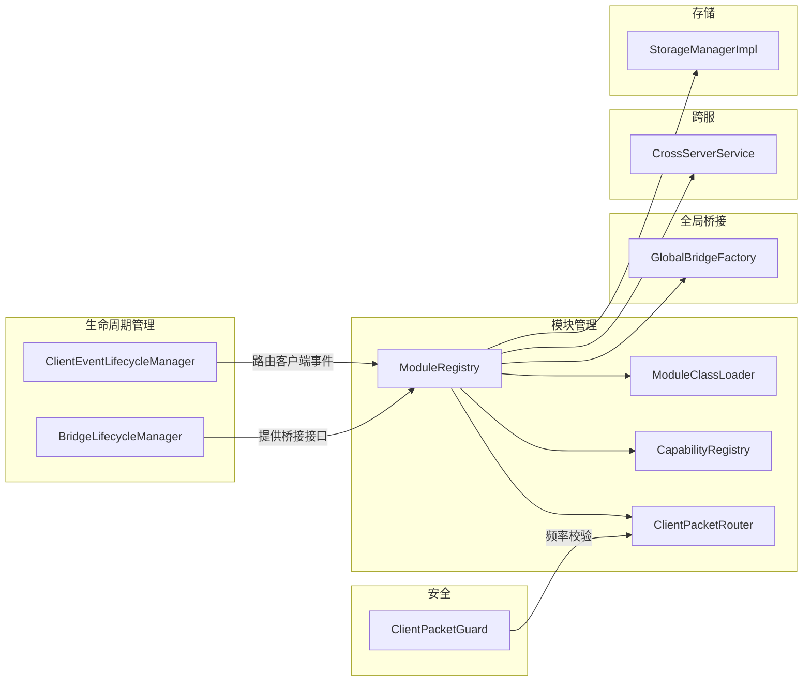

# 架构概览

ArcartXSuite 是专为 ArcartX 客户端 MOD 生态构建的全场景核心套件。一个插件覆盖 **29 个功能领域**，统一 ArcartX UI 体验，模块间深度联动。

## 整体架构图



## 宿主 + 模块设计理念

ArcartXSuite 采用 **宿主薄壳 + 业务核心 + 可插拔模块** 的三层架构：

| 层级 | 职责 | 特点 |
|------|------|------|
| 宿主薄壳 (`ArcartXSuitePlugin`) | 加载保护层、反射加载业务核心 | 不引用任何加密业务类，可明文交付 |
| 业务核心 (`SuiteCoreImpl`) | 编排所有子系统：桥接、模块、安全、存储 | 加密交付，运行时解密加载 |
| 模块层 (`modules/*.jar`) | 各功能领域独立实现 | 仅依赖 `axs-api` 接口，核心实现可完全混淆 |

### 核心设计原则

1. **接口隔离**：模块仅通过 `axs-api` 中的接口与宿主通信，核心实现类可被 ProGuard 完全混淆，模块无法直接引用内部类。

2. **桥接集中管理**：所有 ArcartX 桥接由 `BridgeLifecycleManager` 统一创建、初始化和关闭，模块只通过 `ModuleContext` 获取 API 接口。

3. **ClassLoader 隔离**：每个模块拥有独立的 `ModuleClassLoader`，模块之间默认隔离，通过 Capability 机制进行安全的跨模块通信。

4. **Capability 跨模块通信**：模块通过 `registerCapability` / `getCapability` 发布和查找能力，实现松耦合的模块间协作。

## 核心组件关系



## 子项目划分

```
ArcartXSuite/
├── axs-api/          公开 API 契约（模块仅依赖此）
├── axs-core/         宿主核心实现（含 ProGuard 混淆）
├── axs-placeholder/  PlaceholderAPI 桥接子模块
├── modules/          29 个可插拔模块（每个独立 jar）
├── proxy/            代理端插件（跨服传输）
│   ├── common/       共享代码
│   ├── bungee/      BungeeCord 插件
│   └── velocity/    Velocity 插件
├── native/           C/C++ 安全库（JNI）
├── proguard/         混淆规则
├── scripts/          Python 构建脚本
├── keys/             密钥版本目录
└── src/main/         宿主本体源码
    └── src/modern/   跨版本兼容代码（1.20.2+）
```

## 依赖关系

```
axs-api  ←  所有模块 compileOnly 依赖（模块编译时只见 API 接口）
   ↑
axs-core  ←  实现 axs-api，含 SuiteCoreImpl（宿主核心）
   ↑
modules/*  ←  compileOnly 依赖 axs-api + Spigot + 第三方插件
proxy/*    ←  独立构建，不依赖 axs-api
```

## 技术栈

| 项目 | 版本/说明 |
|------|----------|
| Java | 17+ |
| Minecraft | 1.20.1+（Spigot / Paper） |
| ArcartX 客户端 MOD | 必需 |
| Gradle | 8.10.2（CI 锁定） |
| 连接池 | HikariCP |
| 跨服 | Redis + BungeeCord/Velocity 双后端 |
| 安全 | Native（C/C++ JNI）+ Ed25519 签名 + AES-GCM 加密 |

## 文档导航

- [系统架构](system-architecture) — 启动流程、核心组件详解
- [模块化架构](modular) — 模块加载、ClassLoader 隔离、拓扑排序
- [桥接层](bridges) — 属性/物品/经济/ArcartX 桥接
- [跨服通信](cross-server) — Redis + Proxy 双后端、消息广播
- [数据包流向](packet-flow) — 客户端到服务端的数据流
- [客户端包守卫](security) — ClientPacketGuard 安全校验
- [配置智能诊断](config-autofix) — 配置快照、差异检测、自动修复
- [统一存储层](storage) — HikariCP 连接池复用
