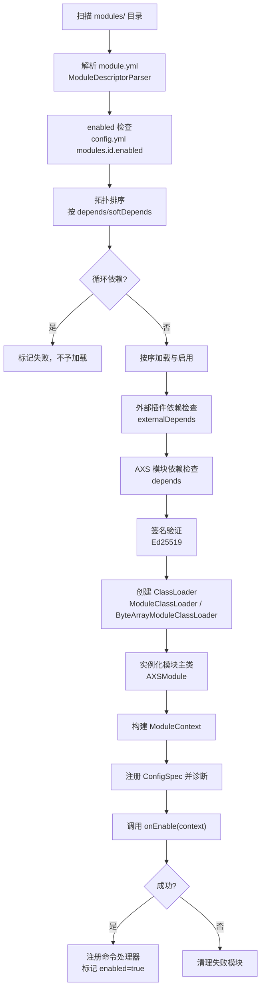
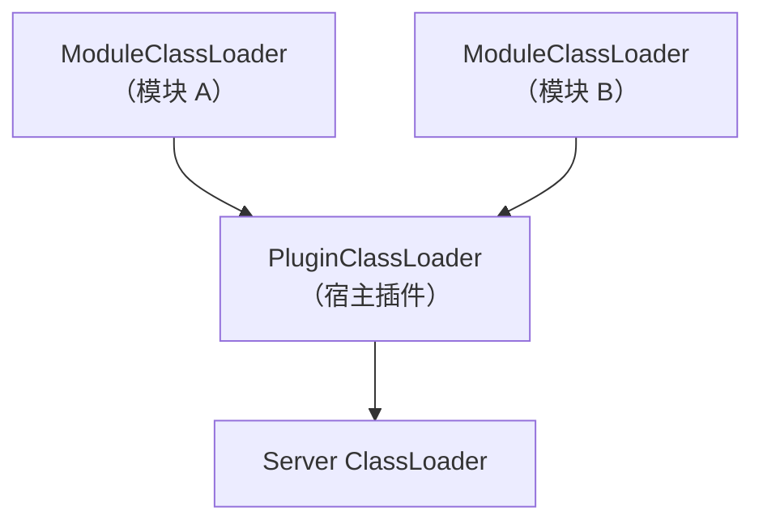
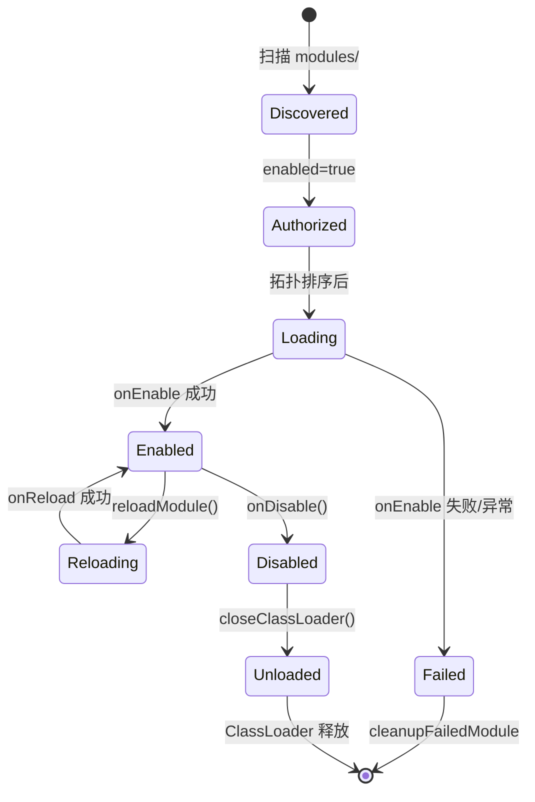

# 模块化架构

ArcartXSuite 已从单体插件重构为 **宿主 + 模块 Jar** 架构。用户可按需放入模块 Jar，实现功能的自由组合。宿主会自动检测外部模块并跳过内置加载，由 `ModuleRegistry` 统一管理生命周期。

## 模块加载流程



### 加载阶段详解

#### 1. 扫描与解析

`ModuleRegistry.loadAll()` 扫描 `plugins/ArcartXSuite/modules/` 目录下的 `.jar` 文件，通过 `ModuleDescriptorParser` 从 jar 内 `module.yml` 读取元数据：

```yaml
id: mymodule
name: MyModule
version: 1.0.0
main: com.example.MyModule
api-version: 1.0
depends: []
softdepends: []
external-depends: []
external-softdepends: []
signature: "<Ed25519 签名>"
```

#### 2. enabled 检查

读取宿主 `config.yml` 的 `modules.&lt;id>.enabled` 字段，默认为 `false`。未启用的模块被跳过并记录日志。

#### 3. 拓扑排序

按 `depends`（硬依赖）和 `softDepends`（软依赖）进行拓扑排序，确保被依赖的模块先加载。检测到循环依赖时强制打断并标记为失败。

#### 4. 依赖检查

- **externalDepends**：指定的 Bukkit 插件必须已安装且已启用，否则跳过加载
- **depends**：指定的 AXS 模块必须已加载，否则跳过加载
- **externalSoftDepends**：缺失仅提示，不影响加载（模块自行降级）

#### 5. 签名验证

若 `config.yml` 配置了 `module-signature-public-keys`，使用 Ed25519 校验模块签名。

#### 6. 创建 ClassLoader 与实例化

根据来源创建对应的 ClassLoader，加载模块主类并实例化：

```java
// 本地 jar
classLoader = new ModuleClassLoader(descriptor.id(), jarUrl, plugin.getClass().getClassLoader());
// 云端内存 jar
classLoader = new ByteArrayModuleClassLoader(descriptor.id(), jarBytes, moduleSeed, plugin.getClass().getClassLoader());

Class<?> mainClass = classLoader.loadClass(descriptor.mainClass());
AXSModule instance = (AXSModule) mainClass.getDeclaredConstructor().newInstance();
```

#### 7. 构建上下文与启用

构建 `DefaultModuleContext`，在 `onEnable` 之前注册并跑模块的 ConfigSpec 诊断（dry-run），然后调用 `instance.onEnable(context)`。

## ClassLoader 隔离

每个模块 Jar 拥有独立的 `ModuleClassLoader`，parent 设置为宿主插件的 ClassLoader。

### 隔离策略



模块可以访问：
- `axs-api` 中的接口（`AXSModule`、`ModuleContext` 等）
- Spigot API
- 宿主插件中的 bridge 类

模块之间默认隔离，通过 `ModuleContext.getCapability()` 进行安全的跨模块通信。

### 混合端兼容

在混合端（Mohist/Arclight）上，parent 委托链可能将 Bukkit API 类错误地解析为 Forge 类。`ModuleClassLoader` 覆写 `loadClass` 确保服务端 API 类优先从服务端 ClassLoader 加载：

```java
@Override
protected Class<?> loadClass(String name, boolean resolve) throws ClassNotFoundException {
    // 优先从服务端 ClassLoader 加载 Bukkit/Spigot/NMS 类
    if (serverClassLoader != null && shouldPreferServerLoader(name)) {
        try {
            return serverClassLoader.loadClass(name);
        } catch (ClassNotFoundException ignored) {
            // 回退到正常委托链
        }
    }
    return super.loadClass(name, resolve);
}
```

`shouldPreferServerLoader` 匹配以下前缀：`org.bukkit.`、`org.spigotmc.`、`net.minecraft.`、`com.mojang.`、`io.papermc.`。

### 云端模块 ClassLoader

云端加密模块（`.axb`）由 `CloudModuleService` 解密为字节数组后经 `ByteArrayModuleClassLoader` 内存加载，不落盘到 `modules/` 目录。模块卸载时调用 `clearSensitiveMaterial()` 清零敏感字节数组。

## 生命周期管理

### 模块生命周期接口

```java
public interface AXSModule {
    ModuleDescriptor descriptor();
    boolean onEnable(ModuleContext context) throws Exception;
    void onDisable();
    void onReload() throws Exception;
    boolean isReady();
    List<ModuleConfigSpec> configSpecs();
}
```

### 生命周期状态流转



### 核心操作

| 操作 | 方法 | 说明 |
|------|------|------|
| 全量加载 | `loadAll()` | 扫描、排序、加载、启用所有模块 |
| 全量卸载 | `unloadAll()` | 逆序禁用并卸载所有模块，重建全局桥接 |
| 单模块重载 | `reloadModule(id)` | 不卸载 ClassLoader，调用 `onReload()` |
| 热卸载 | `unloadModule(id)` | onDisable → 移除注册 → 关闭 ClassLoader |
| 热加载 | `loadModuleById(id)` | 从 modules/ 目录扫描指定 id 的 jar 加载 |
| 云端加载 | `loadCloudModule(bytes)` | 从内存 jar 字节数组直接加载 |

### 卸载时的反向依赖检查

卸载模块前检查反向依赖：若其他已启用模块声明依赖它，则禁止卸载：

```java
List<String> dependents = new ArrayList<>();
for (LoadedModule other : modules.values()) {
    if (other.descriptor().depends().contains(moduleId)) {
        dependents.add(other.descriptor().id());
    }
}
if (!dependents.isEmpty()) {
    LOGGER.warning("无法卸载 " + moduleId + "，仍被依赖于: " + String.join(", ", dependents));
    return false;
}
```

### 注册清理

模块卸载/禁用时自动清理：
- 命令处理器（`commandHandlers`）
- 客户端包处理器（`ClientPacketRouter`）
- 客户端初始化处理器
- Capability 注册（`CapabilityRegistry`）
- 配置诊断 spec

## 拓扑排序

`topologicalSort` 使用 DFS 遍历依赖图，检测循环依赖：

```java
private List<String> topologicalSort(Map<String, DiscoveredModule> modules, List<String> cyclicModules) {
    Map<String, Set<String>> dependencyGraph = new HashMap<>();
    for (var entry : modules.entrySet()) {
        Set<String> deps = new HashSet<>();
        // depends + softDepends 都纳入排序
        for (String dep : entry.getValue().descriptor.depends())
            if (modules.containsKey(dep)) deps.add(dep);
        for (String dep : entry.getValue().descriptor.softDepends())
            if (modules.containsKey(dep)) deps.add(dep);
        dependencyGraph.put(entry.getKey(), deps);
    }
    // DFS 拓扑排序，visiting 集合检测环
    ...
}
```

循环依赖的模块被收集到 `cyclicModules` 列表，标记为失败，不予加载。

## Capability 跨模块通信

模块通过 `ModuleContext` 的 Capability 机制实现松耦合的跨模块通信。

### 注册与查找

```java
// 模块 A 注册能力
context.registerCapability(MailDispatchable.class, myMailService);

// 模块 B 查找能力
MailDispatchable mail = context.getCapability(MailDispatchable.class);
if (mail != null) {
    mail.sendMail(playerUuid, ...);
}
```

### Core Capability

宿主在模块加载前注册的 Core Capability，可被模块覆盖：

| Capability | 说明 |
|------------|------|
| `SecondaryPasswordAccess` | 统一二级密码服务 |
| `PolygonSelectionCapability` | 多边形选区管理器 |
| `MailDispatchable` | 邮件降级适配器（SystemMail） |
| `PendingRewardService` | 统一待发放奖励服务 |
| `EventBusCapability` | 事件总线 |
| `ModuleAdminCapability` | 模块管理能力 |

### 多实例 Capability

部分 Capability 支持多实例注册，按模块 ID 索引：

| Capability | 说明 |
|------------|------|
| `PlayerDataPurgeable` | 玩家数据清除（支持按模块/全量清除） |
| `DatabaseMigratable` | 数据库一键迁移 |

## ModuleContext 可用能力

| 方法 | 说明 |
|------|------|
| `plugin()` | 宿主 JavaPlugin 实例 |
| `logger()` | 模块专用 Logger |
| `packetBridge()` | ArcartX 发包桥接 |
| `clientBridge()` | ArcartX 客户端桥接 |
| `itemStackBridge()` | ItemStack 桥接 |
| `propBridge()` | Prop / 按键绑定桥接 |
| `worldTextureBridge()` | 世界文字贴图桥接 |
| `storageManager()` | 统一数据源管理器 |
| `placeholderResolver()` | PlaceholderAPI 解析器 |
| `packetGuard()` | 客户端包守卫 |
| `crossServer()` | 跨服通道 |
| `accountTypeService()` | 统一账号识别服务 |
| `registerCapability(Class, T)` | 注册跨模块能力 |
| `getCapability(Class)` | 查找跨模块能力 |
| `hasPlugin(String)` | 检查外部插件是否可用 |

## 29 个模块一览

| 模块 | 功能 | UI |
|------|------|----|
| afkreward | AFK 奖励 | — |
| announcer | 公告轮播 + 字幕 | HUD |
| battlepass | 战斗通行证 | UI |
| chat | 全频道聊天 | — |
| combateffect | 战斗特效 + 伤害飘字 | — |
| conversation | NPC 对话引擎 | UI+Selector |
| entitytracker | Boss 追踪面板 | HUD |
| essentials | 基础工具 | — |
| eventpacket | 事件包分发 | — |
| extrabackpack | 扩展背包 | UI |
| fishing | 钓鱼小游戏 | UI |
| loginview | UI 登录界面 | UI |
| lottery | 抽奖系统 | UI |
| mail | 邮件系统 | UI |
| map | 大地图/锚点 | Menu+HUD |
| market | 全球市场 | UI |
| menu | 通用菜单框架 | UI |
| onlinerewards | 在线奖励/签到 | — |
| pickup | 拾取动画 | HUD |
| prop | 快捷道具栏 | — |
| qqbot | QQ 群服互联 | — |
| questgps | 任务导航 | Menu+HUD |
| regions | 区域保护 | — |
| rgb | 渐变文本 | — |
| tab | Tab 列表面板 | — |
| title | 称号系统 | — |
| vanilla | 原版界面替换 | UI |
| warehouse | 仓库系统 | UI |
