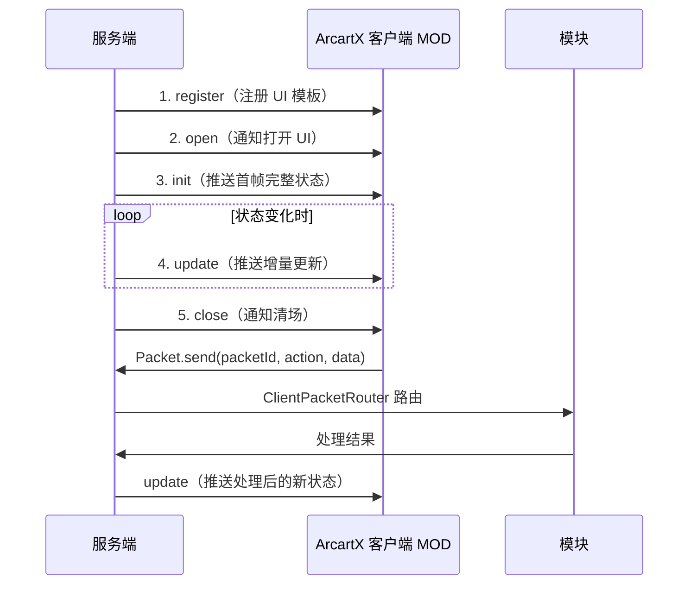
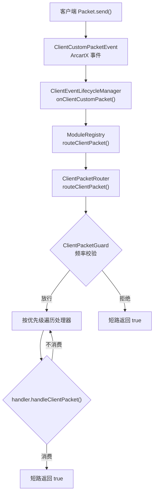
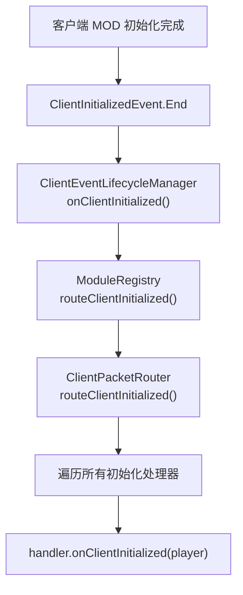

# 数据包流向

所有 UI 类模块都遵循统一的 **五段式生命周期** 数据包协议，从服务端注册 UI 到客户端交互，再到服务端处理回包。

## 五段式生命周期



| 阶段 | 方向 | 说明 |
|------|------|------|
| register | 服务端 → 客户端 | 把 UI 模板注册到 ArcartX |
| open | 服务端 → 客户端 | 通知客户端打开 UI |
| init | 服务端 → 客户端 | 推送首帧完整状态 |
| update | 服务端 → 客户端 | 按刷新周期或事件推增量 |
| close | 服务端 → 客户端 | 通知客户端清场 |

## 服务端 → 客户端

### UI 注册

模块通过 `PacketBridgeAPI` 注册 UI：

```java
PacketBridgeAPI.UiRegistrationResult result =
    packetBridge.registerOrReloadUi("market_shop", uiFile);
```

`registerOrReloadUi` 是幂等安全的：先尝试 reload（已注册则更新），再尝试 register（未注册则注册）。

### init — 推送首帧

```java
Map<String, Object> payload = Map.of(
    "title", "新手村",
    "owned_count", 12,
    "list", listOfTitles
);
packetBridge.sendPacket(player, uiId, "init", payload);
```

### update — 推送增量

update 有两种模式：

| 模式 | 触发方式 | 示例模块 |
|------|----------|----------|
| 周期型 | `refresh-interval-ticks` 定时推 | EntityTracker、Tab |
| 事件型 | 状态变化时推 | Mail、Title |

```java
packetBridge.sendPacket(player, uiId, "update", updatePayload);
```

### close — 通知清场

```java
packetBridge.sendPacket(player, uiId, "close", Map.of());
```

## 客户端 → 服务端

### UI 模板中的 Packet.send

UI 模板中通过 Shimmer 脚本调用 `Packet.send(...)`：

```yaml
controls:
  equip_btn:
    type: button
    onClick: |-
      Packet.send("AXS_TITLE", "equip", "myth_hunter")
```

### 客户端事件路由

客户端发送的自定义包通过 ArcartX 的 `ClientCustomPacketEvent` 事件进入服务端：



### 服务端包处理器路由

`ClientPacketRouter` 按优先级遍历已注册的处理器，第一个消费的处理器短路返回：

```java
boolean routeClientPacket(Player player, String packetId, List<String> data) {
    String action = data.isEmpty() ? "refresh" : data.get(0).toLowerCase();
    for (PrioritizedPacketHandler ph : packetHandlers) {
        // 频率校验
        if (packetGuard != null && !packetGuard.allow(player, guardModule, action, false)) {
            return true; // 被守卫拒绝
        }
        // 处理器消费
        if (ph.handler().handleClientPacket(player, packetId, data)) {
            return true; // 短路
        }
    }
    return false;
}
```

### 模块处理回包

模块的 `ClientPacketHandler` 处理客户端回包：

```java
public class TitlePacketHandler implements ClientPacketHandler {
    @Override
    public boolean handleClientPacket(Player player, String packetId, List<String> data) {
        String action = data.get(0);  // 动作名
        switch (action) {
            case "equip"   -> service.equip(player, data.get(1));
            case "unequip" -> service.unequipGroup(player, data.get(1));
            case "refresh" -> service.refresh(player);
        }
        return true; // 消费
    }
}
```

## 客户端初始化事件

当 ArcartX 客户端 MOD 完成初始化时，触发 `ClientInitializedEvent.End` 事件：



模块通过 `ModuleContext.registerClientInitializedHandler` 注册初始化处理器，用于在客户端就绪后推送初始数据。

## UI Packet 结构

### 三种 payload 形态

| 形态 | 例子 | 客户端读取 |
|------|------|------------|
| 字符串 | `"killer={name};victim={name}"` | 整段文本 |
| 列表 | `["{name}", "{weapon}"]` | `packet[0]` / `packet[1]` |
| 字典 | `{killer: ..., weapon: ...}` | `packet['killer']` |

### 客户端回包数据格式

客户端通过 `Packet.send(packetId, action, ...args)` 发送回包：

| 参数 | 说明 |
|------|------|
| `packetId` | UI ID（如 `AXS_TITLE`） |
| `action` | 动作名（如 `equip`、`refresh`） |
| `args` | 额外参数（可选） |

服务端收到的 `data` 列表中，`data.get(0)` 为 action，后续为额外参数。

## UI ID 命名空间

| 来源 | UI ID 格式 | 示例 |
|------|-----------|------|
| 模块注册 | `模块名:ui_id` | `AXS:lottery_case` |
| 直接 ui/ 目录 | 文件名 | `lottery_case` |

关闭 UI 时需要使用注册时的完整 ID。

## 线程安全

`ClientEventLifecycleManager` 收到客户端事件后，若不在主线程则通过 `AxsScheduler.runTask` 调度到主线程执行，确保模块处理器在主线程安全运行：

```java
Runnable route = () -> registry.routeClientPacket(player, packetId, data);
if (Bukkit.isPrimaryThread()) {
    route.run();
} else {
    AxsScheduler.runTask(plugin, route);
}
```
