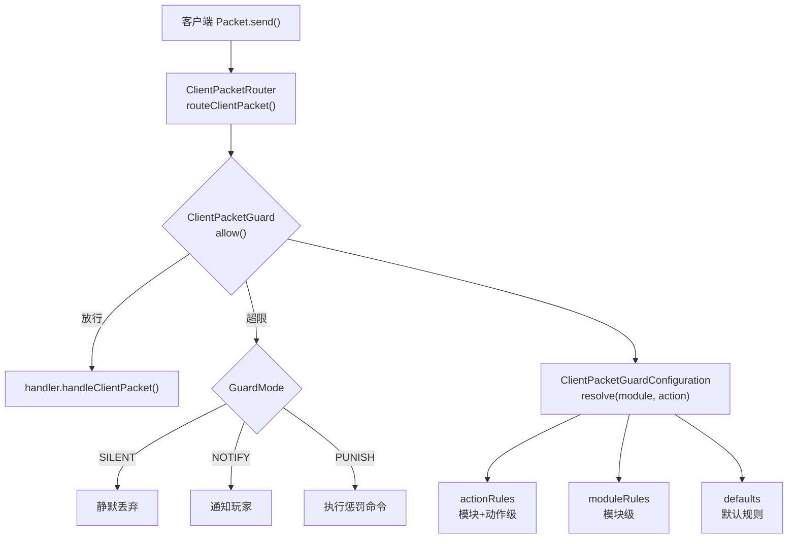
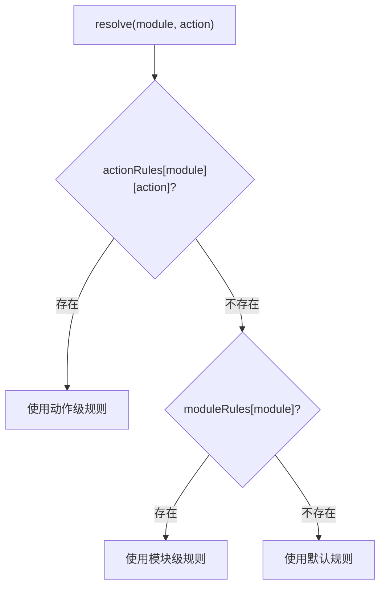

# 客户端包守卫

`ClientPacketGuard` 是 ArcartXSuite 的客户端包安全校验机制，按"模块+动作"维度对客户端回包进行滑动窗口频率限制，防止恶意刷包或自动化攻击。

## 架构



## 配置

客户端包守卫配置位于宿主 `config.yml` 的 `client-packet-guard` 节：

```yaml
client-packet-guard:
  enabled: true
  cleanup-interval-ticks: 200    # 状态清理任务间隔

  defaults:                      # 默认限流规则
    enabled: true
    window-ms: 1000               # 滑动窗口大小（毫秒）
    max-hits: 20                  # 窗口内最大命中次数
    mode: SILENT                  # 超限处理模式
    notify-message: "&c操作过快，请稍后再试。"
    notify-cooldown-ms: 3000     # 通知冷却
    punish-command: ""            # 惩罚命令

  modules:                       # 按模块覆盖
    title:
      window-ms: 500
      max-hits: 10
      mode: NOTIFY

  actions:                       # 按模块+动作覆盖（最高优先级）
    title:
      equip:
        window-ms: 2000
        max-hits: 5
        mode: PUNISH
        punish-command: "kick <player> 操作过于频繁"
```

## 规则解析优先级

`ClientPacketGuardConfiguration.resolve(module, action)` 按以下优先级解析规则：



### 硬编码默认规则

| 参数 | 默认值 |
|------|--------|
| `enabled` | `true` |
| `window-ms` | `1000` |
| `max-hits` | `20` |
| `mode` | `SILENT` |
| `notify-message` | `&c操作过快，请稍后再试。` |
| `notify-cooldown-ms` | `3000` |
| `punish-command` | `""` |

## 滑动窗口频率限制

`ClientPacketGuard` 使用滑动窗口算法，按 `(module, action, playerId)` 三元组维护状态：

```java
boolean allow(UUID playerId, String module, String action, ...) {
    ClientPacketGuardRule rule = configuration.resolve(module, action);
    if (!rule.enabled()) return true;

    RouteKey routeKey = new RouteKey(module, action, playerId);
    GuardState state = states.computeIfAbsent(routeKey, k -> new GuardState());

    synchronized (state) {
        state.prune(now, rule.windowMs());  // 清除窗口外的过期记录
        if (state.hitTimestamps.size() >= rule.maxHits()) {
            // 超限处理
            ...
            return false;
        }
        state.hitTimestamps.addLast(now);  // 记录命中
        return true;
    }
}
```

### GuardState

```java
private static final class GuardState {
    private final ArrayDeque<Long> hitTimestamps = new ArrayDeque<>();
    private long lastNotifyAt;    // 上次通知时间
    private long lastTouchedAt;   // 上次访问时间

    private void prune(long now, long windowMs) {
        // 清除窗口外的过期时间戳
        while (!hitTimestamps.isEmpty() && now - hitTimestamps.peekFirst() >= windowMs) {
            hitTimestamps.removeFirst();
        }
    }
}
```

## 超限处理模式

| 模式 | 说明 |
|------|------|
| `SILENT` | 静默丢弃，不通知玩家 |
| `NOTIFY` | 通知玩家操作过快（受 `notify-cooldown-ms` 冷却控制） |
| `PUNISH` | 执行惩罚命令（如踢出、封禁） |

### NOTIFY 模式

通知受冷却时间控制，避免刷屏：

```java
if (rule.mode() == ClientPacketGuardMode.NOTIFY
    && (state.lastNotifyAt <= 0L || now - state.lastNotifyAt >= rule.notifyCooldownMs())) {
    feedbackSink.notifyPlayer(rule.notifyMessage());
    state.lastNotifyAt = now;
}
```

### PUNISH 模式

执行配置的惩罚命令，`&lt;player>` 占位符替换为玩家名：

```java
if (rule.mode() == ClientPacketGuardMode.PUNISH) {
    feedbackSink.punish(rule.punishCommand());
}
```

## 玩家名安全校验

惩罚命令执行前，对玩家名进行安全校验，防止命令注入：

```java
private static String sanitizePlayerName(String name) {
    // 仅允许字母、数字、下划线 [A-Za-z0-9_]
    // 离线模式下玩家名可包含特殊字符（如 ; |），直接替换到控制台命令可导致 RCE
    for (int i = 0; i < name.length(); i++) {
        char c = name.charAt(i);
        if (!((c >= 'A' && c <= 'Z') || (c >= 'a' && c <= 'z')
            || (c >= '0' && c <= '9') || c == '_')) {
            return null;  // 不安全，跳过惩罚命令执行
        }
    }
    return name;
}
```

> 离线模式下玩家名可包含特殊字符（如 `;`、`|`），若直接替换到控制台命令中可导致远程代码执行（RCE）。

## 状态清理

`ClientPacketGuard` 启动时注册定时清理任务，按 `cleanup-interval-ticks` 间隔清理过期状态：

```java
public void start() {
    cleanupTask = AxsScheduler.runTaskTimer(
        plugin,
        this::cleanup,
        configuration.cleanupIntervalTicks(),
        configuration.cleanupIntervalTicks()
    );
}
```

清理逻辑：清除窗口内无命中且超过保留期的状态记录，释放内存。

## 与 ClientPacketRouter 集成

`ClientPacketRouter` 在路由客户端包前调用 `ClientPacketGuard.allow()` 进行频率校验：

```java
boolean routeClientPacket(Player player, String packetId, List<String> data) {
    String action = data.get(0).toLowerCase();
    for (PrioritizedPacketHandler ph : packetHandlers) {
        if (packetGuard != null
            && (ph.packetId() == null || ph.packetId().equalsIgnoreCase(packetId))) {
            String guardModule = ph.guardModule() != null ? ph.guardModule() : ph.moduleId();
            if (!packetGuard.allow(player, guardModule, action, false)) {
                return true;  // 被守卫拒绝，短路返回
            }
        }
        if (ph.handler().handleClientPacket(player, packetId, data)) {
            return true;
        }
    }
    return false;
}
```

### guardModule 机制

处理器可指定 `guardModule`，使用不同于模块 ID 的名称进行频率校验。这在多个模块共享同一动作名时有用，可统一限流。

## API 接口

模块通过 `ModuleContext.packetGuard()` 获取 `PacketGuardAPI`：

```java
PacketGuardAPI guard = context.packetGuard();
boolean allowed = guard.allow(player, "mymodule", "refresh", false);
```

| 方法 | 说明 |
|------|------|
| `allow(player, module, action, debugLogging)` | 校验是否放行 |
