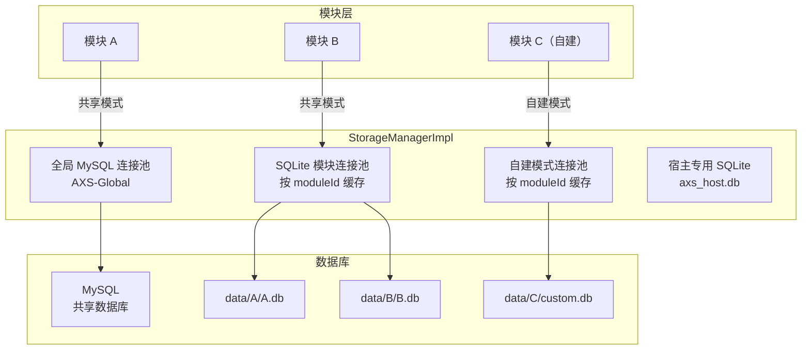
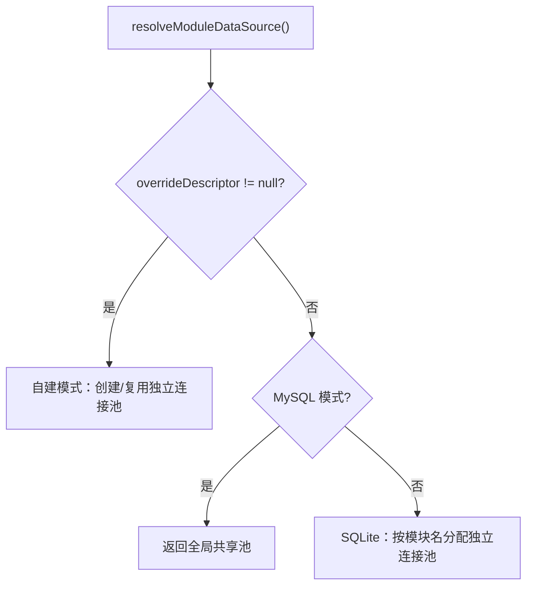

# 统一存储层

ArcartXSuite 提供 `StorageManager` 统一存储层（自 1.4.0 起），基于 HikariCP 连接池，支持 MySQL 共享池和 SQLite 按模块分配两种模式，以及模块自建模式覆盖。

## 架构



## 两种共享模式

### MySQL 模式

所有模块共享同一个 HikariCP 连接池，各模块用 `tablePrefix` 隔离表。连接数从 N×poolSize 降为 1 个池。

```yaml
storage:
  mode: mysql
  pool-size: 8
  mysql:
    host: 127.0.0.1
    port: 3306
    database: arcartxsuite
    username: root
    password: ""
    use-ssl: true
    allow-public-key-retrieval: false
    server-timezone: UTC
    character-encoding: UTF-8
    use-unicode: true
    jdbc-params: ""    # 自定义 JDBC 参数（追加到 URL 末尾，优先级最高）
```

### SQLite 模式

各模块仍使用各自的 `&lt;moduleId>.db` 文件，宿主按模块名缓存对应的 HikariCP 连接池。数据不合并，旧 `.db` 文件零迁移。

```yaml
storage:
  mode: sqlite
```

SQLite 文件位于 `plugins/ArcartX-Suite/data/&lt;moduleId>/&lt;moduleId>.db`，与旧自建模式路径保持一致。

### SQLite 优化

SQLite 连接池创建时自动执行 PRAGMA 优化：

```sql
PRAGMA journal_mode=WAL;       -- WAL 模式，支持并发读 + 串行写
PRAGMA synchronous=NORMAL;     -- 平衡性能与安全
PRAGMA busy_timeout=5000;      -- 锁等待 5 秒
```

连接池参数：`maximumPoolSize=2`，`minimumIdle=1`，支持 WAL 模式下的并发读 + 串行写。

## 自建模式（Override）

模块可配置独立的存储覆盖，使用独立的连接参数：

```java
DataSource ds = storageManager.resolveModuleDataSource(
    "mymodule",
    "custom.db",
    moduleDataFolder,
    StorageDescriptor.mysql("host", 3306, "db", "user", "pass", 4, "prefix_")
);
```

自建模式按 moduleId 缓存独立连接池，与共享模式互不影响。MySQL 自建模式需要完整的连接参数，缺失时抛出明确错误提示。

## 连接池配置

### MySQL 全局池

| 参数 | 值 |
|------|-----|
| 池名 | `AXS-Global` |
| `minimumIdle` | 2 |
| `maximumPoolSize` | `pool-size` 配置（默认 8） |
| `autoCommit` | true |
| 驱动 | `com.mysql.cj.jdbc.Driver` |

### SQLite 模块池

| 参数 | 值 |
|------|-----|
| 池名 | `AXS-SQLite-&lt;moduleId>` |
| `minimumIdle` | 1 |
| `maximumPoolSize` | 2 |
| `autoCommit` | true |
| `connectionTimeout` | 10000ms |
| 驱动 | `org.sqlite.JDBC` |
| 连接测试 | `SELECT 1` |

## JDBC URL 构建

`JdbcParams` 从 `config.yml` 的 `storage.mysql` 节读取参数，构建 JDBC URL：

```
jdbc:mysql://<host>:<port>/<database>?useSSL=true&allowPublicKeyRetrieval=false&serverTimezone=UTC&characterEncoding=UTF-8&useUnicode=true
```

支持自定义 `jdbc-params` 字符串，直接拼接到 URL 末尾，优先级最高，可覆盖基础参数。

## API 接口

模块通过 `ModuleContext.storageManager()` 获取 `StorageManager`：

| 方法 | 说明 |
|------|------|
| `getDataSource()` | 获取全局数据源（MySQL 模式） |
| `getDescriptor()` | 获取存储描述符 |
| `isAvailable()` | 数据源是否可用 |
| `getConnection()` | 获取全局连接（MySQL 模式） |
| `getModuleDataSource(moduleId, fileName)` | 获取模块数据源 |
| `getHostDataSource()` | 获取宿主专用数据源 |
| `getHostConnection()` | 获取宿主专用连接 |
| `resolveModuleDataSource(moduleId, fileName, folder, override)` | 解析模块数据源（支持自建模式） |
| `closeModuleDataSource(moduleId)` | 关闭模块数据源 |

### resolveModuleDataSource 优先级



## 宿主专用数据源

宿主自身使用 `getHostDataSource()` 获取专用数据源：

- **MySQL 模式**：复用全局共享池
- **SQLite 模式**：懒创建 `data/host/axs_host.db` 连接池

## 生命周期管理

### 初始化

`StorageManagerImpl` 在宿主启动阶段 7 初始化：

```java
storageManager = new StorageManagerImpl(getConfig(), getDataFolder());
consoleInfo("统一数据源已初始化 ("
    + (storageManager.getDescriptor().isMysql() ? "MySQL" : "SQLite") + ")");
```

### 关闭

宿主 `onDisable` 时调用 `shutdown()` 关闭所有数据源：

```java
public void shutdown() {
    if (globalDataSource != null) globalDataSource.close();
    for (HikariDataSource ds : sqliteModuleSources.values()) ds.close();
    for (HikariDataSource ds : selfManagedSources.values()) ds.close();
    if (hostSqliteSource != null) hostSqliteSource.close();
}
```

## 涉及持久化的模块

以下模块使用统一存储层进行数据持久化：

| 模块 | 存储内容 |
|------|----------|
| title | 称号数据 |
| mail | 邮件数据 |
| chat | 聊天记录 |
| onlinerewards | 在线奖励 |
| loginview | 登录数据 |
| map | 地图数据 |
| warehouse | 仓库数据 |
| market | 市场数据 |
| battlepass | 通行证数据 |
| fishing | 钓鱼数据 |
| lottery | 抽奖数据 |
| afkreward | 挂机奖励 |
| menu | 菜单数据 |
| regions | 区域数据 |

宿主自身的二级密码（`secondary-password.db`）也通过 `resolveModuleDataSource` 获取独立数据源，支持跨服切换 MySQL。
