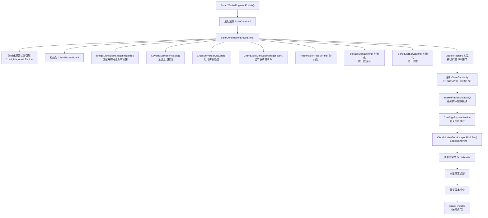

# 系统架构

## 宿主薄壳与业务核心分离

ArcartXSuite 采用 **薄壳 + 加密核心** 的双层设计，从根源上解决加密类加载时序问题。

### ArcartXSuitePlugin（宿主薄壳）

`ArcartXSuitePlugin` 是 Paper 注册的插件主类，只承担三件事：

1. 在 **静态初始化块**（最早时机，早于构造器/onEnable）注入保护层 `ProtectedClassLoader`
2. `onEnable` 时反射加载已被解密的业务核心 `SuiteCoreImpl`
3. 把宿主引用移交业务核心，`onDisable` 时回收

```java
public class ArcartXSuitePlugin extends JavaPlugin {
    static {
        // 最早时机注入保护层，确保加密类加载前 hook 已就位
        ProtectionInit.initialize(ArcartXSuitePlugin.class);
    }

    private SuiteCore core;

    @Override
    public void onEnable() {
        // 反射加载加密业务核心
        Class<?> implClass = Class.forName(
            "xuanmo.arcartxsuite.SuiteCoreImpl", true, getClassLoader());
        SuiteCore loaded = (SuiteCore) implClass.getDeclaredConstructor().newInstance();
        // 契约版本校验
        if (loaded.apiVersion() != SuiteCore.HOST_API_VERSION) {
            getLogger().severe("Suite-core 契约版本不兼容，已禁用插件。");
            getServer().getPluginManager().disablePlugin(this);
            return;
        }
        this.core = loaded;
        core.onEnable(this);
    }
}
```

> 关键：宿主薄壳只引用 `SuiteCore` 契约接口与 JDK/Bukkit/保护层引导类，不直接引用任何加密业务类。因此 Paper 验证/链接本主类时不会触发加载加密类。

### SuiteCoreImpl（业务核心）

`SuiteCoreImpl` 承接全部业务编排，被加密交付，待保护层就位后由宿主薄壳反射加载。它不继承 `JavaPlugin`，而是持有宿主真实插件引用 `host`，需要 Bukkit 调度/事件/资源时一律使用 `host`。

## 启动流程



### 启动阶段编号对照

| 阶段 | 组件 | 说明 |
|------|------|------|
| 0 | ConfigDiagnosticEngine | 初始化配置诊断引擎 + 宿主 config.yml spec |
| 1 | ClientPacketGuard | 客户端包频率限制器 |
| 2 | BridgeLifecycleManager | ArcartX UI/Packet/Client 等桥接初始化 |
| 3 | KeybindService | 全局按键注册 |
| 4 | CrossServerService | 跨服传输（Redis + Proxy 双后端） |
| 5 | ClientEventLifecycleManager | 客户端事件转发到 ModuleRegistry |
| 6 | PlaceholderResolverImpl | 统一 PAPI 解析器 |
| 7 | StorageManagerImpl | 统一数据源（HikariCP 连接池） |
| 8 | SchedulerServiceImpl | 统一调度服务（日历触发/跨服单点） |
| 8 | ModuleRegistry | 扫描并加载所有外部模块 |
| 8.5 | PolygonSelectionManager | 多边形选区管理器（Core Capability） |
| 8.6 | SystemMail 降级适配器 | 邮件降级（Core Capability） |
| 9 | ChatSignBypassService | Paper 1.21+ 聊天签名绕过 |
| 10 | CloudModuleService | 云端模块异步同步 |
| 11 | ArcartXSuiteCommand | 主命令注册 |
| 12 | 配置诊断 | 全量诊断（只报警，不写盘） |
| 13 | VersionCheckService | 异步版本检查 |
| 14 | AuthlibInjectorManager | 多方认证（默认禁用） |

## 核心组件

### BridgeLifecycleManager

负责创建、初始化、关闭所有 ArcartX 桥接实现。仅由核心入口调用，模块不直接访问此类。

```java
public final class BridgeLifecycleManager {
    private final ArcartXPacketBridge packetBridge;      // UI 注册/发包
    private final ArcartXClientBridge clientBridge;     // 客户端桥接
    private final ArcartXItemStackBridge itemStackBridge;// 物品桥接
    private final ArcartXPropBridge propBridge;          // 按键/道具桥接
    private final ArcartXWorldTextureService worldTextureBridge; // 世界贴图
    private TaczCombatBridge taczCombatBridge;           // TACZ 战斗（可选）

    public boolean initialize(boolean taczEnabled, boolean taczDebug) {
        if (!packetBridge.initialize()) return false;  // packetBridge 失败则中止
        clientBridge.initialize();
        itemStackBridge.initialize();
        propBridge.initialize();
        worldTextureBridge.initialize();
        taczCombatBridge = TaczCombatBridge.tryInitialize(plugin, taczEnabled, taczDebug);
        return true;
    }
}
```

桥接初始化失败（如 ArcartX 客户端 MOD 未安装）会直接禁用整个插件。

### ClientEventLifecycleManager

监听 ArcartX 客户端的初始化与自定义包事件，并路由到已加载模块的客户端包处理器。

```java
public final class ClientEventLifecycleManager implements Listener {
    @EventHandler(priority = EventPriority.MONITOR)
    public void onClientCustomPacket(ClientCustomPacketEvent event) {
        // 路由到 ModuleRegistry.routeClientPacket()
        registry.routeClientPacket(player, packetId, data);
    }

    @EventHandler(priority = EventPriority.MONITOR)
    public void onClientInitialized(ClientInitializedEvent.End event) {
        // 路由到 ModuleRegistry.routeClientInitialized()
        registry.routeClientInitialized(player);
    }
}
```

非主线程收到的事件会通过 `AxsScheduler.runTask` 调度到主线程执行。

### ModuleRegistry

模块注册表，负责扫描、加载、启用、禁用和查询模块。详见 [模块化架构](modular)。

### GlobalBridgeFactory

全局桥接工厂，管理所有宿主级桥接单例的创建、初始化和查询。从 `ModuleRegistry` 拆分而来，职责单一。

管理的全局桥接单例包括：

| 桥接 | 说明 |
|------|------|
| `DefaultItemSourceRegistry` | 物品来源（MythicMobs/NeigeItems/Overture/MMOItems） |
| `DefaultItemRewardDispatcher` | 统一物品奖励发放器 |
| `DefaultPendingRewardService` | 统一待发放奖励服务 |
| `CurrencyBridgeManager` | 全局货币池（Vault/PlayerPoints 等） |
| `DefaultAttributeBridgeRegistry` | 属性插件桥接注册表 |
| `DefaultRondoBridge` | Rondo 经济系统桥接 |
| `DefaultAriaBridge` | Aria 脚本桥接 |
| `DefaultVanillaItemNameBridge` | 原版物品中文名解析 |
| `ContentModeratorImpl` | 内容审核桥接 |
| `AccountTypeServiceImpl` | 统一账号识别服务 |

### CapabilityRegistry

管理模块提供的能力实例、玩家数据清除器和数据库迁移器。详见 [模块化架构](modular)。

### ClientPacketRouter

客户端包路由器，管理客户端包处理器和初始化处理器的注册与路由。从 `ModuleRegistry` 拆分而来，线程安全。

## 文件布局（运行时）

```
plugins/ArcartXSuite/
├── config.yml                  宿主主配置（模块开关、货币、跨服、安全）
├── data/
│   └── <moduleId>/
│       ├── config.yml          模块配置
│       └── messages.yml        模块消息文件
├── ui/                         ArcartX UI 文件（所有模块共享）
├── modules/                    模块 jar 存放目录
├── diagnosis/                  配置诊断报告
├── backup/                     配置备份
└── secondary-password.db       二级密码 SQLite
```

## 宿主 config.yml 关键节

| 节 | 说明 |
|---|---|
| `cloud` | 云端授权（QQ + apiKey → server-code，自动下发模块） |
| `currencies` | 全局货币定义（dynamicSection） |
| `security.secondary-password` | 统一二级密码（PBKDF2 哈希） |
| `cross-server` | 跨服传输（Redis + Proxy 双后端，HMAC 签名） |
| `keybinds` | 全局按键定义（dynamicSection） |
| `modules.&lt;id>.enabled` | 模块启用开关 |
| `module-signature-public-keys` | 模块签名验证公钥列表 |
| `storage` | 统一存储配置（MySQL/SQLite） |
| `client-packet-guard` | 客户端包守卫配置 |
| `attribute-bridges` | 属性插件桥接开关 |
