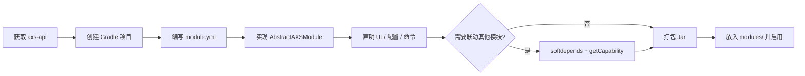

# 开发者概览

本章面向第三方模块开发者与需要集成自定义模块的服主。Suite 采用「宿主 + 独立模块 Jar」架构：宿主只提供基础设施（桥接、模块加载、跨服、配置诊断），所有业务逻辑都在 `modules/*.jar` 中运行。你可以基于公开 API 编写自己的模块，也可以安装他人发布的模块 Jar。

## 核心概念

```
plugins/
  ArcartXSuite.jar          ← 宿主（Bukkit 插件）
  ArcartXSuite/
    config.yml              ← 模块开关 modules.<id>.enabled
    modules/
      MyModule.jar          ← 你的第三方模块
    data/mymodule/          ← 模块运行时数据（配置、数据库）
    ui/                     ← 从模块 Jar 导出的 ArcartX UI
```

- **模块**：实现 `AXSModule` 或继承 `AbstractAXSModule` 的独立 Jar，通过 `module.yml` 声明入口类与依赖。
- **ModuleContext**：模块与宿主通信的唯一入口——取桥接 API、注册命令、注册 Capability，都通过它完成。
- **Capability**：AXS 推荐的跨模块调用方式。提供方注册接口实例，使用方按类型查找，避免模块之间直接 `import` 实现类。

## 你是谁？读哪几篇

| 角色 | 目标 | 推荐阅读顺序 |
|------|------|-------------|
| 模块开发者 | 从零写一个 AXS 模块 | [开发第三方模块](./module-development) → [Capability 详解](./capability-guide) → [API 参考](../api/) |
| 模块开发者 | 调用官方模块（发称号、发邮件等） | [Capability 详解](./capability-guide) → [Capability API](../api/capability) |
| 服主 / 运维 | 安装他人模块、排错 | [使用第三方模块](./using-third-party-modules) |

## 开发路线图



1. 获取 `axs-api.jar`：从 GitHub Releases 下载，或克隆仓库后 `./gradlew :axs-api:jar` 构建。
2. 按 [开发第三方模块](./module-development) 搭建项目并实现入口类。
3. 若需调用 Title、Mail、EventPacket 等官方模块，阅读 [Capability 详解](./capability-guide)。
4. 构建 Jar → 放入 `plugins/ArcartX-Suite/modules/` → 在 `config.yml` 启用 → `/axs load <id>` 或重启。

## 环境搭建

| 项目 | 要求 |
|------|------|
| JDK | 17+ |
| 构建 | Gradle（推荐）或 Maven |
| 服务端 | 已安装 ArcartX 插件 + ArcartXSuite 宿主 |
| 客户端 | 玩家需安装 ArcartX 模组（UI/HUD/自定义包依赖客户端） |
| SDK | `axs-api.jar`（`compileOnly` 依赖） |

```kotlin
// build.gradle.kts
dependencies {
    compileOnly(files("libs/axs-api-x.x.x.jar"))
    compileOnly("org.spigotmc:spigot-api:1.20.1-R0.1-SNAPSHOT")
    // 可选
    compileOnly("me.clip:placeholderapi:2.11.7")
}
```

::: warning 不要引用宿主实现
模块代码中只能 `import xuanmo.arcartxsuite.api.*`。不要 `import xuanmo.arcartxsuite.bridge.*` 或宿主 `module` 包——会导致 ClassLoader 隔离失败，且在不同版本间不兼容。
:::

## 文档索引

| 文档 | 内容 |
|------|------|
| [开发第三方模块](./module-development) | 项目结构、Gradle、`module.yml`、`AbstractAXSModule`、UI 绑定、客户端包、子命令 |
| [模块 Ed25519 签名](./module-signature) | 开发者生成密钥、签名 `module.yml`；服主配置公钥校验 |
| [使用第三方模块](./using-third-party-modules) | 服主安装、启用、热加载、依赖与签名、常见问题 |
| [Capability 详解](./capability-guide) | 原理、内置能力表、提供方/使用方完整示例 |
| [模块生命周期 API](../api/module-lifecycle) | `AXSModule` / `AbstractAXSModule` 接口说明 |
| [ModuleContext](../api/module-context) | 桥接、跨服、资源导出等上下文 API |
| [Capability API](../api/capability) | 各内置 Capability 接口方法签名 |

## 与官方模块的关系

AXS 自带 29 个官方模块（Title、Mail、Chat 等），它们与第三方模块使用同一套加载机制：

- 同样放在 `modules/`（或云端下发到内存加载）。
- 同样通过 `ModuleContext` 获取桥接。
- 同样通过 Capability 暴露能力供其他模块调用。

因此：你为服务器写的「小插件」，在架构上与 Title、Mail 是平级的——这正是 Suite（组曲）的设计。
