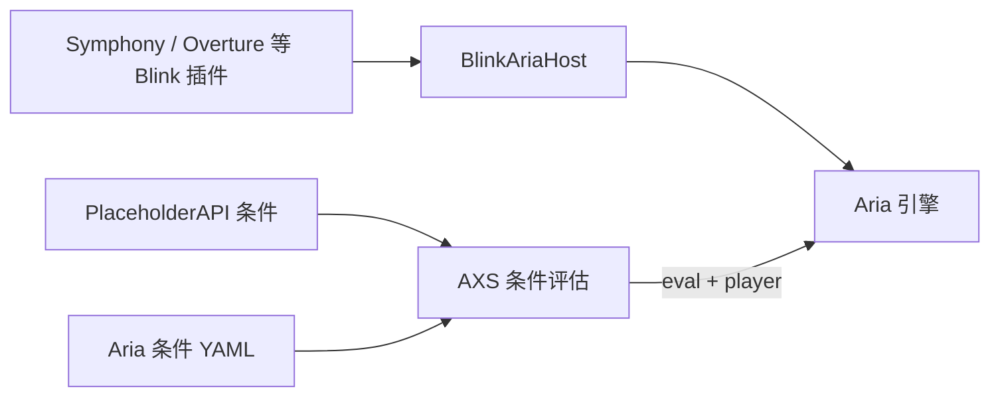

# 条件系统（PlaceholderAPI + Aria）

AXS 在 **Menu、Prop、EventPacket、Mail** 等模块中统一使用同一套条件引擎。你可以用 **PlaceholderAPI 行内表达式** 做简单数值/字符串判断，也可以用 **Aria 脚本** 编写复杂逻辑。

本页是**通用参考**；各模块的字段名与行为差异见文末「模块对照表」，并链接到对应模块文档。

---

## 前置知识：两种条件类型

| 类型 | 配置识别方式 | 运行时依赖 | 典型用途 |
| --- | --- | --- | --- |
| **PAPI 条件** | `%变量% 运算符 期望值` | [PlaceholderAPI](https://www.spigotmc.org/resources/placeholderapi.6245/)（推荐安装） | 等级、余额、权限组、世界名 |
| **Aria 条件** | `aria:` 前缀、`type: aria`、或 `aria-conditions` 键 | [Blink 系插件](https://github.com/17Artist/Blink) 注入的 `BlinkAriaHost` | 多条件组合、调用 Java API、与 Symphony/Overture 脚本生态一致 |

::: info 逻辑关系
同一列表内的**多条条件为 AND（且）关系**——必须全部通过才算满足。暂不支持 OR / NOT 组合；复杂逻辑请写进一条 Aria 脚本。
:::

::: warning Aria 不是 AX 内置能力
Aria 由 Blink 框架在服务端 JVM **按需注入**（独立 Bukkit 插件 `BlinkAriaHost`）。  
服务器上需至少安装一个启用了 `enableAria` 的 Blink 系插件（如 [Symphony](https://github.com/17Artist/Symphony)、[Overture](https://github.com/17Artist/Overture) 等）。  
未部署 Aria 时：**PAPI 条件照常工作**；**Aria 条件求值结果为 false**（按钮禁用 / 规则不触发 / 领取失败）。
:::

---

## 一、PlaceholderAPI 条件（PAPI）

### 1.1 行内写法（最常用）

```yaml
# 格式：%占位符% <运算符> <期望值>
conditions:
  - "%player_level% >= 10"           # 等级 ≥ 10
  - "%player_world% == world"        # 在主世界
  - "%luckperms_groups% contains VIP" # 权限组包含 VIP
  - "%player_name% regex ^[A-Z].*"   # 名字以大写字母开头
```

**解析规则：**

- 占位符必须以 `%` 开头和结尾。
- 占位符与运算符、期望值之间用**空格**分隔。
- 期望值可含空格（从第三个 token 起全部算作期望值），例如：`%player_biome% == 深暗之域`。

### 1.2 结构化写法

适合在 UI 或管理工具中逐项编辑：

```yaml
conditions:
  - placeholder: "%player_level%"   # 可写 player_level，会自动补 %
    operator: ">="                  # 别名 op
    value: "10"
  - expr: "%vault_eco_balance% >= 100"   # 等价于行内写法
  - expression: "%player_gamemode% == SURVIVAL"
```

| 字段 | 别名 | 说明 |
| --- | --- | --- |
| `placeholder` | `placeholders` | PAPI 变量 |
| `operator` | `op` | 运算符，见下表 |
| `value` | — | 期望比较值 |
| `expr` / `expression` | — | 整行 PAPI 表达式，与行内写法等价 |

### 1.3 运算符

| 运算符 | 含义 | 示例 |
| --- | --- | --- |
| `==` | 等于（**不区分大小写**） | `%player_world% == world` |
| `!=` | 不等于 | `%craneattribute_job% != 无职业` |
| `>=` `<=` `>` `<` | 数值比较；无法解析为数字时**回退为字符串比较** | `%player_level% >= 30` |
| `contains` | 子串包含（不区分大小写） | `%luckperms_groups% contains admin` |
| `regex` | 正则匹配（不区分大小写） | `%player_name% regex ^Steve.*` |

### 1.4 未安装 PlaceholderAPI 时

- PAPI 占位符**不会被解析**，按字面字符串参与比较。
- 例如 `%player_level% >= 10` 会把 `%player_level%` 当作普通文本，几乎永远不等于 `10`，条件**不通过**。
- 生产环境请安装 PAPI，并确认相关 Expansion 已注册。

### 1.5 教学示例：限制 VIP 且等级 ≥ 20

```yaml
conditions:
  - "%luckperms_primary_group% == vip"
  - "%player_level% >= 20"
```

玩家必须**同时**是 VIP 组且等级 ≥ 20。任一不满足则整体失败。

---

## 二、Aria 脚本条件

[Aria](https://github.com/17Artist/Aria) 是运行在 JVM 上的轻量脚本语言（与 Shimmer 同系，支持 JS 兼容模式）。AXS 通过 Blink 的 `AriaScriptManager` 执行脚本，并将 **`player`** 注入为脚本全局变量。

### 2.1 运行时架构（简要）



### 2.2 写法一：行内 `aria:` 前缀

```yaml
conditions:
  - "aria: return player.getLevel() >= 10"
  - "aria: player.getWorld().getName() == 'world'"
```

`aria:` 后面整段为脚本内容（可多行时用 YAML 块标量，见下文）。

### 2.3 写法二：独立 Aria 列表键

以下键名下的**每一行字符串整段视为 Aria 脚本**（无需写 `aria:` 前缀）：

| 键名 | 说明 |
| --- | --- |
| `aria-conditions` | 推荐，语义清晰 |
| `ariaConditions` | 驼峰别名 |
| `aria-condition` / `ariaCondition` | 单数形式 |
| `aria` | 简短形式 |

```yaml
aria-conditions:
  - |
    // JS 兼容模式示例
    return player.getLevel() >= 10 && player.hasPermission('vip.access')
```

Menu 模块还在按钮级支持 `condition` / `use-conditions` 等键旁挂载 Aria；见 [Menu 文档](/modules/menu#按钮条件)。

### 2.4 写法三：结构化 Map

```yaml
conditions:
  - type: aria                    # 或 kind: aria
    script: |
      var level = player.getLevel()
      return level >= 10 && level <= 100
  - type: aria
    expression: "return !player.isOp()"   # script / code / aria 字段等价
```

| 字段 | 说明 |
| --- | --- |
| `type` / `kind` | 填 `aria` 表示 Aria 条件 |
| `script` | 脚本正文（推荐） |
| `expression` / `code` / `aria` | 与 `script` 等价 |

::: tip 与 Overture 物品脚本的关系
[Overture](https://github.com/17Artist/Overture) 物品事件使用同一 Aria 运行时，并注册了 `item`、`cooldown` 等命名空间。  
**AXS 通用条件只注入 `player`**，不包含 `item` 流；物品相关逻辑请在 Overture 配置或自定义 Aria 函数中编写。
:::

### 2.5 脚本中可用的 `player`

评估时 AXS 注入：

```text
bindings = { "player": <Bukkit Player 对象> }
```

在 Aria / JS 兼容模式下可直接调用 Bukkit API，例如：

```javascript
// 等级与世界
return player.getLevel() >= 10
return player.getWorld().getName() == 'world_nether'

// 权限（Bukkit 原生）
return player.hasPermission('myplugin.vip')

// 游戏模式
return player.getGameMode().name() == 'SURVIVAL'

// 复合逻辑（OR 只能写在脚本里）
return player.getLevel() >= 50 || player.isOp()
```

::: warning 不要在 Aria 条件里直接写 %placeholder%
AXS **不会**在 Aria 脚本内自动展开 PAPI。若要用 PAPI 值，需通过 Aria 的 Java 互操作自行调用，或改用 PAPI 行内条件。
:::

### 2.6 返回值与布尔语义

脚本最后一行的值会被转换为布尔：

| 返回值 | 视为 |
| --- | --- |
| `true` / 非零数字 | 通过 |
| `false` / `null` / `0` / 空字符串 | 不通过 |
| 非空字符串 | 通过（除 `"false"`、`"0"`） |

**建议**复杂条件显式 `return true` 或 `return false`，避免歧义。

### 2.7 教学示例：周末双倍活动入口

```yaml
# EventPacket 规则片段
conditions:
  - type: aria
    script: |
      // 周六或周日，且等级 ≥ 10
      var day = new Date().getDay()   // 0=周日, 6=周六
      var isWeekend = (day == 0 || day == 6)
      return isWeekend && player.getLevel() >= 10
actions:
  - type: command.dispatch
    executor: player
    command: "warp event"
```

### 2.8 教学示例：PAPI + Aria 混用

同一列表可混写两种类型（仍 AND）：

```yaml
open-requirements:
  - "%player_level% >= 5"                    # PAPI：快速筛等级
  - "aria: return player.hasPermission('menu.shop.open')"  # Aria：Bukkit 权限
```

---

## 三、模块对照表

各模块**字段名**不同，但**语法引擎相同**。

| 模块 | 配置文件 | 条件字段 | 不满足时行为 | 文档 |
| --- | --- | --- | --- | --- |
| **Menu** | `data/menu/menus/*.yml` | `open-requirements`（打开）<br>`requirements` / `view-conditions`（可见）<br>`condition` / `use-conditions`（可点击） | 打不开 / 隐藏按钮 / 灰色禁用 | [Menu](/modules/menu) |
| **Prop** | `prop/props/*.yml` | `conditions` | 禁止使用，提示 `CONDITION_NOT_MET` | [Prop](/modules/prop) |
| **EventPacket** | `data/eventpacket/rules/*.yml` | `conditions` | 跳过该规则动作链 | [EventPacket](/modules/eventpacket) |
| **Mail** | `mail/presets/*.yml` 等 | `claim-conditions` | 无法领取附件/命令奖励 | [Mail](/modules/mail) |

### Menu 特有：可见 vs 使用

| 类型 | 字段 | 玩家看到的效果 |
| --- | --- | --- |
| **可见条件** | `requirements`、`view-conditions`、`conditions` | 不满足 → **按钮不渲染** |
| **使用条件** | `condition`、`use-conditions`、`click-conditions` | 不满足 → **按钮灰色显示**，点击无效；可配 `deny-message` |

详见 [Menu 按钮条件](/modules/menu#按钮条件)。

### Mail 特有：序列化格式

邮件领取条件持久化到数据库时支持：

- 行内：`%player_level% >= 10`
- 预设 YAML 旧格式：`%player_level%::GTE::10`（`::` 分隔，兼容）
- Aria：`aria:` 前缀或 `type: aria` 块（存储为 Base64 编码的 `aria\t...`）

---

## 四、从零配置：分步教程

### 步骤 1 — 确认 PAPI 可用（PAPI 条件）

```bash
/papi parse me %player_level%
```

有正常数值输出即可。AXS 占位符见 [PlaceholderAPI 速查](/guide/placeholders)。

### 步骤 2 — 写一条最简单的 PAPI 条件

在 Prop 道具定义中：

```yaml
# prop/props/healing_potion.yml
conditions:
  - "%player_health% < 10"    # 血量低于 10 才可用
```

重载 Prop 模块后测试。

### 步骤 3 — 确认 Aria 可用（Aria 条件）

1. 安装 Symphony / Overture 等 **enableAria=true** 的 Blink 插件。
2. 启动后检查 `plugins/.blink-shared/BlinkAriaHost.jar` 是否被加载，或 `/plugins` 列表出现 **BlinkAriaHost**。
3. 在 Menu 按钮上添加：

```yaml
condition:
  - "aria: return player.getLevel() >= 1"
```

4. 若 Aria 未就绪，按钮应显示为**禁用**（使用条件）或**打不开**（打开条件）。

### 步骤 4 — 用 Aria 替代多条 PAPI

**之前（3 条 PAPI）：**

```yaml
conditions:
  - "%player_level% >= 30"
  - "%player_world% == world"
  - "%luckperms_primary_group% == warrior"
```

**之后（1 条 Aria）：**

```yaml
conditions:
  - type: aria
    script: |
      return player.getLevel() >= 30
        && player.getWorld().getName() == 'world'
        && player.hasPermission('group.warrior')
```

---

## 五、故障排查

| 现象 | 可能原因 | 处理 |
| --- | --- | --- |
| PAPI 条件永远不满足 | 未装 PAPI / Expansion 未注册 | 安装 PAPI，`/papi ecloud download <expansion>` |
| 数值比较异常 | 占位符返回带单位字符串 | 检查 PAPI 返回值；必要时用 Aria 做 `parseInt` |
| Aria 条件永远不满足 | 无 BlinkAriaHost | 安装 Blink 系插件并确认 Aria 启用 |
| 脚本语法错误 | YAML 缩进 / 引号 | 用 `\|` 块标量；查看服务端 fine 日志 |
| Menu 按钮「看得见点不了」 | 仅 **使用条件** 未通过 | 检查 `condition` / `deny-message` |
| Menu 按钮完全消失 | **可见条件** 未通过 | 检查 `requirements` / `view-conditions` |
| Mail 领取失败无提示 | `claim-conditions` 未满足 | 检查预设 YAML 与 PAPI/Aria 条件 |

---

## 六、开发者 API

模块可通过 `ModuleContext` 获取统一评估器：

```java
// 判断是否通过
boolean ok = context.scriptConditionEvaluator().passes(player, conditions);

// 获取第一条失败条件（用于提示）
ScriptCondition failed = context.scriptConditionEvaluator().firstFailed(player, conditions);

// Aria 桥接状态
boolean ariaReady = context.ariaBridge().available();
```

---

## 相关链接

- [PlaceholderAPI 速查](/guide/placeholders) — AXS 输出的 `%AXS...%` 变量
- [Menu 通用菜单](/modules/menu) — 可见/使用/打开条件详解
- [Blink 开发者手册](https://github.com/17Artist/Blink/blob/main/DEVELOPER.md) — AriaScriptManager API
- [Aria 语言仓库](https://github.com/17Artist/Aria) — 语法与 JIT 特性
