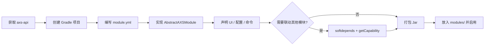

# 开发者指南

本章面向 **第三方模块开发者** 与 **需要集成自定义模块的服主**。ArcartX-Suite（AXS）采用「宿主 + 独立模块 Jar」架构：宿主只提供基础设施（桥接、模块加载、跨服、配置诊断），**所有业务逻辑都在 `modules/*.jar` 中运行**。你可以基于公开 API 编写自己的模块，也可以安装他人发布的模块 Jar。

::: tip 获取 axs-api
推荐从 [ArcartXSuite-Core Releases](https://github.com/xuanmomo233/ArcartXSuite-Core/releases) 下载 `axs-api-<version>.jar`。也可克隆该仓库后执行 `./gradlew :axs-api:jar` 自行构建（产物在 `axs-api/build/libs/`）。
:::

完整 API 源码与 `MODULAR-README.md` 见 GitHub：[ArcartXSuite-Core](https://github.com/xuanmomo233/ArcartXSuite-Core)。开发时只需 `compileOnly` 依赖 `axs-api` JAR，**禁止**直接引用宿主实现类（`xuanmo.arcartxsuite.bridge.*` 等）。

## 你是谁？读哪几篇

| 角色 | 目标 | 推荐阅读顺序 |
|------|------|----------------|
| **模块开发者** | 从零写一个 AXS 模块 | [开发第三方模块](./module-development) → [Capability 详解](./capability-guide) → [API 参考](/api/) |
| **模块开发者** | 调用官方模块（发称号、发邮件等） | [Capability 详解](./capability-guide) → [Capability API 速查](/api/capability) |
| **服主 / 运维** | 安装他人模块、排错 | [使用第三方模块](./using-third-party-modules) → [模块启用](/guide/module-enablement) |
| **架构了解** | 理解模块如何被加载 | [模块化架构](/architecture/modular) |

## 核心概念

```
plugins/
  ArcartXSuite.jar          ← 宿主（Bukkit 插件）
  ArcartXSuite/
    config.yml              ← 模块开关 modules.<id>.enabled
    modules/
      MyModule.jar          ← 你的第三方模块
    data/mymodule/          ← 模块运行时数据（配置、数据库）
    ui/                     ← 从模块 Jar 导出的 ArcartX UI
```

- **模块**：实现 `AXSModule` 或继承 `AbstractAXSModule` 的独立 Jar，通过 `module.yml` 声明入口类与依赖。
- **ModuleContext**：模块与宿主通信的唯一入口——取桥接 API、注册命令、注册 Capability，都通过它完成。
- **Capability**：AXS **推荐的跨模块调用方式**。提供方注册接口实例，消费方按类型查找，避免模块之间直接 `import` 实现类。

## 开发路线图



1. 获取 `axs-api.jar`：从 [ArcartXSuite-Core Releases](https://github.com/xuanmomo233/ArcartXSuite-Core/releases) 下载，或克隆仓库后 `./gradlew :axs-api:jar` 构建。
2. 按 [开发第三方模块](./module-development) 搭建项目并实现入口类。
3. 若需调用 Title、Mail、EventPacket 等官方模块，阅读 [Capability 详解](./capability-guide)。
4. 构建 Jar → 放入 `plugins/ArcartXSuite/modules/` → 在 `config.yml` 启用 → `/axs load <id>` 或重启。

## 文档索引

| 文档 | 内容 |
|------|------|
| [ArcartXSuite-Core](https://github.com/xuanmomo233/ArcartXSuite-Core) | 开源 SDK 仓库（`axs-api` 源码、`MODULAR-README.md`） |
| [开发第三方模块](./module-development) | 项目结构、Gradle、`module.yml`、`AbstractAXSModule`、UI 绑定、客户端包、子命令 |
| [使用第三方模块](./using-third-party-modules) | 服主安装、启用、热加载、依赖与签名、常见问题 |
| [Capability 详解](./capability-guide) | 原理、内置能力表、提供方/消费方完整示例、多实例 Capability |
| [模块生命周期 API](/api/module-lifecycle) | `AXSModule` / `AbstractAXSModule` 接口说明 |
| [ModuleContext](/api/module-context) | 桥接、跨服、资源导出等上下文 API |
| [Capability API 速查](/api/capability) | 各内置 Capability 接口方法签名 |

## 与官方模块的关系

AXS 自带 26+ 个官方模块（Title、Mail、Chat…），它们与第三方模块 **使用同一套加载机制**：

- 同样放在 `modules/`（或云端下发到内存加载）。
- 同样通过 `ModuleContext` 获取桥接。
- 同样通过 **Capability** 暴露能力供其他模块调用。

因此：你为服务器写的「小插件」，在架构上与 Title、Mail 是 **平级的乐章**——这正是 Suite（组曲）的设计。
