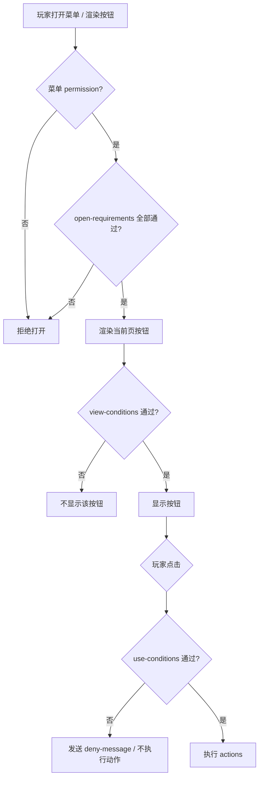

# Menu 通用 ArcartX 菜单系统

## 功能定位

Menu 模块提供 **配置驱动的 ArcartX 全屏菜单**，可替代 TrMenu 等插件的常见能力：

- 多菜单、多页面、动态按钮渲染（Observer + 服务端发包）
- 按钮动作：玩家命令、控制台命令、消息、打开子菜单、关闭、翻页、音效
- 打开条件：权限 + PlaceholderAPI / **Aria 脚本** / **JavaScript** 表达式（见 [条件系统](/guide/conditions)）
- **命令绑定**：精确命令 + 正则命令拦截
- **物品绑定**：手持/副手物品右键打开菜单
- **按钮图标**：Slot ~Icon 展示 Bukkit / Mythic / Neige / MMOItems 物品
- **ESC 暂停界面替换**：左侧滑出菜单 + 第三人称镜头

## 依赖

| 类型 | 依赖 | 作用 |
| --- | --- | --- |
| 必需 | ArcartX | UI 注册、发包、打开/关闭界面 |
| 可选 | PlaceholderAPI | PAPI 行内条件、文本变量 |
| 可选 | Blink 系 + **BlinkAriaHost** | Aria 脚本条件（Symphony / Overture 等注入） |
| 可选 | MythicMobs / NeigeItems / MMOItems | 按钮 `icon.source` 外部物品生成 |

## 启用步骤

```yaml
modules:
  menu:
    enabled: true
```

部署 `plugins/ArcartX-Suite/modules/ArcartX-Suite-Menu-*.jar` 后执行 `/axs menu reload`。

## 命令

| 命令 | 权限 | 说明 |
| --- | --- | --- |
| `/menu open <菜单ID>` | `arcartxsuite.menu.use` | 打开指定菜单 |
| `/menu list` | `arcartxsuite.menu.use` | 列出已加载菜单 |
| `/axmenu` | 同上 | `/menu` 别名 |
| `/axs menu reload` | `ArcartX-Suite.menu.reload` | 重载配置与菜单定义 |
| `/axs menu open <ID> [玩家]` | `ArcartX-Suite.menu.open.other` | 管理员代开 |

## 主配置（`ArcartXMenu.yml`）

```yaml
client:
  packet-id: "AXS_MENU"
  panel-ui-id: "ArcartX-Suite:menu_panel"
  esc-ui-id: "ArcartX-Suite:menu_esc"
  esc-menu-id: "esc_main"          # ESC 界面默认加载的菜单 ID
  register-ui-on-enable: true
  overwrite-ui-files: false

settings:
  menus-directory: "menus"
  default-layout: "panel"          # panel | esc
  columns: 2
  buttons-per-page: 12
  click-cooldown-ms: 300
  close-on-action: true
  notify-open-failed: true
  item-binds:                      # 全局物品绑定
    - menu: example
      material: NETHER_STAR
      name-contains: "服务器菜单"
      action: RIGHT_CLICK
```

## 菜单定义（`data/menu/menus/*.yml`）

每个文件可包含多个文档（用 `---` 分隔），每个文档定义一个菜单。

### 基础结构

```yaml
id: shop
title: "&f&l商城"
layout: panel                     # panel=居中面板 | esc=暂停界面布局
columns: 2
buttons-per-page: 8
permission: ""
match-esc: false                  # 是否作为 ESC 候选菜单

open-requirements:
  - "%player_level% >= 1"
open-actions:
  - "message: &a欢迎！"
close-actions:
  - "sound: UI_BUTTON_CLICK|1|1"

commands:
  - "shop"                        # 精确命令绑定：/shop
command-regex:
  - "openshop(?:\\s+(?<page>\\w+))?"   # 正则绑定：/openshop vip

item-binds:
  - material: DIAMOND
    name-contains: "商城"
    action: RIGHT_CLICK
    main-hand: true
    off-hand: false

pages:
  - id: main
    title: "&f商品"
    buttons:
      vip:
        text: "&fVIP 专区"
        order: 0
        permission: ""
        requirements:
          - "%luckperms_primary_group% == vip"
        condition:
          - "%player_level% >= 10"
        deny-message: "&c等级不足"
        icon:
          material: EMERALD
          name: "&aVIP"
          lore:
            - "&7点击进入"
          custom-model-data: 10001
          # 或使用外部物品库：
          # source: mythic
          # id: MagicCoin
          # source: mmo
          # mmo-type: SWORD
          # mmo-id: STEEL_SWORD
        actions:
          - "command: /market shop"
          - "close"

footer-buttons:
  options:
    text: "&f游戏选项"
    client-action: "options"      # 客户端原生动作
  quit:
    text: "&f退出游戏"
    client-action: "quit"
```

### 布局类型

| layout | UI 文件 | 打开方式 |
| --- | --- | --- |
| `panel` | `ui/menu_panel.yml` | `/menu open`、命令/物品绑定 |
| `esc` | `ui/menu_esc.yml` | 按 ESC（`match: 暂停界面`） |

ESC 菜单在 UI `open` 时发送 `esc_open` 包，服务端只推送数据，不重复 `openUi`。

## 命令绑定

### 精确绑定

```yaml
commands:
  - "shop"
  - "openmenu"
```

玩家执行 `/shop` 或 `/shop 任意参数` 时，拦截并打开该菜单。

### 正则绑定

```yaml
command-regex:
  - "warp(?:\\s+(?<target>\\w+))?"
  - "^gm\\s+shop$"
```

- 匹配时不区分大小写
- 命中后取消原命令并打开菜单
- 需满足菜单 `permission` 与 `open-requirements`

::: tip
正则绑定无需在 `plugin.yml` 声明命令，适合迁移 TrMenu 的自定义命令。
:::

## 物品绑定

### 菜单级

```yaml
item-binds:
  - material: COMPASS
    name-contains: "菜单"
    name-regex: ".*功能.*"          # 可选，与 contains 同时满足
    lore-contains: "右键打开"
    custom-model-data: 10001
    action: RIGHT_CLICK             # RIGHT_CLICK | LEFT_CLICK
    main-hand: true
    off-hand: false
    permission: ""
```

### 全局（`ArcartXMenu.yml` → `settings.item-binds`）

```yaml
item-binds:
  - menu: example                   # 必填：打开的菜单 ID
    material: NETHER_STAR
    name-contains: "服务器菜单"
```

## 按钮动作

每行格式：`<类型>: <参数>`

| 类型 | 别名 | 示例 |
| --- | --- | --- |
| `command` | `cmd`, `player` | `command: /spawn` |
| `console` | `op` | `console: eco give {player} 100` |
| `message` | `msg`, `tell` | `message: &a成功` |
| `open` | `menu` | `open: teleport` |
| `close` | — | `close` |
| `page` | — | `page: next` / `page: main` |
| `sound` | — | `sound: UI_BUTTON_CLICK\|1\|1` |

`{player}` 会替换为玩家名；支持 PlaceholderAPI（需安装 PAPI）。

## 按钮图标

按钮左侧显示 `Slot ~Icon` 物品预览：

```yaml
icon:
  material: DIAMOND
  amount: 1
  name: "&b示例"
  lore:
    - "&7描述"
  custom-model-data: 10001
  json: ""                         # 直接指定 ArcartX 物品 JSON（高级）
  source: mythic                     # mythic | neige | overture | mmo
  id: SomeItemId
  mmo-type: SWORD                  # source=mmo 时可分开写
  mmo-id: STEEL_SWORD
```

无 `icon` 或解析失败时仅显示文字按钮。

## 按钮条件 {#按钮条件}

Menu 的条件系统与 Prop / EventPacket / Mail **共用同一引擎**，完整语法见 **[条件系统（PlaceholderAPI + Aria + JS）](/guide/conditions)**。  
本节侧重 Menu **字段名**、**可见 vs 使用** 语义，以及菜单场景下的教学示例。

### 条件如何生效（流程）



::: info 评估顺序
1. **打开菜单**：`permission` → `open-requirements`  
2. **渲染按钮**：按钮 `permission` → **可见条件**  
3. **点击按钮**：**使用条件** → `actions`  

命令绑定、物品绑定打开菜单时，同样检查菜单级 `permission` 与 `open-requirements`。
:::

### 两类条件：可见 vs 使用

| 类型 | 配置字段 | 别名 | 不满足时的表现 |
| --- | --- | --- | --- |
| **可见条件** | `requirements` | `view-conditions`、`viewConditions`、`conditions` | 按钮**从 UI 移除**，玩家看不到 |
| **使用条件** | `condition` | `use-conditions`、`useConditions`、`click-conditions`、`clickConditions` | 按钮**仍显示但为灰色禁用**；点击不执行 `actions` |

**设计建议：**

- 用 **可见条件** 隐藏「玩家根本不该知道」的入口（例如未解锁的系统）。
- 用 **使用条件** + `deny-message` 提示「看得见但暂时不能用」（例如等级不足、材料不够）。

### 字段别名速查

```yaml
buttons:
  vip_shop:
    text: "&fVIP 商城"
    requirements:
      - "%luckperms_groups% contains VIP"   # 可见：非 VIP 看不到
    condition:
      - "%player_level% >= 20"              # 使用：等级不足则灰色
    deny-message: "&c需要达到 &e20 &c级才能进入 VIP 商城"
    actions:
      - "command: /vipshop"
      - "close"
```

列表内多条条件为 **AND（且）**。

### PlaceholderAPI 行内写法

```yaml
requirements:
  - "%luckperms_primary_group% == vip"
  - "%player_world% == world"
  - "%player_level% >= 10"
  - "%luckperms_groups% contains admin"
  - "%player_name% regex ^[A-Z].*"
```

格式：`%占位符% <运算符> <期望值>`。

### 结构化写法

```yaml
condition:
  - placeholder: "%player_level%"
    operator: ">="
    value: "10"
  - expr: "%vault_eco_balance% >= 100"
```

### Aria 脚本写法

需 **BlinkAriaHost**（Blink 系插件注入）。脚本内用 **`player`** 访问 Bukkit 玩家对象。

```yaml
# 行内 aria: 前缀
condition:
  - "aria: return player.getLevel() >= 20"

# 独立 Aria 列表
aria-conditions:
  - "return player.hasPermission('menu.vip')"

# 结构化
requirements:
  - type: aria
    script: "return player.isOp() || player.getLevel() >= 50"
```

| 位置 | 可用条件键 |
| --- | --- |
| 按钮可见 | `requirements`、`view-conditions`、`conditions`、`aria-conditions`、`js-conditions` |
| 按钮使用 | `condition`、`use-conditions`、`click-conditions`、`aria-condition`、`js-condition` |
| 菜单打开 | `open-requirements`、`aria-conditions`、`js-conditions` |

::: warning
Aria / JS 脚本内不会自动展开 `%placeholder%`。混用 PAPI 行 + 脚本时仍为 AND。
:::

### deny-message

使用条件未通过且玩家点击时发送，支持 `{player}` 与 PAPI。

### 教学示例：在线奖励 + VIP 专区

```yaml
rewards:
  text: "&f在线奖励"
  condition:
    - "%player_level% >= 5"
  deny-message: "&c需要 &e5 &c级"
  actions:
    - "command: /onlinerewards open"

vip_zone:
  text: "&6VIP 专区"
  requirements:
    - "%luckperms_groups% contains VIP"
  condition:
    - type: aria
      script: |
        var d = new Date().getDay()
        return d == 0 || d == 6 || player.hasPermission('menu.vip.bypass')
  deny-message: "&c仅周末开放"
  actions:
    - "open: vip_shop"
```

### 运算符参考

| 运算符 | 说明 |
| --- | --- |
| `==` / `!=` | 等于 / 不等于（忽略大小写） |
| `>=` `<=` `>` `<` | 数值比较（失败则字符串比较） |
| `contains` / `regex` | 包含 / 正则 |

PAPI 未安装时 PAPI 条件通常不通过；Aria 未部署时 Aria 条件为 **false**。

## 菜单打开条件

```yaml
open-requirements:
  - "%player_level% >= 10"
  - "%player_world% == world"
  - type: aria
    script: "return player.hasPermission('menu.shop.open')"
```

不满足时命令/物品绑定与 `/menu open` 均无法打开。

## 跨模块调用

```java
MenuOpenable menu = context.getCapability(MenuOpenable.class);
if (menu != null) {
    menu.openMenu(player, "example");
}
```

## UI 资源

| 文件 | 说明 |
| --- | --- |
| `ui/menu_panel.yml` | 居中面板菜单 |
| `ui/menu_esc.yml` | ESC 暂停界面 |

修改 UI 后设置 `overwrite-ui-files: true` 或使用 `/axs menu reload` 重新导出。

## 权限

| 节点 | 默认 | 说明 |
| --- | --- | --- |
| `arcartxsuite.menu.use` | true | 玩家 `/menu` |
| `ArcartX-Suite.menu.reload` | op | 重载模块 |
| `ArcartX-Suite.menu.open.other` | op | 管理员代开 |

菜单/按钮级 `permission:` 字段可进一步限制。

## 示例菜单

首次启用自动导出：

- `menus/example.yml` — 功能入口 + 传送子菜单 + 图标/命令/物品绑定示例
- `menus/esc_main.yml` — ESC 暂停界面按钮

## 与 TrMenu 迁移对照

| TrMenu | ArcartX-Suite Menu |
| --- | --- |
| `/trmenu open xxx` | `/menu open xxx` |
| 命令绑定 RegEx | `command-regex` |
| 物品绑定 | `item-binds` |
| 按钮材质/物品 | `icon:` + ArcartX Slot |
| Kether/JS 脚本 | 使用 `command`/`console` 动作或 EventPacket |
| 多页 Layout | `pages` 列表 |

## 故障排查

| 现象 | 排查 |
| --- | --- |
| 菜单打不开 | 检查 `modules.menu.enabled`、ArcartX 是否在线、控制台 UI 注册日志 |
| ESC 无按钮 | 确认 `esc-menu-id` 指向有效菜单；UI `open` 会发 `esc_open` |
| 命令绑定无效 | 正则语法错误看控制台警告；检查 `permission` / `open-requirements` |
| 物品绑定无效 | 核对 material 名、displayName、main/off hand |
| 图标不显示 | 检查 `icon` 配置；外部物品需对应插件已安装 |
| 按钮灰色点不了 | **使用条件** `condition` 未通过；查看 `deny-message`；Aria 未部署时 Aria 条件恒失败，可改用 **JS 条件** |
| 按钮不显示 | **可见条件** `requirements` 未通过 |
| PAPI 条件异常 | 确认 PAPI 与 Expansion；见 [条件系统](/guide/conditions#故障排查) |
| Aria 条件全失败 | 确认 `BlinkAriaHost` 已加载；见 [条件系统 · Aria](/guide/conditions#二aria-脚本条件)；若无 Blink 请改用 **JS 条件** |
| JS 条件全失败 | 确认 Java 版本 ≥ 8（Nashorn）；脚本语法错误查看服务端 fine 日志 |

