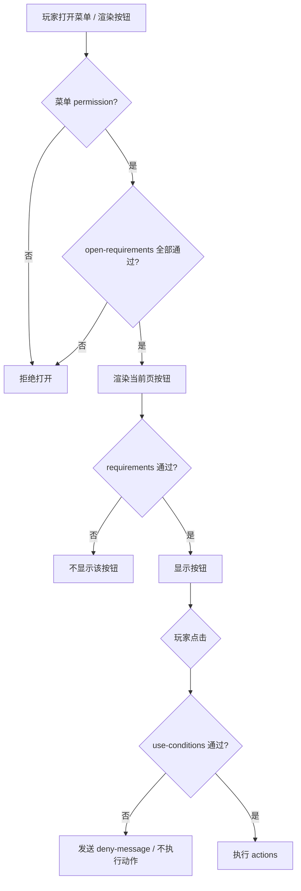

# Menu 通用 ArcartX 菜单系统

::: tip 付费模块
本模块为付费模块。授权由 [云端平台](/guide/cloud-modules) 统一管理：在 [cloud.021209.xyz](https://cloud.021209.xyz) 购买/领取授权后，于「装备模块」页面勾选到对应服务器即可，无需填写 `password` 或 `license.yml`。
:::

## 功能定位

Menu 模块提供 **配置驱动的 ArcartX 全屏菜单**，可替代 TrMenu 等插件的常见能力，所有可视化由 ArcartX 客户端渲染，服务端仅负责数据推送与命令处理。

### 核心特性

- **多菜单 / 多页面**：单个 YAML 文件可用 `---` 分隔定义多个菜单，每个菜单支持多页面并通过 `page:` 动作切换
- **按钮动作**：支持玩家命令、控制台命令、消息、打开子菜单、关闭、翻页、音效等内置动作
- **打开条件**：支持权限 + PlaceholderAPI / **Aria 脚本** / **JavaScript** 表达式（见 [条件系统](/guide/conditions)）
- **命令绑定**：精确命令与正则命令拦截，命中后取消原命令并打开菜单
- **物品绑定**：手持 / 副手物品右键（或自定义点击动作）打开菜单
- **按钮图标**：Slot ~Icon 展示 Bukkit / MythicMobs / NeigeItems / MMOItems / Overture 物品，支持自定义模型数据、附魔光效、头颅材质、皮革染色
- **ArcartX 自定义贴图**：通过 `icon` / `url` NBT 实现无资源包的 GUI 自定义贴图
- **ESC 暂停界面替换**：左侧滑出菜单 + 第三人称镜头，支持 `match-esc` 菜单候选
- **跨模块调用**：通过 `MenuOpenable` Capability 接口供其他模块打开菜单

### 性能架构

| 组件 | 渲染位置 | 服务端开销 |
| --- | --- | --- |
| 居中面板菜单 | 客户端 | 打开 / 翻页时 1 次 UI 数据包 |
| ESC 暂停界面 | 客户端 | 按 ESC 时 1 次 `esc_open` 数据包 |
| 按钮图标 | 客户端 | 物品 JSON 随 UI 数据包一次性下发 |
| 命令 / 物品绑定 | 服务端事件 | 命中时单次打开逻辑，无持续 tick 开销 |

**所有菜单 UI 均为客户端渲染，服务端仅在打开、关闭、点击动作时执行逻辑。**

## 依赖

| 类型 | 依赖 | 作用 | 缺少时表现 |
| --- | --- | --- | --- |
| 必需 | ArcartX | UI 注册、发包、打开/关闭界面；Aria 脚本条件随 ArcartX 内置提供 | 模块无法启动 |
| 可选 | PlaceholderAPI | PAPI 行内条件、文本变量 | PAPI 条件不通过、变量不展开 |
| 可选 | MythicMobs / NeigeItems / MMOItems / Overture | 按钮 `icon.source` 外部物品生成 | 外部图标解析失败，回退为默认材质或隐藏 |

## 启用步骤

```yaml
modules:
  menu:
    enabled: true
```

部署 `plugins/ArcartX-Suite/modules/ArcartX-Suite-Menu-*.jar` 后执行 `/axs reload menu`，首次启用会自动导出默认 UI 文件与示例菜单。

## 配置

配置文件路径：`plugins/ArcartXSuite/data/menu/ArcartXMenu.yml`  
菜单定义目录：`data/menu/menus/*.yml`（由 `settings.menus-directory` 指定）

### ArcartXMenu.yml 配置项一览

#### `debug`

| 字段 | 类型 | 默认值 | 说明 |
| --- | --- | --- | --- |
| `enabled` | boolean | `false` | 开发者调试日志 |

#### `client`

| 字段 | 类型 | 默认值 | 说明 |
| --- | --- | --- | --- |
| `packet-id` | string | `AXS_MENU` | 发包协议 ID，须与 UI 脚本一致 |
| `panel-ui-id` | string / list | `AXS:menu_panel` | 居中面板菜单 UI；支持列表多 UI 同时发包，见 [多 UI 发包](/guide/multi-ui) |
| `esc-ui-id` | string / list | `AXS:menu_esc` | ESC 暂停界面 UI |
| `esc-menu-id` | string | `esc_main` | 按 ESC 时默认打开的菜单 ID |
| `register-ui-on-enable` | boolean | `true` | 模块启用时向 ArcartX 注册 UI 资源 |
| `overwrite-ui-files` | boolean | `false` | 是否覆盖服内已有 UI 文件 |

#### `settings`

| 字段 | 类型 | 默认值 | 可选值 | 说明 |
| --- | --- | --- | --- | --- |
| `menus-directory` | string | `menus` | — | 菜单定义目录名，相对 `data/menu/` |
| `default-layout` | string | `panel` | `panel` / `esc` / `pause` / `pause-menu` | 菜单默认布局；`pause` / `pause-menu` 为 `esc` 别名 |
| `columns` | int | `2` | ≥ 1 | 默认每行列数 |
| `buttons-per-page` | int | `12` | ≥ 1 | 默认每页按钮数 |
| `click-cooldown-ms` | long | `300` | ≥ 0 | 按钮点击冷却（毫秒） |
| `close-on-action` | boolean | `true` | — | 执行动作后是否关闭菜单 |
| `notify-open-failed` | boolean | `true` | — | 打开失败时是否提示玩家 |
| `item-binds` | list | `[]` | — | 全局物品绑定，见下方「物品绑定」 |

#### `messages`（`messages.yml`）

消息文案独立存放在 `messages.yml` 中，修改后执行 `/axs reload menu` 生效。

| 键路径 | 默认值 | 说明 |
| --- | --- | --- |
| `prefix` | `&3◆ &6ArcartXSuite &7| &r` | 消息前缀 |
| `common.no-permission` | `&c你没有权限执行此操作。` | 无权限提示 |
| `common.player-only` | `&c该命令只能由玩家执行。` | 非玩家执行提示 |
| `common.ui-unavailable` | `&cArcartX UI 当前不可用。` | UI 不可用提示 |
| `common.module-disabled` | `&cMenu 模块当前不可用。` | 模块未启用提示 |
| `menu-not-found` | `&c未找到菜单: &f{menu}` | 菜单不存在提示 |
| `menu-open-failed` | `&c无法打开菜单 &f{menu}&c: &7{reason}` | 打开失败提示 |
| `menu-open-success` | `&a已打开菜单 &f{menu}` | 打开成功提示 |
| `button-unavailable` | `&c该按钮当前不可用。` | 按钮不可用提示 |
| `button-condition-denied` | `&c条件未满足，无法使用该按钮。` | 按钮使用条件未通过提示 |
| `page-empty` | `&7当前页没有可用按钮。` | 当前页无可见按钮提示 |
| `reload-success` | `&aMenu 模块配置已重载。` | 重载成功提示 |
| `reload-failed` | `&cMenu 模块重载失败: &7{error}` | 重载失败提示 |

### 配置示例（精简）

```yaml
# plugins/ArcartXSuite/data/menu/ArcartXMenu.yml
debug:
  enabled: false

client:
  packet-id: "AXS_MENU"
  panel-ui-id: "AXS:menu_panel"
  esc-ui-id: "AXS:menu_esc"
  esc-menu-id: "esc_main"
  register-ui-on-enable: true
  overwrite-ui-files: false

settings:
  menus-directory: "menus"
  default-layout: "panel"
  columns: 2
  buttons-per-page: 12
  click-cooldown-ms: 300
  close-on-action: true
  notify-open-failed: true
  item-binds:
    # 全局物品绑定示例：手持指定物品右键打开 example 菜单
    - menu: example
      material: NETHER_STAR
      name-contains: "服务器菜单"
      action: RIGHT_CLICK
```

### `menus/*.yml` 菜单定义配置项一览

菜单文件位于 `data/menu/menus/*.yml`。**一个文件可用 `---` 分隔定义多个菜单**，每个文档是一个独立菜单。

#### 菜单级字段

| 字段 | 类型 | 默认值 | 说明 |
| --- | --- | --- | --- |
| `id` | string | — | **必填**，菜单唯一标识，用于 `open:` 动作和命令 |
| `title` | string | 同 `id` | 菜单标题，支持 `&` 颜色码与 MiniMessage |
| `layout` | string | 继承 `settings.default-layout` | `panel` / `esc` / `pause` / `pause-menu` |
| `columns` | int | 继承 `settings.columns` | 每行列数 |
| `buttons-per-page` | int | 继承 `settings.buttons-per-page` | 每页最大按钮数，超出自动分页 |
| `permission` | string | `""` | 打开菜单所需权限节点 |
| `match-esc` | boolean | `false` | 是否作为 ESC 暂停界面的候选菜单 |
| `open-requirements` | list | `[]` | 打开菜单的前置条件，见 [条件系统](/guide/conditions) |
| `open-actions` | list | `[]` | 打开菜单时执行的动作列表 |
| `close-actions` | list | `[]` | 关闭菜单时执行的动作列表 |
| `commands` | list | `[]` | 精确命令绑定，如 `shop` 会响应 `/shop` |
| `command-regex` | list | `[]` | 正则命令绑定，命中后取消原命令并打开菜单 |
| `item-binds` | list | `[]` | 菜单级物品绑定，见下方「物品绑定」 |
| `pages` | list / map | `[{id: main}]` | 页面列表，见下方「页面级字段」 |
| `footer-buttons` | map | `{}` | 底部固定按钮（如 ESC 菜单的「选项」「退出」）；同样支持 `order`，与普通按钮共用排序规则，数字越小越靠前 |

#### 页面级字段

`pages` 支持两种写法：

- **列表写法**（推荐）：每个页面是带 `id` 的 map
- **Map 写法**：`pages.<id>.title` / `pages.<id>.buttons`

| 字段 | 类型 | 默认值 | 说明 |
| --- | --- | --- | --- |
| `id` | string | `main` | 页面标识，用于 `page:` 动作跳转 |
| `title` | string | 同页面 `id` | 页面标题 |
| `buttons` | map | `{}` | 页面按钮集合，键为按钮 ID |

#### 按钮级字段

| 字段 | 类型 | 默认值 | 说明 |
| --- | --- | --- | --- |
| `text` | string | 按钮 `id` | 按钮显示文字 |
| `order` | int | `0` | 排序权重，越小越靠前 |
| `permission` | string | `""` | 按钮级权限，无权限时按钮不可见 |
| `requirements` | list | `[]` | 可见条件，不满足时按钮从 UI 移除 |
| `use-conditions` | list | `[]` | 使用条件，不满足时点击无效 |
| `deny-message` | string | `""` | 使用条件未通过时的提示消息 |
| `actions` | list | `[]` | 点击通过使用条件后执行的动作 |
| `client-action` | string | `""` | 客户端原生动作，如 `options` / `quit` |
| `icon` | map | — | 按钮图标配置，见下方「按钮图标」 |

#### 按钮动作

每行格式：`<类型>: <参数>`。

| 类型 | 示例 | 说明 |
| --- | --- | --- |
| `command` | `command: /spawn` | 以玩家身份执行命令，自动去掉开头的 `/` |
| `console` | `console: eco give {player} 100` | 以控制台身份执行命令 |
| `op` | `op: /some-command` | 以玩家身份临时给予 OP 执行命令，用完自动收回 OP 状态 |
| `message` | `message: &a成功` | 向玩家发送聊天消息 |
| `open` | `open: teleport` | 打开另一个菜单 |
| `close` | `close` | 关闭当前菜单 |
| `page` | `page: next` / `page: main` | 切换同菜单内的页面 |
| `sound` | `sound: UI_BUTTON_CLICK\|1\|1` | 播放音效，格式 `音效名|音量|音调` |
| `signal` | `signal: signin_success` / `signal: signin_success\|key=value\|key2=value2` | 触发 EventPacket 的 `trigger: command-signal` 规则；`signal:` 必须匹配，主题玩家为点击者，变量值支持 PlaceholderAPI / `{player}`，EventPacket 未启用时静默跳过 |
| `aria` | `aria: player.command('warp vip')` | 执行 Aria 脚本动作；绑定 AXS `AriaPlayer` 门面，适合条件分支和多个副作用 |
| `js` | `js: player.command('warp vip')` | 执行 JavaScript 动作；绑定 AXS `AriaPlayer` 门面和 `Bukkit`，需要 classpath 提供 JS 引擎 |

- `command` / `console` / `message` / `signal` 会展开 PlaceholderAPI 与 `{player}`；`signal` 的名称及变量值都会展开。
- `aria` / `js` 是脚本动作，不是条件别名：脚本作为副作用执行，返回值不参与动作成败判断；脚本在 Bukkit 主线程执行。`close-on-action` 为 `true` 时，动作执行后关闭菜单。
- 脚本动作可以写成单行，也可以使用 YAML 块标量 `- |`，并在首行写 `aria:` 或 `js:`。Aria 脚本可用换行或 `;` 分隔多条语句。
- 两侧脚本中的 `player` 都是 AXS 的 `AriaPlayer` 门面。常用方法包括 `hasPermission` / `hasPerm`、`papi` / `papiNumber`、`command` / `console` / `op`、`msg` / `sendMessage`、`title`、`sound`、`close` 和 `bukkit()`。
- Aria 动作在求值前会预展开脚本文本中的 `%...%` PAPI 和 `{player}`；JS 动作不做脚本级预展开，JS 中取 PAPI 请使用 `player.papi()` 或 `player.papiNumber()`。
- `page` 支持 `prev` / `previous` / `-` / `<`（上一页）、`next` / `+` / `>`（下一页），其余值按页面 ID 处理。
- Menu 没有独立的 `title:` / `subtitle:` / `actionbar:` / `delay:` / `back:` / `refresh:` 等内置动作关键字；需要这些效果时，可在脚本动作中使用 `player.title()` 等 `AriaPlayer` 方法，或通过 EventPacket 实现。

脚本动作可以用于打开动作、关闭动作和按钮 `actions`。例如，下面的写法按 VIP 权限和余额选择折后价，扣除货币后发放物品：

```yaml
actions:
  - |
    aria:
      if (player.hasPermission('shop.vip') && player.papiNumber('%vault_eco_balance%') >= 80) {
        player.console('eco take %player_name% 80');
        player.command('give %player_name% diamond 1');
        player.msg('&aVIP 折扣购买成功：扣除 80 金币');
      } elif (player.papiNumber('%vault_eco_balance%') >= 100) {
        player.console('eco take %player_name% 100');
        player.command('give %player_name% diamond 1');
        player.msg('&a购买成功：扣除 100 金币');
      } else {
        player.msg('&c余额不足');
      }
```

按余额分档发放不同奖励：

```yaml
actions:
  - |
    aria:
      if (player.papiNumber('%vault_eco_balance%') >= 10000) {
        player.console('give %player_name% diamond 3');
      } elif (player.papiNumber('%vault_eco_balance%') >= 5000) {
        player.console('give %player_name% diamond 2');
      } elif (player.papiNumber('%vault_eco_balance%') >= 1000) {
        player.console('give %player_name% diamond 1');
      } else {
        player.msg('&c余额未达到奖励档位');
      }
```

按权限发放不同奖励：

```yaml
actions:
  - |
    aria:
      if (player.hasPermission('rank.mvp')) {
        player.command('give %player_name% diamond 5');
      } elif (player.hasPermission('rank.vip')) {
        player.command('give %player_name% diamond 2');
      } else {
        player.msg('&c需要 VIP 或 MVP 权限');
      }
```

扣货币、发物资并组合声音与标题反馈：

```yaml
actions:
  - |
    aria:
      if (player.papiNumber('%vault_eco_balance%') >= 250) {
        player.console('eco take %player_name% 250');
        player.command('give %player_name% emerald 8');
        player.sound('ENTITY_PLAYER_LEVELUP', 1.0, 1.0);
        player.title('&a购买成功', '&f获得 8 个绿宝石');
      } else {
        player.msg('&c需要 250 金币');
        player.sound('ENTITY_VILLAGER_NO');
      }
```

#### 按钮图标

按钮左侧显示 `Slot ~Icon` 物品预览。图标字段按其作用方式分为四类：

- **直接构建 ItemStack**：`material`、`amount`、`name`、`lore`、`custom-model-data`
- **外部物品来源**：`source` + `id` / `item-id` + `mmo-type` / `mmo-id`（见「外部物品来源」）
- **原始 JSON**：`json`（见独立章节「原始 JSON 图标」）
- **外观修饰**：`glow`、`skull-texture`、`color`、`texture`、`texture-url`、`nbt`

优先级规则：`json` 非空时**直接使用该 JSON 并短路**，其余所有字段都会被忽略；否则依次尝试 `source` / `mmo-type+mmo-id` / `material` 路径。

```yaml
icon:
  material: DIAMOND
  amount: 1
  name: "&b示例"
  lore:
    - "&7描述"
  custom-model-data: 10001
```

无 `icon` 或解析失败时仅显示文字按钮。

##### 外部物品来源

当按钮图标需要展示外部物品库（NeigeItems、MythicMobs、Overture、MMOItems）生成的物品时，使用 `source` 系列字段。外部来源会保留物品库自身的 NBT、属性与外观，便于与服务器现有装备体系保持一致。

| 来源 | `source` 写法（含别名） | 必填字段 | 适用场景 |
| --- | --- | --- | --- |
| NeigeItems | `neigeitems`、`neige` | `id` | 展示 NI 物品、礼包、材料 |
| MythicMobs | `mythicmobs`、`mythic` | `id` | 展示 MM 掉落、武器、任务物品 |
| Overture | `overture` | `id` | 展示 Overture 自定义物品（生成时携带玩家上下文） |
| MMOItems | `mmoitems`、`mmo` | `mmo-type` + `mmo-id` | 展示 MMOItems 装备、道具 |

**单一 ID 定位示例**（NeigeItems / MythicMobs / Overture）：

```yaml
# NeigeItems：单一 ID 定位
neige_demo:
  text: "&fNeigeItems 物品"
  order: 0
  icon:
    source: neigeitems         # 也可写 neige
    id: herb_bundle            # 替换为你 NeigeItems 里真实的物品 ID
    name: "&aNeigeItems 示例"   # 覆盖显示名（可选）
    lore:
      - "&7source: neigeitems"
      - "&7id: <物品ID>"
  actions:
    - "close"
```

```yaml
# MythicMobs：单一 ID 定位
mythic_demo:
  text: "&fMythicMobs 物品"
  order: 1
  icon:
    source: mythicmobs         # 也可写 mythic
    id: MagicSword             # 替换为你 MythicMobs 里真实的物品 ID
    name: "&aMythicMobs 示例"
    lore:
      - "&7source: mythicmobs"
      - "&7id: <物品ID>"
  actions:
    - "close"
```

```yaml
# Overture：单一 ID 定位（生成时携带玩家上下文）
overture_demo:
  text: "&fOverture 物品"
  order: 2
  icon:
    source: overture
    id: sample_item            # 替换为你 Overture 里真实的物品 ID
    name: "&aOverture 示例"
    lore:
      - "&7source: overture"
      - "&7id: <物品ID>"
  actions:
    - "close"
```

**MMOItems 两段定位示例**：

```yaml
# MMOItems：需要 类型(type) + ID 两段定位
mmoitems_demo:
  text: "&fMMOItems 物品"
  order: 3
  icon:
    source: mmoitems           # 也可写 mmo
    mmo-type: SWORD            # MMOItems 类型
    mmo-id: STEEL_SWORD        # MMOItems ID
    name: "&aMMOItems 示例"
    lore:
      - "&7source: mmoitems"
      - "&7mmo-type: SWORD"
      - "&7mmo-id: STEEL_SWORD"
  actions:
    - "close"
```

::: tip
外部物品库图标支持用 `name`、`lore` 等字段做显示覆盖，但如果外部物品本身包含复杂的 NBT 或自定义模型，建议直接通过 `json` 字段传入完整物品 JSON，以避免字段冲突。
:::

::: warning
所有 `id` 都必须替换为服务器对应物品库中真实存在的 ID；来源插件未安装或 ID 无效时，图标解析失败，按钮会回退为文字按钮或默认材质。
:::

##### ArcartX 自定义贴图 NBT（YAML 简写）

ArcartX 会读取物品上的 `icon` / `url` NBT 来选择贴图。Menu 在把 ItemStack 转成 JSON 之前，通过 ArcartX 的 ItemBridge 写入这些 NBT；若桥接不可用则静默跳过；具体请查阅 [ArcartX 自定义物品贴图](https://wiki.arcartx.com/docs/arcartx_v2/2_simple/1_item_texture)  。

| 字段 | 说明 |
| --- | --- |
| `texture` | 写入 `icon` NBT，固定只渲染 `ArcartX/resource/item_icon/` 下的贴图；子目录写成 `xxx/xxx` |
| `texture-url` / `url` | 写入 `url` NBT，渲染 `ArcartX/resource/` 下的任意文件夹贴图，支持文件路径、网络链接、GIF |
| `nbt` | 写入任意字符串 NBT 键值对 |

```yaml
icon:
  material: PAPER
  name: "&b自定义贴图"
  texture: "item"                 # → icon NBT：ArcartX/resource/item_icon/item.png 贴图
  # texture-url: "menu/icon.png"  # → url NBT：ArcartX/resource/menu/icon.png（支持 GIF / 网络链接）
  # nbt:                          # 或直接写任意字符串 NBT（可用于支持其他插件或mod的渲染）
  #   icon: "item"
  #   url: "https://example.com/icon.gif"
```

::: info ArcartX 贴图资源准备
将 PNG 贴图放入客户端资源目录的 `resource/item_icon/` 下；如需子目录，路径写成 `xxx/xxx`。文件名加 `_handheld` 后缀（如 `sword_handheld.png`）会以工具形式手持；序列帧贴图需同时放入 `.mcmeta` 文件。仅识别 PNG 格式。
:::

##### 外观修饰字段

以下字段在**直接构建 ItemStack**（`material` 路径）时生效；`json` 非空会短路并忽略它们：

- `glow`：布尔；`true` 时给图标加隐藏附魔光效。
- `skull-texture`：当 `material` 为 `PLAYER_HEAD` 时生效；接受 base64 材质值或直接的 `http(s)` 贴图 URL。
- `color`：当 `material` 为 `LEATHER_*` 时生效；十六进制颜色，如 `#FF5555`。

```yaml
icon:
  material: PLAYER_HEAD
  name: "&e自定义头颅"
  skull-texture: "eyJ0ZXh0dXJlcyI6..."   # base64 材质值，或 http(s) 贴图 URL
  glow: true                             # 隐藏附魔光效
# 皮革染色示例：
# icon:
#   material: LEATHER_CHESTPLATE
#   color: "#FF5555"
```

#### 原始 JSON 图标

当需要精确控制物品的完整 NBT 结构、或外部物品库字段无法满足需求时，使用 `json` 字段直接传入 Minecraft 物品 JSON / SNBT 字符串。

- `json` 非空时，**所有其他 icon 字段都会被忽略**（包括 `material`、`source`、`name`、`texture` 等）。
- 字符串须符合 Minecraft `ItemStack` 格式：`{id:"<物品ID>", Count:<数量>b, tag:{...}}`。
- YAML 中建议将整个 JSON 用**单引号**包裹，避免与 JSON 内部的双引号冲突。

##### 基础格式

最简物品 JSON，只指定物品 ID 与数量：

```yaml
icon:
  json: '{"id":"minecraft:diamond_sword","Count":1b}'
```

##### 复杂嵌套结构

带有 `display`（名称、Lore）、`Enchantments`、`HideFlags`、`CustomModelData` 等标签的完整示例：

```yaml
icon:
  json: '{"id":"minecraft:diamond_sword","Count":1b,"tag":{"display":{"Name":"{\"text\":\"苍穹之刃\",\"color\":\"aqua\",\"italic\":false}","Lore":["{\"text\":\"传说级武器\",\"color\":\"gray\",\"italic\":false}","{\"text\":\"+10 攻击力\",\"color\":\"red\",\"italic\":false}"]},"Enchantments":[{"id":"minecraft:sharpness","lvl":5s},{"id":"minecraft:unbreaking","lvl":3s}],"HideFlags":127,"CustomModelData":10001}}'
```

::: warning YAML 转义注意
JSON 字符串内部的双引号需要转义。使用单引号 YAML 字符串时，内部仅需 `\"`；若使用双引号 YAML 字符串，则需 `\\\"`。复杂 JSON 建议先用 SNBT 生成器生成，再粘贴到 YAML 中。
:::

##### ArcartX 自定义贴图 NBT JSON 写法

若要通过 JSON 直接写入 ArcartX 的 `icon` / `url` NBT，实现自定义贴图或 GUI 图标，在 `tag` 根级添加 `icon` 或 `url` 键。

```yaml
# 使用 icon NBT 渲染 resource/item_icon/ 下的贴图（手持 / AX-UI 有效）
icon:
  json: '{"id":"minecraft:paper","Count":1b,"tag":{"display":{"Name":"{\"text\":\"自定义贴图\",\"color\":\"aqua\",\"italic\":false}"},"icon":"item"}}'
```

```yaml
# 使用 url NBT 渲染原版 GUI 图标（支持本地路径 / 网络链接 / GIF）
icon:
  json: '{"id":"minecraft:paper","Count":1b,"tag":{"display":{"Name":"{\"text\":\"GUI 图标\",\"color\":\"aqua\",\"italic\":false}"},"url":"menu/demo_icon.png"}}'
```

```yaml
# 子目录贴图：resource/item_icon/menu/vip.png
icon:
  json: '{"id":"minecraft:paper","Count":1b,"tag":{"display":{"Name":"{\"text\":\"VIP 图标\",\"color\":\"aqua\",\"italic\":false}"},"icon":"menu/vip"}}'
```

::: info 与 YAML 简写的对应关系
| YAML 字段 | 等效 JSON NBT |
| --- | --- |
| `texture: "item"` | `"icon":"item"` |
| `texture-url: "menu/demo_icon.png"` | `"url":"menu/demo_icon.png"` |
| `nbt: { icon: "item", url: "..." }` | `"icon":"item", "url":"..."` |

JSON 写法适合需要同时组合多个 NBT、或从外部工具导出完整物品数据的场景。
:::

#### 条件系统

Menu 的条件系统与 Prop / EventPacket / Mail **共用同一引擎**，完整语法见 **[条件系统](/guide/conditions)**。

##### 两类条件：可见 vs 使用

| 类型 | 配置字段 | 别名 | 不满足时的表现 |
| --- | --- | --- | --- |
| **可见条件** | `requirements` | 无别名 | 按钮**从 UI 移除** |
| **使用条件** | `use-conditions` | 无别名 | 按钮**仍显示但点击无效**；有 `deny-message` 时提示 |

列表内多条条件为 **AND（且）**。

**设计建议：**

- 用 **可见条件** 隐藏「玩家根本不该知道」的入口（例如未解锁的系统）。
- 用 **使用条件** + `deny-message` 提示「看得见但暂时不能用」（例如等级不足、材料不够）。

##### 条件生效流程


```mermaid
flowchart TD
  A[玩家打开菜单 / 渲染按钮] --> B{菜单 permission?}
  B -->|否| Z[拒绝打开]
  B -->|是| C{open-requirements 全部通过?}
  C -->|否| Z
  C -->|是| D[渲染当前页按钮]
  D --> E{requirements 通过?}
  E -->|否| F[不显示该按钮]
  E -->|是| G[显示按钮]
  G --> H{玩家点击}
  H --> I{use-conditions 通过?}
  I -->|否| J[发送 deny-message / 不执行动作]
  I -->|是| K[执行 actions]
```

##### 常用写法示例

```yaml
buttons:
  vip_shop:
    text: "&fVIP 商城"
    requirements:
      - "%luckperms_groups% contains VIP"   # 可见：非 VIP 看不到
    condition:
      - "%player_level% >= 20"              # 使用：等级不足则灰色
    deny-message: "&c需要达到 &e20 &c级才能进入 VIP 商城"
    actions:
      - "command: /vipshop"
      - "close"
```

PlaceholderAPI 行内写法：

```yaml
requirements:
  - "%luckperms_primary_group% == vip"
  - "%player_world% == world"
  - "%player_level% >= 10"
  - "%luckperms_groups% contains admin"
  - "%player_name% regex ^[A-Z].*"
```

Aria 脚本写法：

```yaml
condition:
  - "aria: return player.getLevel() >= 20"

requirements:
  - type: aria
    script: "return player.isOp() || player.getLevel() >= 50"
```

::: warning
Aria 脚本会在求值/执行前自动展开 `%...%` PAPI 占位符和 `{player}`；JS 脚本不会做脚本级预展开，JS 中请使用 `player.papi()` 或 `player.papiNumber()` 获取 PAPI 值。混用 PAPI 行 + 脚本时仍为 AND。
:::

##### 运算符参考

| 运算符 | 说明 |
| --- | --- |
| `==` / `!=` | 等于 / 不等于（忽略大小写） |
| `>=` `<=` `>` `<` | 数值比较（失败则字符串比较） |
| `contains` / `regex` | 包含 / 正则 |

#### 命令绑定

##### 精确绑定

```yaml
commands:
  - "shop"
  - "openmenu"
```

玩家执行 `/shop` 或 `/shop 任意参数` 时，拦截并打开该菜单。

##### 正则绑定

```yaml
command-regex:
  - "warp(?:\\s+(?<target>\\w+))?"
  - "^gm\\s+shop$"
```

- 匹配时不区分大小写
- 命中后取消原命令并打开菜单
- 需满足菜单 `permission` 与 `open-requirements`

::: tip
正则绑定无需在 `plugin.yml` 声明命令，适合迁移 TrMenu 的自定义命令。
:::

#### 物品绑定

##### 菜单级

```yaml
item-binds:
  - material: COMPASS
    name-contains: "菜单"
    name-regex: ".*功能.*"          # 可选，与 contains 同时满足
    lore-contains: "右键打开"
    custom-model-data: 10001
    action: RIGHT_CLICK             # 见下方点击匹配说明
    main-hand: true                 # 默认 true
    off-hand: false                 # 默认 true
    permission: ""
```

##### 全局（`ArcartXMenu.yml` → `settings.item-binds`）

```yaml
item-binds:
  - menu: example                   # 必填：打开的菜单 ID（也可写 open）
    material: NETHER_STAR
    name-contains: "服务器菜单"
```

::: info 点击匹配（`action`）
`action` 基于 Bukkit `Action` 判断，只区分**左键 / 右键 / 物理点击**：显式 `LEFT` / `LEFT_CLICK` / `LEFT_CLICK_AIR` / `LEFT_CLICK_BLOCK` 与 `PHYSICAL` 会被精确匹配，其余值（含 `RIGHT_CLICK`）按右键处理。因此 **shift-click 变体不做区分**。
:::

### 菜单定义示例

```yaml
# data/menu/menus/shop.yml
id: shop
title: "&f&l商城"
layout: panel                     # panel=居中面板 | esc=暂停界面布局（pause/pause-menu 同 esc）
columns: 2
buttons-per-page: 8
permission: ""
match-esc: false                  # 是否作为 ESC 候选菜单

open-requirements:
  - "%player_level% >= 1"
open-actions:
  - "message: &a欢迎！"
close-actions:
  - "sound: UI_BUTTON_CLICK|1|1"

commands:
  - "shop"                        # 精确命令绑定：/shop
command-regex:
  - "openshop(?:\\s+(?<page>\\w+))?"   # 正则绑定：/openshop vip

item-binds:
  - material: DIAMOND
    name-contains: "商城"
    action: RIGHT_CLICK
    main-hand: true
    off-hand: false

pages:
  - id: main
    title: "&f商品"
    buttons:
      vip:
        text: "&fVIP 专区"
        order: 0
        permission: ""
        requirements:
          - "%luckperms_primary_group% == vip"
        condition:
          - "%player_level% >= 10"
        deny-message: "&c等级不足"
        icon:
          material: EMERALD
          name: "&aVIP"
          lore:
            - "&7点击进入"
          custom-model-data: 10001
        actions:
          - "command: /market shop"
          - "close"
      back:
        text: "&7« 返回"
        order: 100
        actions:
          - "page: main"
```

## 命令

### 管理命令（权限：`axs.menu.reload` / `axs.menu.open.other`）

| 命令 | 说明 |
| --- | --- |
| `/axs menu status` | 查看模块状态（菜单数量、UI ID、绑定计数） |
| `/axs menu list` | 列出所有已注册菜单（ID、布局、标题） |
| `/axs menu open <菜单ID> [玩家]` | 为指定玩家打开菜单（或自己） |

### 玩家命令（权限：`arcartxsuite.menu.use`）

| 命令 | 说明 |
| --- | --- |
| `/menu open <菜单ID>` | 打开指定菜单 |
| `/menu list` | 列出已加载菜单 |
| `/axmenu` | `/menu` 别名 |

菜单级与按钮级 `permission:` 字段可进一步限制访问。

## UI / Packet

菜单 UI 发包结构对齐 ArcartX-Suite 统一数据包规范：服务端推送 UI 数据，客户端负责渲染。

| 文件 | UI ID | 说明 |
| --- | --- | --- |
| `ui/menu_panel.yml` | `ArcartX-Suite:menu_panel` | 居中面板菜单 |
| `ui/menu_esc.yml` | `ArcartX-Suite:menu_esc` | ESC 暂停界面 |

### Menu Packet 主要字段

| 字段 | 说明 |
| --- | --- |
| `packetId` | 包标识（`AXS_MENU`） |
| `menuId` | 当前菜单 ID |
| `pageId` | 当前页面 ID |
| `title` | 菜单标题 |
| `buttons` | 按钮列表，每项含 `id`、`text`、`order`、`icon`、`clientAction` 等 |
| `footerButtons` | 底部固定按钮 |
| `layout` | 当前布局类型 |

修改 UI 后设置 `overwrite-ui-files: true` 或使用 `/axs reload menu` 重新导出。

## EventPacket 联动

可通过 EventPacket 动作向玩家推送菜单：

| 动作类型 | 参数 | 说明 |
| --- | --- | --- |
| `menu.open` | `menu-id` | 为玩家打开指定菜单 |
| `menu.close` | — | 关闭玩家当前 Menu 菜单 |

EventPacket 配置示例（`data/eventpacket/rules/welcome.yml`）：

```yaml
welcome_open_menu:
  enabled: true
  trigger: join
  repeatable: false
  conditions:
    - "%player_has_played_before% == false"
  actions:
    - type: menu.open
      menu-id: "example"
```

## 跨模块调用

其他模块可通过 Capability 打开 Menu 菜单：

```java
MenuOpenable menu = context.getCapability(MenuOpenable.class);
if (menu != null) {
    menu.openMenu(player, "example");
}
```

## 与 TrMenu 迁移对照

| TrMenu | ArcartX-Suite Menu |
| --- | --- |
| `/trmenu open xxx` | `/menu open xxx` |
| 命令绑定 RegEx | `command-regex` |
| 物品绑定 | `item-binds` |
| 按钮材质/物品 | `icon:` + ArcartX Slot |
| Kether/JS 脚本 | 使用 `command`/`console` 动作或 EventPacket |
| 多页 Layout | `pages` 列表 |

## 故障排查

| 现象 | 排查 |
| --- | --- |
| 菜单打不开 | 检查 `modules.menu.enabled`、ArcartX 是否在线、控制台 UI 注册日志 |
| ESC 无按钮 | 确认 `esc-menu-id` 指向有效菜单；UI `open` 会发 `esc_open` |
| 命令绑定无效 | 正则语法错误看控制台警告；检查 `permission` / `open-requirements` |
| 物品绑定无效 | 核对 material 名、displayName、main/off hand |
| 图标不显示 | 检查 `icon` 配置；外部物品需对应插件已安装 |
| 贴图不生效 | 确认 ArcartX 在线且 ItemBridge 可用；`json` 非空会短路 `texture`/`nbt`；`texture` 对应 `resource/item_icon` 路径 |
| 按钮灰色点不了 | **使用条件** `use-conditions` 未通过；查看 `deny-message`；Aria 条件应随 ArcartX 内置可用，请确认 ArcartX 已正常加载 |
| 按钮不显示 | **可见条件** `requirements` 未通过 |
| PAPI 条件异常 | 确认 PAPI 与 Expansion；见 [条件系统](/guide/conditions#故障排查) |
| Aria 条件全失败 | 确认 ArcartX 已正常加载；见 [条件系统 · Aria](/guide/conditions#二aria-脚本条件)。Suite 硬依赖 ArcartX，Aria 随之提供，无需安装额外 Aria 宿主插件 |
| JS 条件全失败 | 确认 classpath 已提供 JavaScript `ScriptEngine`（Java 15+ 默认无 Nashorn，可使用 GraalJS 或 standalone Nashorn）；脚本语法错误查看服务端日志 |
