# UI Packet 数据全景

本文档自动生成，汇总 ArcartX-Suite 全部 UI YAML 的数据交互全景。

- **左侧**：服务端 `packetHandler` 下发字段（`packet['xxx']`）
- **中间**：客户端本地变量（`var.xxx`）与 UI 渲染
- **右侧**：客户端 `Packet.send(...)` 回包路由与参数

## afkreward

### afk_reward_hud

**PacketHandler 事件**：`init`, `update`

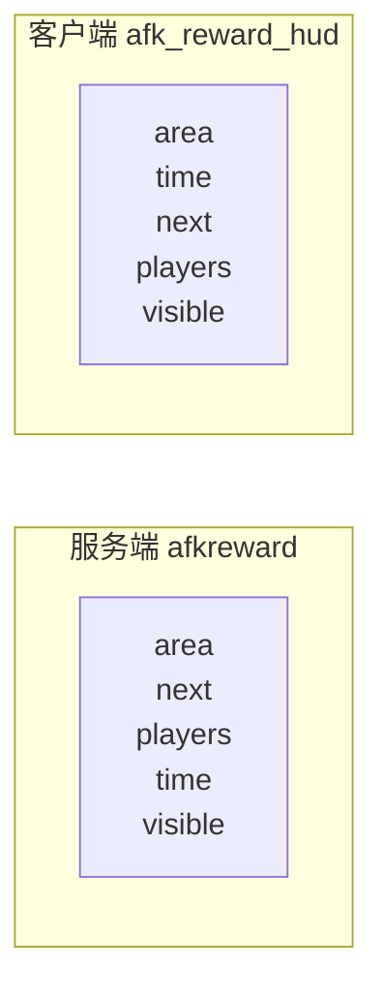
```mermaid
flowchart LR
    subgraph SRV_afkreward_afk_reward_hud["服务端 afkreward"]
        SRVF_afkreward_afk_reward_hud["area<br/>next<br/>players<br/>time<br/>visible"]
    end
    subgraph CLI_afkreward_afk_reward_hud["客户端 afk_reward_hud"]
        CLIV_afkreward_afk_reward_hud["area<br/>time<br/>next<br/>players<br/>visible"]
    end
```

**接收字段（服务端 → 客户端）**

| 字段名 | 说明 |
| --- | --- |
| `area` | |
| `next` | |
| `players` | |
| `time` | |
| `visible` | |

**本地变量（action.load / action.open 默认值）**

| 变量名 | 默认值 |
| --- | --- |
| `var.area` | `packet['area']` |
| `var.time` | `packet['time']` |
| `var.next` | `packet['next']` |
| `var.players` | `packet['players']` |
| `var.visible` | `packet['visible']` |

---

## announcer

### announcer_hud

**PacketHandler 事件**：`display`, `load`, `tick`

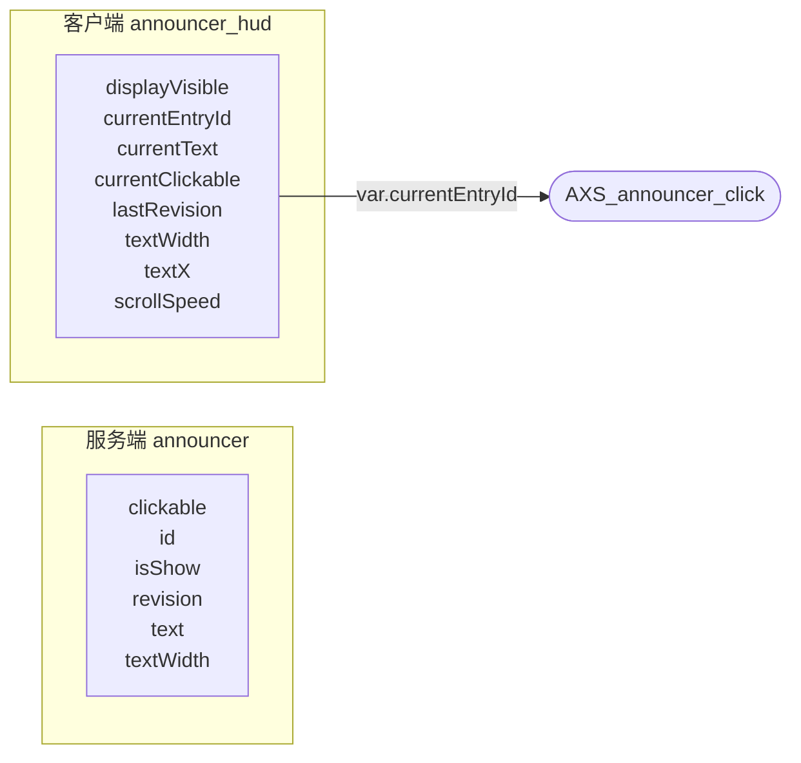
```mermaid
flowchart LR
    subgraph SRV_announcer_announcer_hud["服务端 announcer"]
        SRVF_announcer_announcer_hud["clickable<br/>id<br/>isShow<br/>revision<br/>text<br/>textWidth"]
    end
    subgraph CLI_announcer_announcer_hud["客户端 announcer_hud"]
        CLIV_announcer_announcer_hud["displayVisible<br/>currentEntryId<br/>currentText<br/>currentClickable<br/>lastRevision<br/>textWidth<br/>textX<br/>scrollSpeed"]
    end
    CLIV_announcer_announcer_hud -->|"var.currentEntryId"| SND_announcer_announcer_hud_0([""AXS_announcer_click""])
```

**接收字段（服务端 → 客户端）**

| 字段名 | 说明 |
| --- | --- |
| `clickable` | |
| `id` | |
| `isShow` | |
| `revision` | |
| `text` | |
| `textWidth` | |

**发送调用（客户端 → 服务端）**

| 目标路由 | Action | 参数 |
| --- | --- | --- |
| `"AXS_announcer_click"` | `var.currentEntryId` | `—` |

**本地变量（action.load / action.open 默认值）**

| 变量名 | 默认值 |
| --- | --- |
| `var.displayVisible` | `packet['isShow']` |
| `var.currentEntryId` | `packet['id']` |
| `var.currentText` | `packet['text']` |
| `var.currentClickable` | `packet['clickable']` |
| `var.lastRevision` | `packet['revision']` |
| `var.textWidth` | `packet['textWidth']` |
| `var.textX` | `Display.width()` |
| `var.scrollSpeed` | `1.5` |

---

### subtitle_hud

**PacketHandler 事件**：`play`, `close`, `load`

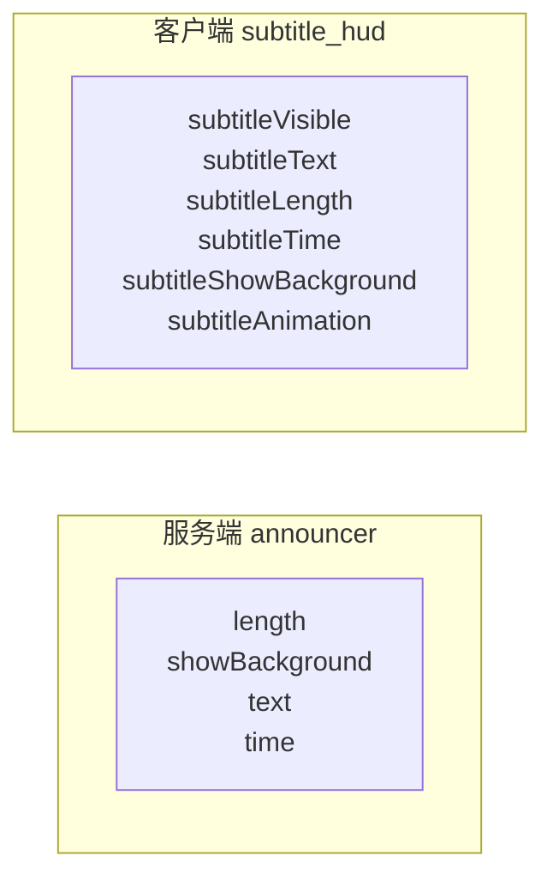
```mermaid
flowchart LR
    subgraph SRV_announcer_subtitle_hud["服务端 announcer"]
        SRVF_announcer_subtitle_hud["length<br/>showBackground<br/>text<br/>time"]
    end
    subgraph CLI_announcer_subtitle_hud["客户端 subtitle_hud"]
        CLIV_announcer_subtitle_hud["subtitleVisible<br/>subtitleText<br/>subtitleLength<br/>subtitleTime<br/>subtitleShowBackground<br/>subtitleAnimation"]
    end
```

**接收字段（服务端 → 客户端）**

| 字段名 | 说明 |
| --- | --- |
| `length` | |
| `showBackground` | |
| `text` | |
| `time` | |

**本地变量（action.load / action.open 默认值）**

| 变量名 | 默认值 |
| --- | --- |
| `var.subtitleVisible` | `true` |
| `var.subtitleText` | `packet['text']` |
| `var.subtitleLength` | `packet['length']` |
| `var.subtitleTime` | `packet['time']` |
| `var.subtitleShowBackground` | `packet['showBackground']` |
| `var.subtitleAnimation` | `Lerp(0, var.subtitleLength, var.subtitleTime)` |

---

## battlepass

### battlepass_main

**PacketHandler 事件**：`init`, `update`, `load`

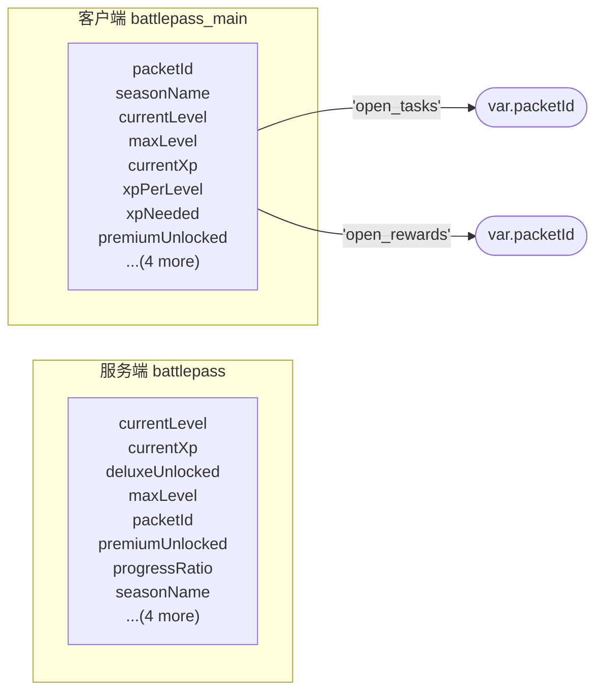
```mermaid
flowchart LR
    subgraph SRV_battlepass_battlepass_main["服务端 battlepass"]
        SRVF_battlepass_battlepass_main["currentLevel<br/>currentXp<br/>deluxeUnlocked<br/>maxLevel<br/>packetId<br/>premiumUnlocked<br/>progressRatio<br/>seasonName<br/>...(4 more)"]
    end
    subgraph CLI_battlepass_battlepass_main["客户端 battlepass_main"]
        CLIV_battlepass_battlepass_main["packetId<br/>seasonName<br/>currentLevel<br/>maxLevel<br/>currentXp<br/>xpPerLevel<br/>xpNeeded<br/>premiumUnlocked<br/>...(4 more)"]
    end
    CLIV_battlepass_battlepass_main -->|"'open_tasks'"| SND_battlepass_battlepass_main_0(["var.packetId"])
    CLIV_battlepass_battlepass_main -->|"'open_rewards'"| SND_battlepass_battlepass_main_1(["var.packetId"])
```

**接收字段（服务端 → 客户端）**

| 字段名 | 说明 |
| --- | --- |
| `currentLevel` | |
| `currentXp` | |
| `deluxeUnlocked` | |
| `maxLevel` | |
| `packetId` | |
| `premiumUnlocked` | |
| `progressRatio` | |
| `seasonName` | |
| `tier` | |
| `tierDisplay` | |
| `xpNeeded` | |
| `xpPerLevel` | |

**发送调用（客户端 → 服务端）**

| 目标路由 | Action | 参数 |
| --- | --- | --- |
| `var.packetId` | `'open_tasks'` | `—` |
| `var.packetId` | `'open_rewards'` | `—` |

**本地变量（action.load / action.open 默认值）**

| 变量名 | 默认值 |
| --- | --- |
| `var.packetId` | `packet['packetId']` |
| `var.seasonName` | `packet['seasonName']` |
| `var.currentLevel` | `packet['currentLevel']` |
| `var.maxLevel` | `packet['maxLevel']` |
| `var.currentXp` | `packet['currentXp']` |
| `var.xpPerLevel` | `packet['xpPerLevel']` |
| `var.xpNeeded` | `packet['xpNeeded']` |
| `var.premiumUnlocked` | `packet['premiumUnlocked']` |
| `var.deluxeUnlocked` | `packet['deluxeUnlocked']` |
| `var.tier` | `packet['tier']` |
| `var.tierDisplay` | `packet['tierDisplay']` |
| `var.progressRatio` | `packet['progressRatio']` |

---

### battlepass_tasks

**PacketHandler 事件**：`init`, `update`, `open`

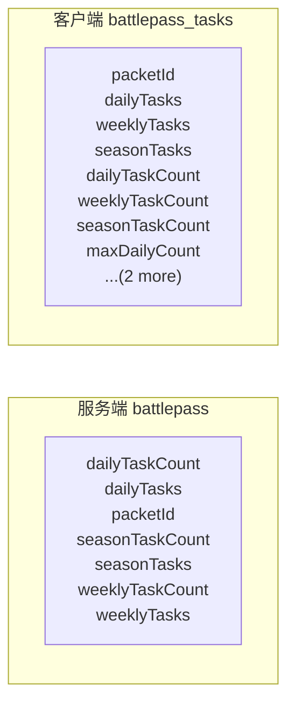
```mermaid
flowchart LR
    subgraph SRV_battlepass_battlepass_tasks["服务端 battlepass"]
        SRVF_battlepass_battlepass_tasks["dailyTaskCount<br/>dailyTasks<br/>packetId<br/>seasonTaskCount<br/>seasonTasks<br/>weeklyTaskCount<br/>weeklyTasks"]
    end
    subgraph CLI_battlepass_battlepass_tasks["客户端 battlepass_tasks"]
        CLIV_battlepass_battlepass_tasks["packetId<br/>dailyTasks<br/>weeklyTasks<br/>seasonTasks<br/>dailyTaskCount<br/>weeklyTaskCount<br/>seasonTaskCount<br/>maxDailyCount<br/>...(2 more)"]
    end
```

**接收字段（服务端 → 客户端）**

| 字段名 | 说明 |
| --- | --- |
| `dailyTaskCount` | |
| `dailyTasks` | |
| `packetId` | |
| `seasonTaskCount` | |
| `seasonTasks` | |
| `weeklyTaskCount` | |
| `weeklyTasks` | |

**本地变量（action.load / action.open 默认值）**

| 变量名 | 默认值 |
| --- | --- |
| `var.packetId` | `packet['packetId']` |
| `var.dailyTasks` | `packet['dailyTasks']` |
| `var.weeklyTasks` | `packet['weeklyTasks']` |
| `var.seasonTasks` | `packet['seasonTasks']` |
| `var.dailyTaskCount` | `packet['dailyTaskCount']` |
| `var.weeklyTaskCount` | `packet['weeklyTaskCount']` |
| `var.seasonTaskCount` | `packet['seasonTaskCount']` |
| `var.maxDailyCount` | `10` |
| `var.maxWeeklyCount` | `10` |
| `var.maxSeasonCount` | `10` |

---

## combateffect

### combat_kill_effect

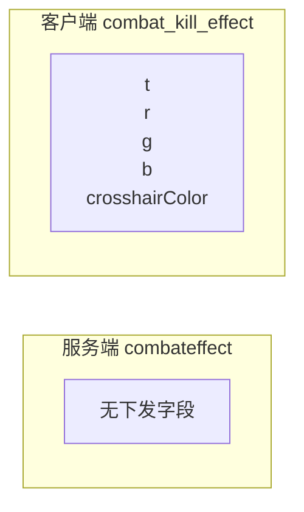
```mermaid
flowchart LR
    subgraph SRV_combateffect_combat_kill_effect["服务端 combateffect"]
        SRVF_combateffect_combat_kill_effect["无下发字段"]
    end
    subgraph CLI_combateffect_combat_kill_effect["客户端 combat_kill_effect"]
        CLIV_combateffect_combat_kill_effect["t<br/>r<br/>g<br/>b<br/>crosshairColor"]
    end
```

**本地变量（action.load / action.open 默认值）**

| 变量名 | 默认值 |
| --- | --- |
| `var.t` | `Time.currentTime() / 1000.0` |
| `var.r` | `Cast.toInt(128 + 127 * Math.sin(var.t * 3)).round()` |
| `var.g` | `Cast.toInt(128 + 127 * Math.sin(var.t * 3 + 2.094)).round()` |
| `var.b` | `Cast.toInt(128 + 127 * Math.sin(var.t * 3 + 4.189)).round()` |
| `var.crosshairColor` | `var.r + ',' + var.g + ',' + var.b + ',200'` |

---

### combo_effect

**PacketHandler 事件**：`combo`, `combo_milestone`

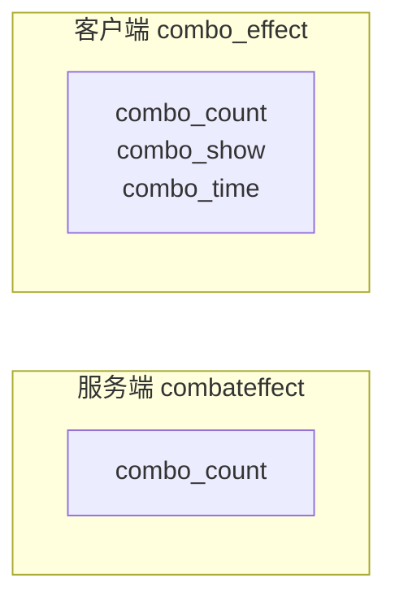
```mermaid
flowchart LR
    subgraph SRV_combateffect_combo_effect["服务端 combateffect"]
        SRVF_combateffect_combo_effect["combo_count"]
    end
    subgraph CLI_combateffect_combo_effect["客户端 combo_effect"]
        CLIV_combateffect_combo_effect["combo_count<br/>combo_show<br/>combo_time"]
    end
```

**接收字段（服务端 → 客户端）**

| 字段名 | 说明 |
| --- | --- |
| `combo_count` | |

**本地变量（action.load / action.open 默认值）**

| 变量名 | 默认值 |
| --- | --- |
| `var.combo_count` | `Cast.toInt(packet['combo_count'])` |
| `var.combo_show` | `true` |
| `var.combo_time` | `Time.currentTime()` |

---

### death_buffer

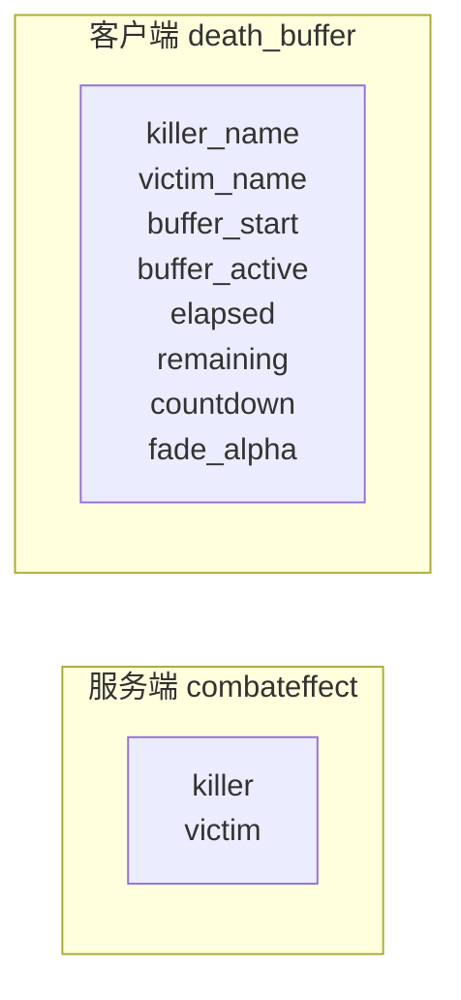
```mermaid
flowchart LR
    subgraph SRV_combateffect_death_buffer["服务端 combateffect"]
        SRVF_combateffect_death_buffer["killer<br/>victim"]
    end
    subgraph CLI_combateffect_death_buffer["客户端 death_buffer"]
        CLIV_combateffect_death_buffer["killer_name<br/>victim_name<br/>buffer_start<br/>buffer_active<br/>elapsed<br/>remaining<br/>countdown<br/>fade_alpha"]
    end
```

**接收字段（服务端 → 客户端）**

| 字段名 | 说明 |
| --- | --- |
| `killer` | |
| `victim` | |

**本地变量（action.load / action.open 默认值）**

| 变量名 | 默认值 |
| --- | --- |
| `var.killer_name` | `packet['killer']` |
| `var.victim_name` | `packet['victim']` |
| `var.buffer_start` | `Time.currentTime()` |
| `var.buffer_active` | `true` |
| `var.elapsed` | `Time.currentTime() - var.buffer_start` |
| `var.remaining` | `Math.max(0, 3000 - var.elapsed)` |
| `var.countdown` | `Cast.toInt(var.remaining / 1000) + 1` |
| `var.fade_alpha` | `Math.min(200, Cast.toInt(var.elapsed * 200 / 1500))` |

---

## conversation

### conversation_dialog

**PacketHandler 事件**：`sync`, `close`, `load`, `keyPress`

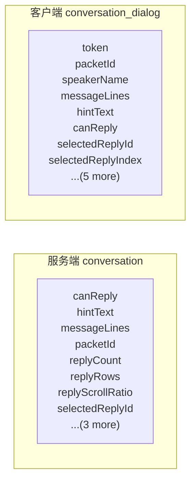
```mermaid
flowchart LR
    subgraph SRV_conversation_conversation_dialog["服务端 conversation"]
        SRVF_conversation_conversation_dialog["canReply<br/>hintText<br/>messageLines<br/>packetId<br/>replyCount<br/>replyRows<br/>replyScrollRatio<br/>selectedReplyId<br/>...(3 more)"]
    end
    subgraph CLI_conversation_conversation_dialog["客户端 conversation_dialog"]
        CLIV_conversation_conversation_dialog["token<br/>packetId<br/>speakerName<br/>messageLines<br/>hintText<br/>canReply<br/>selectedReplyId<br/>selectedReplyIndex<br/>...(5 more)"]
    end
```

**接收字段（服务端 → 客户端）**

| 字段名 | 说明 |
| --- | --- |
| `canReply` | |
| `hintText` | |
| `messageLines` | |
| `packetId` | |
| `replyCount` | |
| `replyRows` | |
| `replyScrollRatio` | |
| `selectedReplyId` | |
| `selectedReplyIndex` | |
| `speakerName` | |
| `token` | |

**本地变量（action.load / action.open 默认值）**

| 变量名 | 默认值 |
| --- | --- |
| `var.token` | `packet['token']` |
| `var.packetId` | `packet['packetId']` |
| `var.speakerName` | `packet['speakerName']` |
| `var.messageLines` | `packet['messageLines']` |
| `var.hintText` | `packet['hintText']` |
| `var.canReply` | `packet['canReply']` |
| `var.selectedReplyId` | `packet['selectedReplyId']` |
| `var.selectedReplyIndex` | `packet['selectedReplyIndex']` |
| `var.replyCount` | `packet['replyCount']` |
| `var.replyScrollRatio` | `packet['replyScrollRatio']` |
| `var.replyRows` | `packet['replyRows']` |
| `var.k` | `self.currentKeyPress` |
| `var.rowKey` | `"r000" + (var.k - 1)` |

---

### conversation_selector

**PacketHandler 事件**：`sync`, `close`, `load`

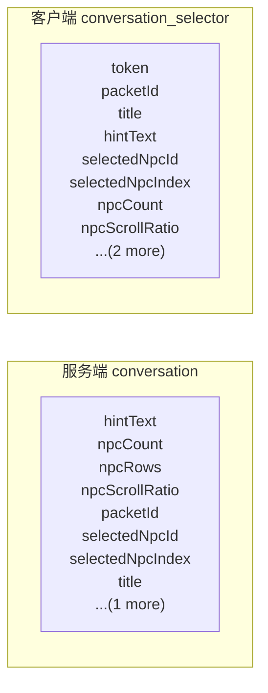
```mermaid
flowchart LR
    subgraph SRV_conversation_conversation_selector["服务端 conversation"]
        SRVF_conversation_conversation_selector["hintText<br/>npcCount<br/>npcRows<br/>npcScrollRatio<br/>packetId<br/>selectedNpcId<br/>selectedNpcIndex<br/>title<br/>...(1 more)"]
    end
    subgraph CLI_conversation_conversation_selector["客户端 conversation_selector"]
        CLIV_conversation_conversation_selector["token<br/>packetId<br/>title<br/>hintText<br/>selectedNpcId<br/>selectedNpcIndex<br/>npcCount<br/>npcScrollRatio<br/>...(2 more)"]
    end
```

**接收字段（服务端 → 客户端）**

| 字段名 | 说明 |
| --- | --- |
| `hintText` | |
| `npcCount` | |
| `npcRows` | |
| `npcScrollRatio` | |
| `packetId` | |
| `selectedNpcId` | |
| `selectedNpcIndex` | |
| `title` | |
| `token` | |

**本地变量（action.load / action.open 默认值）**

| 变量名 | 默认值 |
| --- | --- |
| `var.token` | `packet['token']` |
| `var.packetId` | `packet['packetId']` |
| `var.title` | `packet['title']` |
| `var.hintText` | `packet['hintText']` |
| `var.selectedNpcId` | `packet['selectedNpcId']` |
| `var.selectedNpcIndex` | `packet['selectedNpcIndex']` |
| `var.npcCount` | `packet['npcCount']` |
| `var.npcScrollRatio` | `packet['npcScrollRatio']` |
| `var.npcRows` | `packet['npcRows']` |
| `var.maxNpcCount` | `128` |

---

## entitytracker

### attack_target_hud

**PacketHandler 事件**：`init`, `update`, `close`, `load`

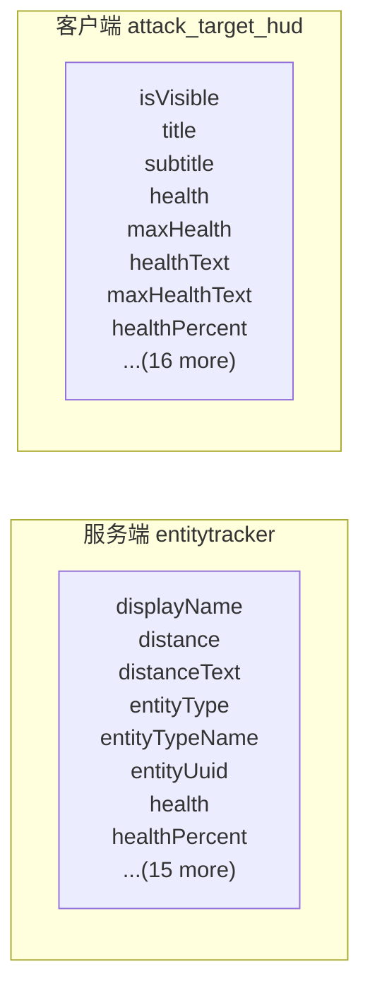
```mermaid
flowchart LR
    subgraph SRV_entitytracker_attack_target_hud["服务端 entitytracker"]
        SRVF_entitytracker_attack_target_hud["displayName<br/>distance<br/>distanceText<br/>entityType<br/>entityTypeName<br/>entityUuid<br/>health<br/>healthPercent<br/>...(15 more)"]
    end
    subgraph CLI_entitytracker_attack_target_hud["客户端 attack_target_hud"]
        CLIV_entitytracker_attack_target_hud["isVisible<br/>title<br/>subtitle<br/>health<br/>maxHealth<br/>healthText<br/>maxHealthText<br/>healthPercent<br/>...(16 more)"]
    end
```

**接收字段（服务端 → 客户端）**

| 字段名 | 说明 |
| --- | --- |
| `displayName` | |
| `distance` | |
| `distanceText` | |
| `entityType` | |
| `entityTypeName` | |
| `entityUuid` | |
| `health` | |
| `healthPercent` | |
| `healthPercentText` | |
| `healthText` | |
| `isPlayerTarget` | |
| `lastHitAgoMs` | |
| `maxHealth` | |
| `maxHealthText` | |
| `mythicMobId` | |
| `progress` | |
| `subtitle` | |
| `timeoutMs` | |
| `title` | |
| `world` | |
| `x` | |
| `y` | |
| `z` | |

**本地变量（action.load / action.open 默认值）**

| 变量名 | 默认值 |
| --- | --- |
| `var.isVisible` | `true` |
| `var.title` | `packet['title']` |
| `var.subtitle` | `packet['subtitle']` |
| `var.health` | `packet['health']` |
| `var.maxHealth` | `packet['maxHealth']` |
| `var.healthText` | `packet['healthText']` |
| `var.maxHealthText` | `packet['maxHealthText']` |
| `var.healthPercent` | `packet['healthPercent']` |
| `var.healthPercentText` | `packet['healthPercentText']` |
| `var.progress` | `packet['progress']` |
| `var.distance` | `packet['distance']` |
| `var.distanceText` | `packet['distanceText']` |
| `var.displayName` | `packet['displayName']` |
| `var.entityUuid` | `packet['entityUuid']` |
| `var.world` | `packet['world']` |
| `var.x` | `packet['x']` |
| `var.y` | `packet['y']` |
| `var.z` | `packet['z']` |
| `var.entityType` | `packet['entityType']` |
| `var.entityTypeName` | `packet['entityTypeName']` |
| ... | 共 24 个变量 |

---

### boss_tracker

**PacketHandler 事件**：`init`, `update`, `close`, `load`

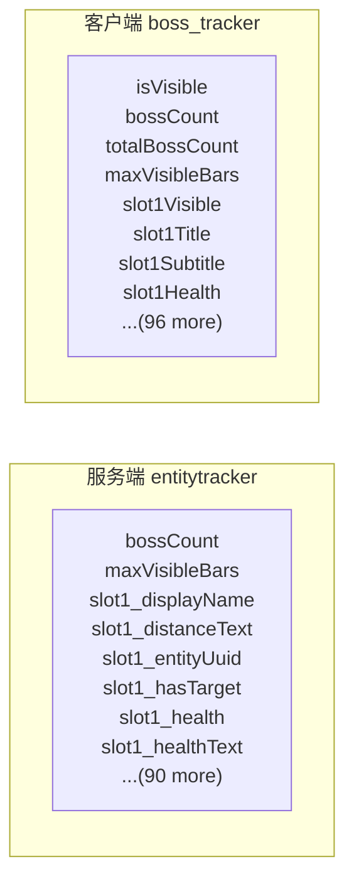
```mermaid
flowchart LR
    subgraph SRV_entitytracker_boss_tracker["服务端 entitytracker"]
        SRVF_entitytracker_boss_tracker["bossCount<br/>maxVisibleBars<br/>slot1_displayName<br/>slot1_distanceText<br/>slot1_entityUuid<br/>slot1_hasTarget<br/>slot1_health<br/>slot1_healthText<br/>...(90 more)"]
    end
    subgraph CLI_entitytracker_boss_tracker["客户端 boss_tracker"]
        CLIV_entitytracker_boss_tracker["isVisible<br/>bossCount<br/>totalBossCount<br/>maxVisibleBars<br/>slot1Visible<br/>slot1Title<br/>slot1Subtitle<br/>slot1Health<br/>...(96 more)"]
    end
```

**接收字段（服务端 → 客户端）**

| 字段名 | 说明 |
| --- | --- |
| `bossCount` | |
| `maxVisibleBars` | |
| `slot1_displayName` | |
| `slot1_distanceText` | |
| `slot1_entityUuid` | |
| `slot1_hasTarget` | |
| `slot1_health` | |
| `slot1_healthText` | |
| `slot1_maxHealth` | |
| `slot1_maxHealthText` | |
| `slot1_mobId` | |
| `slot1_progress` | |
| `slot1_spawnOrder` | |
| `slot1_subtitle` | |
| `slot1_targetDisplayName` | |
| `slot1_targetType` | |
| `slot1_targetUuid` | |
| `slot1_title` | |
| `slot1_viewerDamageText` | |
| `slot1_viewerRankText` | |
| `slot1_visible` | |
| `slot2_displayName` | |
| `slot2_distanceText` | |
| `slot2_entityUuid` | |
| `slot2_hasTarget` | |
| `slot2_health` | |
| `slot2_healthText` | |
| `slot2_maxHealth` | |
| `slot2_maxHealthText` | |
| `slot2_mobId` | |
| `slot2_progress` | |
| `slot2_spawnOrder` | |
| `slot2_subtitle` | |
| `slot2_targetDisplayName` | |
| `slot2_targetType` | |
| `slot2_targetUuid` | |
| `slot2_title` | |
| `slot2_viewerDamageText` | |
| `slot2_viewerRankText` | |
| `slot2_visible` | |
| `slot3_displayName` | |
| `slot3_distanceText` | |
| `slot3_entityUuid` | |
| `slot3_hasTarget` | |
| `slot3_health` | |
| `slot3_healthText` | |
| `slot3_maxHealth` | |
| `slot3_maxHealthText` | |
| `slot3_mobId` | |
| `slot3_progress` | |
| `slot3_spawnOrder` | |
| `slot3_subtitle` | |
| `slot3_targetDisplayName` | |
| `slot3_targetType` | |
| `slot3_targetUuid` | |
| `slot3_title` | |
| `slot3_viewerDamageText` | |
| `slot3_viewerRankText` | |
| `slot3_visible` | |
| `slot4_displayName` | |
| `slot4_distanceText` | |
| `slot4_entityUuid` | |
| `slot4_hasTarget` | |
| `slot4_health` | |
| `slot4_healthText` | |
| `slot4_maxHealth` | |
| `slot4_maxHealthText` | |
| `slot4_mobId` | |
| `slot4_progress` | |
| `slot4_spawnOrder` | |
| `slot4_subtitle` | |
| `slot4_targetDisplayName` | |
| `slot4_targetType` | |
| `slot4_targetUuid` | |
| `slot4_title` | |
| `slot4_viewerDamageText` | |
| `slot4_viewerRankText` | |
| `slot4_visible` | |
| `slot5_displayName` | |
| `slot5_distanceText` | |
| `slot5_entityUuid` | |
| `slot5_hasTarget` | |
| `slot5_health` | |
| `slot5_healthText` | |
| `slot5_maxHealth` | |
| `slot5_maxHealthText` | |
| `slot5_mobId` | |
| `slot5_progress` | |
| `slot5_spawnOrder` | |
| `slot5_subtitle` | |
| `slot5_targetDisplayName` | |
| `slot5_targetType` | |
| `slot5_targetUuid` | |
| `slot5_title` | |
| `slot5_viewerDamageText` | |
| `slot5_viewerRankText` | |
| `slot5_visible` | |
| `totalBossCount` | |

**本地变量（action.load / action.open 默认值）**

| 变量名 | 默认值 |
| --- | --- |
| `var.isVisible` | `true` |
| `var.bossCount` | `packet['bossCount']` |
| `var.totalBossCount` | `packet['totalBossCount']` |
| `var.maxVisibleBars` | `packet['maxVisibleBars']` |
| `var.slot1Visible` | `packet['slot1_visible']` |
| `var.slot1Title` | `packet['slot1_title']` |
| `var.slot1Subtitle` | `packet['slot1_subtitle']` |
| `var.slot1Health` | `packet['slot1_health']` |
| `var.slot1MaxHealth` | `packet['slot1_maxHealth']` |
| `var.slot1HealthText` | `packet['slot1_healthText']` |
| `var.slot1MaxHealthText` | `packet['slot1_maxHealthText']` |
| `var.slot1DistanceText` | `packet['slot1_distanceText']` |
| `var.slot1Progress` | `packet['slot1_progress']` |
| `var.slot1MobId` | `packet['slot1_mobId']` |
| `var.slot1DisplayName` | `packet['slot1_displayName']` |
| `var.slot1EntityUuid` | `packet['slot1_entityUuid']` |
| `var.slot1HasTarget` | `packet['slot1_hasTarget']` |
| `var.slot1TargetDisplayName` | `packet['slot1_targetDisplayName']` |
| `var.slot1TargetUuid` | `packet['slot1_targetUuid']` |
| `var.slot1TargetType` | `packet['slot1_targetType']` |
| ... | 共 104 个变量 |

---

### ranking_rewards

**PacketHandler 事件**：`list`, `result`

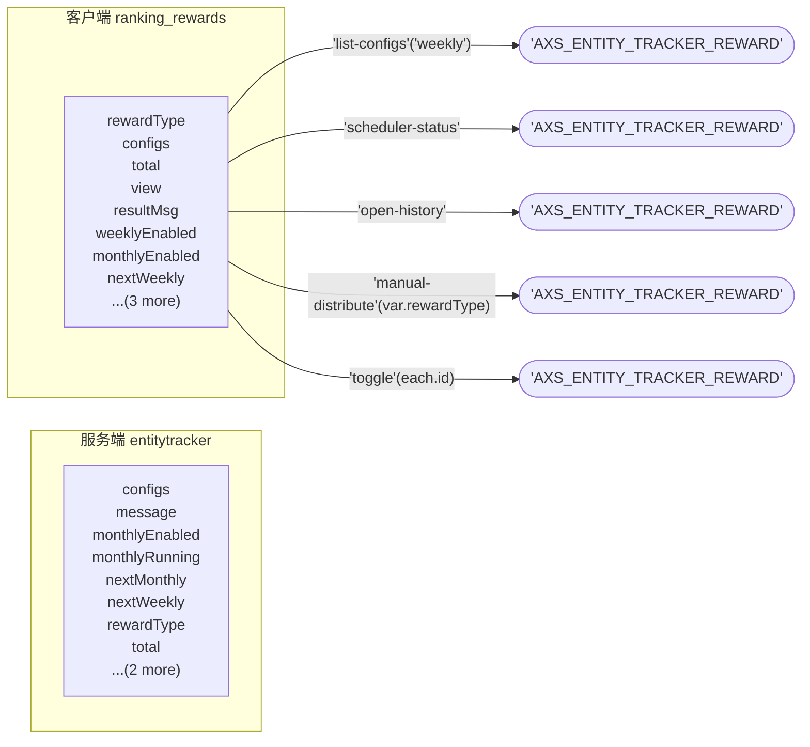
```mermaid
flowchart LR
    subgraph SRV_entitytracker_ranking_rewards["服务端 entitytracker"]
        SRVF_entitytracker_ranking_rewards["configs<br/>message<br/>monthlyEnabled<br/>monthlyRunning<br/>nextMonthly<br/>nextWeekly<br/>rewardType<br/>total<br/>...(2 more)"]
    end
    subgraph CLI_entitytracker_ranking_rewards["客户端 ranking_rewards"]
        CLIV_entitytracker_ranking_rewards["rewardType<br/>configs<br/>total<br/>view<br/>resultMsg<br/>weeklyEnabled<br/>monthlyEnabled<br/>nextWeekly<br/>...(3 more)"]
    end
    CLIV_entitytracker_ranking_rewards -->|"'list-configs'('weekly')"| SND_entitytracker_ranking_rewards_0(["'AXS_ENTITY_TRACKER_REWARD'"])
    CLIV_entitytracker_ranking_rewards -->|"'scheduler-status'"| SND_entitytracker_ranking_rewards_2(["'AXS_ENTITY_TRACKER_REWARD'"])
    CLIV_entitytracker_ranking_rewards -->|"'open-history'"| SND_entitytracker_ranking_rewards_3(["'AXS_ENTITY_TRACKER_REWARD'"])
    CLIV_entitytracker_ranking_rewards -->|"'manual-distribute'(var.rewardType)"| SND_entitytracker_ranking_rewards_4(["'AXS_ENTITY_TRACKER_REWARD'"])
    CLIV_entitytracker_ranking_rewards -->|"'toggle'(each.id)"| SND_entitytracker_ranking_rewards_5(["'AXS_ENTITY_TRACKER_REWARD'"])
```

**接收字段（服务端 → 客户端）**

| 字段名 | 说明 |
| --- | --- |
| `configs` | |
| `message` | |
| `monthlyEnabled` | |
| `monthlyRunning` | |
| `nextMonthly` | |
| `nextWeekly` | |
| `rewardType` | |
| `total` | |
| `weeklyEnabled` | |
| `weeklyRunning` | |

**发送调用（客户端 → 服务端）**

| 目标路由 | Action | 参数 |
| --- | --- | --- |
| `'AXS_ENTITY_TRACKER_REWARD'` | `'list-configs'` | `'weekly'` |
| `'AXS_ENTITY_TRACKER_REWARD'` | `'list-configs'` | `'monthly'` |
| `'AXS_ENTITY_TRACKER_REWARD'` | `'scheduler-status'` | `—` |
| `'AXS_ENTITY_TRACKER_REWARD'` | `'open-history'` | `—` |
| `'AXS_ENTITY_TRACKER_REWARD'` | `'manual-distribute'` | `var.rewardType` |
| `'AXS_ENTITY_TRACKER_REWARD'` | `'toggle'` | `each.id` |
| `'AXS_ENTITY_TRACKER_REWARD'` | `'list-configs'` | `var.rewardType` |

**本地变量（action.load / action.open 默认值）**

| 变量名 | 默认值 |
| --- | --- |
| `var.rewardType` | `packet['rewardType']` |
| `var.configs` | `packet['configs']` |
| `var.total` | `packet['total']` |
| `var.view` | `'list'` |
| `var.resultMsg` | `''` |
| `var.weeklyEnabled` | `packet['weeklyEnabled']` |
| `var.monthlyEnabled` | `packet['monthlyEnabled']` |
| `var.nextWeekly` | `packet['nextWeekly']` |
| `var.nextMonthly` | `packet['nextMonthly']` |
| `var.weeklyRunning` | `packet['weeklyRunning']` |
| `var.monthlyRunning` | `packet['monthlyRunning']` |

---

### reward_editor

**PacketHandler 事件**：`detail`, `result`

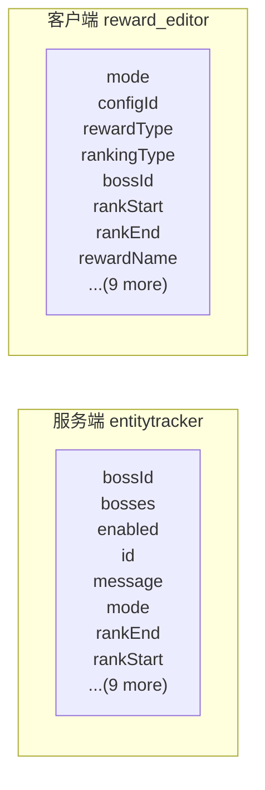
```mermaid
flowchart LR
    subgraph SRV_entitytracker_reward_editor["服务端 entitytracker"]
        SRVF_entitytracker_reward_editor["bossId<br/>bosses<br/>enabled<br/>id<br/>message<br/>mode<br/>rankEnd<br/>rankStart<br/>...(9 more)"]
    end
    subgraph CLI_entitytracker_reward_editor["客户端 reward_editor"]
        CLIV_entitytracker_reward_editor["mode<br/>configId<br/>rewardType<br/>rankingType<br/>bossId<br/>rankStart<br/>rankEnd<br/>rewardName<br/>...(9 more)"]
    end
```

**接收字段（服务端 → 客户端）**

| 字段名 | 说明 |
| --- | --- |
| `bossId` | |
| `bosses` | |
| `enabled` | |
| `id` | |
| `message` | |
| `mode` | |
| `rankEnd` | |
| `rankStart` | |
| `rankingType` | |
| `rewardCommandsPreview` | |
| `rewardDescription` | |
| `rewardDkp` | |
| `rewardItemsPreview` | |
| `rewardMoney` | |
| `rewardName` | |
| `rewardType` | |
| `success` | |

**本地变量（action.load / action.open 默认值）**

| 变量名 | 默认值 |
| --- | --- |
| `var.mode` | `packet['mode']` |
| `var.configId` | `packet['id']` |
| `var.rewardType` | `packet['rewardType']` |
| `var.rankingType` | `packet['rankingType']` |
| `var.bossId` | `packet['bossId']` |
| `var.rankStart` | `packet['rankStart']` |
| `var.rankEnd` | `packet['rankEnd']` |
| `var.rewardName` | `packet['rewardName']` |
| `var.rewardDescription` | `packet['rewardDescription']` |
| `var.rewardMoney` | `packet['rewardMoney']` |
| `var.rewardDkp` | `packet['rewardDkp']` |
| `var.rewardItemsPreview` | `packet['rewardItemsPreview']` |
| `var.rewardCommandsPreview` | `packet['rewardCommandsPreview']` |
| `var.enabled` | `packet['enabled']` |
| `var.resultMsg` | `''` |
| `var.bossList` | `packet['bosses']` |
| `var.saved` | `packet['success']` |

---

### reward_history

**PacketHandler 事件**：`list`, `statistics`, `result`

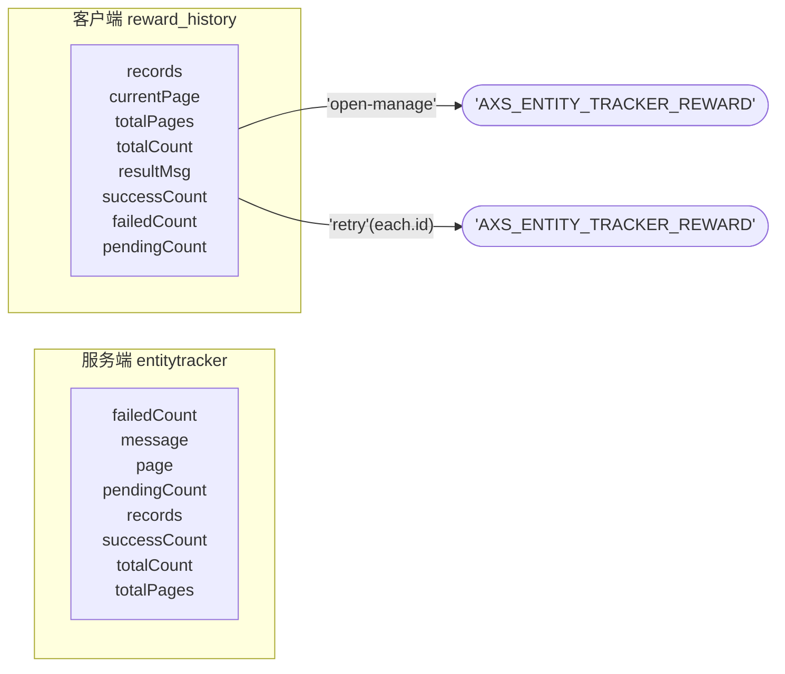
```mermaid
flowchart LR
    subgraph SRV_entitytracker_reward_history["服务端 entitytracker"]
        SRVF_entitytracker_reward_history["failedCount<br/>message<br/>page<br/>pendingCount<br/>records<br/>successCount<br/>totalCount<br/>totalPages"]
    end
    subgraph CLI_entitytracker_reward_history["客户端 reward_history"]
        CLIV_entitytracker_reward_history["records<br/>currentPage<br/>totalPages<br/>totalCount<br/>resultMsg<br/>successCount<br/>failedCount<br/>pendingCount"]
    end
    CLIV_entitytracker_reward_history -->|"'open-manage'"| SND_entitytracker_reward_history_0(["'AXS_ENTITY_TRACKER_REWARD'"])
    CLIV_entitytracker_reward_history -->|"'retry'(each.id)"| SND_entitytracker_reward_history_1(["'AXS_ENTITY_TRACKER_REWARD'"])
```

**接收字段（服务端 → 客户端）**

| 字段名 | 说明 |
| --- | --- |
| `failedCount` | |
| `message` | |
| `page` | |
| `pendingCount` | |
| `records` | |
| `successCount` | |
| `totalCount` | |
| `totalPages` | |

**发送调用（客户端 → 服务端）**

| 目标路由 | Action | 参数 |
| --- | --- | --- |
| `'AXS_ENTITY_TRACKER_REWARD'` | `'open-manage'` | `—` |
| `'AXS_ENTITY_TRACKER_REWARD'` | `'retry'` | `each.id` |

**本地变量（action.load / action.open 默认值）**

| 变量名 | 默认值 |
| --- | --- |
| `var.records` | `packet['records']` |
| `var.currentPage` | `packet['page']` |
| `var.totalPages` | `packet['totalPages']` |
| `var.totalCount` | `packet['totalCount']` |
| `var.resultMsg` | `''` |
| `var.successCount` | `packet['successCount']` |
| `var.failedCount` | `packet['failedCount']` |
| `var.pendingCount` | `packet['pendingCount']` |

---

## essentials

### essentials_admin

**PacketHandler 事件**：`init`

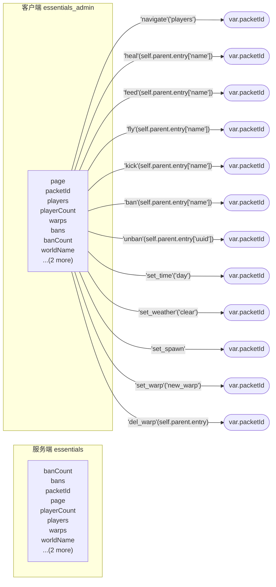
```mermaid
flowchart LR
    subgraph SRV_essentials_essentials_admin["服务端 essentials"]
        SRVF_essentials_essentials_admin["banCount<br/>bans<br/>packetId<br/>page<br/>playerCount<br/>players<br/>warps<br/>worldName<br/>...(2 more)"]
    end
    subgraph CLI_essentials_essentials_admin["客户端 essentials_admin"]
        CLIV_essentials_essentials_admin["page<br/>packetId<br/>players<br/>playerCount<br/>warps<br/>bans<br/>banCount<br/>worldName<br/>...(2 more)"]
    end
    CLIV_essentials_essentials_admin -->|"'navigate'('players')"| SND_essentials_essentials_admin_0(["var.packetId"])
    CLIV_essentials_essentials_admin -->|"'heal'(self.parent.entry['name'])"| SND_essentials_essentials_admin_4(["var.packetId"])
    CLIV_essentials_essentials_admin -->|"'feed'(self.parent.entry['name'])"| SND_essentials_essentials_admin_5(["var.packetId"])
    CLIV_essentials_essentials_admin -->|"'fly'(self.parent.entry['name'])"| SND_essentials_essentials_admin_6(["var.packetId"])
    CLIV_essentials_essentials_admin -->|"'kick'(self.parent.entry['name'])"| SND_essentials_essentials_admin_7(["var.packetId"])
    CLIV_essentials_essentials_admin -->|"'ban'(self.parent.entry['name'])"| SND_essentials_essentials_admin_8(["var.packetId"])
    CLIV_essentials_essentials_admin -->|"'unban'(self.parent.entry['uuid'])"| SND_essentials_essentials_admin_9(["var.packetId"])
    CLIV_essentials_essentials_admin -->|"'set_time'('day')"| SND_essentials_essentials_admin_10(["var.packetId"])
    CLIV_essentials_essentials_admin -->|"'set_weather'('clear')"| SND_essentials_essentials_admin_13(["var.packetId"])
    CLIV_essentials_essentials_admin -->|"'set_spawn'"| SND_essentials_essentials_admin_16(["var.packetId"])
    CLIV_essentials_essentials_admin -->|"'set_warp'('new_warp')"| SND_essentials_essentials_admin_17(["var.packetId"])
    CLIV_essentials_essentials_admin -->|"'del_warp'(self.parent.entry)"| SND_essentials_essentials_admin_18(["var.packetId"])
```

**接收字段（服务端 → 客户端）**

| 字段名 | 说明 |
| --- | --- |
| `banCount` | |
| `bans` | |
| `packetId` | |
| `page` | |
| `playerCount` | |
| `players` | |
| `warps` | |
| `worldName` | |
| `worldTime` | |
| `worldWeather` | |

**发送调用（客户端 → 服务端）**

| 目标路由 | Action | 参数 |
| --- | --- | --- |
| `var.packetId` | `'navigate'` | `'players'` |
| `var.packetId` | `'navigate'` | `'bans'` |
| `var.packetId` | `'navigate'` | `'warps'` |
| `var.packetId` | `'navigate'` | `'world'` |
| `var.packetId` | `'heal'` | `self.parent.entry['name']` |
| `var.packetId` | `'feed'` | `self.parent.entry['name']` |
| `var.packetId` | `'fly'` | `self.parent.entry['name']` |
| `var.packetId` | `'kick'` | `self.parent.entry['name']` |
| `var.packetId` | `'ban'` | `self.parent.entry['name']` |
| `var.packetId` | `'unban'` | `self.parent.entry['uuid']` |
| `var.packetId` | `'set_time'` | `'day'` |
| `var.packetId` | `'set_time'` | `'night'` |
| `var.packetId` | `'set_time'` | `'noon'` |
| `var.packetId` | `'set_weather'` | `'clear'` |
| `var.packetId` | `'set_weather'` | `'rain'` |
| `var.packetId` | `'set_weather'` | `'thunder'` |
| `var.packetId` | `'set_spawn'` | `—` |
| `var.packetId` | `'set_warp'` | `'new_warp'` |
| `var.packetId` | `'del_warp'` | `self.parent.entry` |

**本地变量（action.load / action.open 默认值）**

| 变量名 | 默认值 |
| --- | --- |
| `var.page` | `packet['page']` |
| `var.packetId` | `packet['packetId']` |
| `var.players` | `packet['players']` |
| `var.playerCount` | `packet['playerCount']` |
| `var.warps` | `packet['warps']` |
| `var.bans` | `packet['bans']` |
| `var.banCount` | `packet['banCount']` |
| `var.worldName` | `packet['worldName']` |
| `var.worldTime` | `packet['worldTime']` |
| `var.worldWeather` | `packet['worldWeather']` |

---

### essentials_menu

**PacketHandler 事件**：`init`

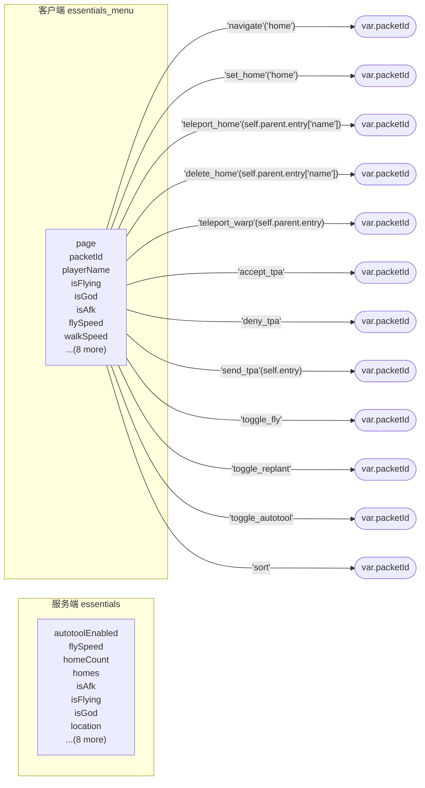
```mermaid
flowchart LR
    subgraph SRV_essentials_essentials_menu["服务端 essentials"]
        SRVF_essentials_essentials_menu["autotoolEnabled<br/>flySpeed<br/>homeCount<br/>homes<br/>isAfk<br/>isFlying<br/>isGod<br/>location<br/>...(8 more)"]
    end
    subgraph CLI_essentials_essentials_menu["客户端 essentials_menu"]
        CLIV_essentials_essentials_menu["page<br/>packetId<br/>playerName<br/>isFlying<br/>isGod<br/>isAfk<br/>flySpeed<br/>walkSpeed<br/>...(8 more)"]
    end
    CLIV_essentials_essentials_menu -->|"'navigate'('home')"| SND_essentials_essentials_menu_0(["var.packetId"])
    CLIV_essentials_essentials_menu -->|"'set_home'('home')"| SND_essentials_essentials_menu_5(["var.packetId"])
    CLIV_essentials_essentials_menu -->|"'teleport_home'(self.parent.entry['name'])"| SND_essentials_essentials_menu_6(["var.packetId"])
    CLIV_essentials_essentials_menu -->|"'delete_home'(self.parent.entry['name'])"| SND_essentials_essentials_menu_7(["var.packetId"])
    CLIV_essentials_essentials_menu -->|"'teleport_warp'(self.parent.entry)"| SND_essentials_essentials_menu_8(["var.packetId"])
    CLIV_essentials_essentials_menu -->|"'accept_tpa'"| SND_essentials_essentials_menu_9(["var.packetId"])
    CLIV_essentials_essentials_menu -->|"'deny_tpa'"| SND_essentials_essentials_menu_10(["var.packetId"])
    CLIV_essentials_essentials_menu -->|"'send_tpa'(self.entry)"| SND_essentials_essentials_menu_11(["var.packetId"])
    CLIV_essentials_essentials_menu -->|"'toggle_fly'"| SND_essentials_essentials_menu_12(["var.packetId"])
    CLIV_essentials_essentials_menu -->|"'toggle_replant'"| SND_essentials_essentials_menu_13(["var.packetId"])
    CLIV_essentials_essentials_menu -->|"'toggle_autotool'"| SND_essentials_essentials_menu_14(["var.packetId"])
    CLIV_essentials_essentials_menu -->|"'sort'"| SND_essentials_essentials_menu_15(["var.packetId"])
```

**接收字段（服务端 → 客户端）**

| 字段名 | 说明 |
| --- | --- |
| `autotoolEnabled` | |
| `flySpeed` | |
| `homeCount` | |
| `homes` | |
| `isAfk` | |
| `isFlying` | |
| `isGod` | |
| `location` | |
| `onlinePlayers` | |
| `packetId` | |
| `page` | |
| `playerName` | |
| `replantEnabled` | |
| `walkSpeed` | |
| `warpCount` | |
| `warps` | |

**发送调用（客户端 → 服务端）**

| 目标路由 | Action | 参数 |
| --- | --- | --- |
| `var.packetId` | `'navigate'` | `'home'` |
| `var.packetId` | `'navigate'` | `'homes'` |
| `var.packetId` | `'navigate'` | `'warps'` |
| `var.packetId` | `'navigate'` | `'tpa'` |
| `var.packetId` | `'navigate'` | `'settings'` |
| `var.packetId` | `'set_home'` | `'home'` |
| `var.packetId` | `'teleport_home'` | `self.parent.entry['name']` |
| `var.packetId` | `'delete_home'` | `self.parent.entry['name']` |
| `var.packetId` | `'teleport_warp'` | `self.parent.entry` |
| `var.packetId` | `'accept_tpa'` | `—` |
| `var.packetId` | `'deny_tpa'` | `—` |
| `var.packetId` | `'send_tpa'` | `self.entry` |
| `var.packetId` | `'toggle_fly'` | `—` |
| `var.packetId` | `'toggle_replant'` | `—` |
| `var.packetId` | `'toggle_autotool'` | `—` |
| `var.packetId` | `'sort'` | `—` |

**本地变量（action.load / action.open 默认值）**

| 变量名 | 默认值 |
| --- | --- |
| `var.page` | `packet['page']` |
| `var.packetId` | `packet['packetId']` |
| `var.playerName` | `packet['playerName']` |
| `var.isFlying` | `packet['isFlying']` |
| `var.isGod` | `packet['isGod']` |
| `var.isAfk` | `packet['isAfk']` |
| `var.flySpeed` | `packet['flySpeed']` |
| `var.walkSpeed` | `packet['walkSpeed']` |
| `var.location` | `packet['location']` |
| `var.homes` | `packet['homes']` |
| `var.homeCount` | `packet['homeCount']` |
| `var.warps` | `packet['warps']` |
| `var.warpCount` | `packet['warpCount']` |
| `var.onlinePlayers` | `packet['onlinePlayers']` |
| `var.replantEnabled` | `packet['replantEnabled']` |
| `var.autotoolEnabled` | `packet['autotoolEnabled']` |

---

## fishing

### fishing_collection

**PacketHandler 事件**：`init`, `update`, `open`

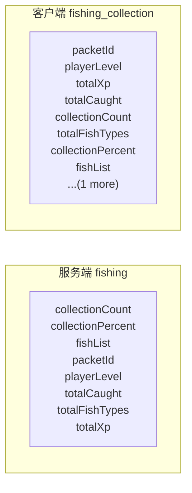
```mermaid
flowchart LR
    subgraph SRV_fishing_fishing_collection["服务端 fishing"]
        SRVF_fishing_fishing_collection["collectionCount<br/>collectionPercent<br/>fishList<br/>packetId<br/>playerLevel<br/>totalCaught<br/>totalFishTypes<br/>totalXp"]
    end
    subgraph CLI_fishing_fishing_collection["客户端 fishing_collection"]
        CLIV_fishing_fishing_collection["packetId<br/>playerLevel<br/>totalXp<br/>totalCaught<br/>collectionCount<br/>totalFishTypes<br/>collectionPercent<br/>fishList<br/>...(1 more)"]
    end
```

**接收字段（服务端 → 客户端）**

| 字段名 | 说明 |
| --- | --- |
| `collectionCount` | |
| `collectionPercent` | |
| `fishList` | |
| `packetId` | |
| `playerLevel` | |
| `totalCaught` | |
| `totalFishTypes` | |
| `totalXp` | |

**本地变量（action.load / action.open 默认值）**

| 变量名 | 默认值 |
| --- | --- |
| `var.packetId` | `packet['packetId']` |
| `var.playerLevel` | `packet['playerLevel']` |
| `var.totalXp` | `packet['totalXp']` |
| `var.totalCaught` | `packet['totalCaught']` |
| `var.collectionCount` | `packet['collectionCount']` |
| `var.totalFishTypes` | `packet['totalFishTypes']` |
| `var.collectionPercent` | `packet['collectionPercent']` |
| `var.fishList` | `packet['fishList']` |
| `var.maxFishCount` | `30` |

---

### fishing_minigame

**PacketHandler 事件**：`init`, `update`, `load`, `keyPress`, `keyRelease`, `click`, `release`

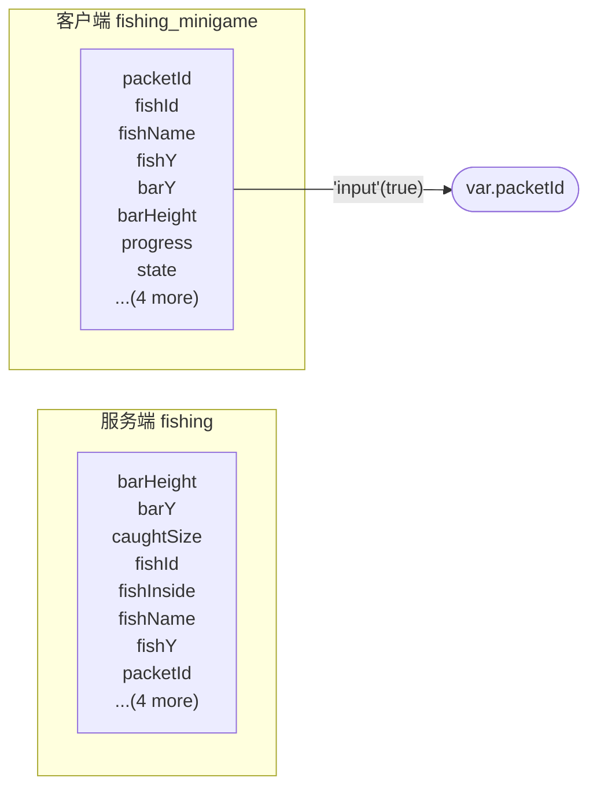
```mermaid
flowchart LR
    subgraph SRV_fishing_fishing_minigame["服务端 fishing"]
        SRVF_fishing_fishing_minigame["barHeight<br/>barY<br/>caughtSize<br/>fishId<br/>fishInside<br/>fishName<br/>fishY<br/>packetId<br/>...(4 more)"]
    end
    subgraph CLI_fishing_fishing_minigame["客户端 fishing_minigame"]
        CLIV_fishing_fishing_minigame["packetId<br/>fishId<br/>fishName<br/>fishY<br/>barY<br/>barHeight<br/>progress<br/>state<br/>...(4 more)"]
    end
    CLIV_fishing_fishing_minigame -->|"'input'(true)"| SND_fishing_fishing_minigame_0(["var.packetId"])
```

**接收字段（服务端 → 客户端）**

| 字段名 | 说明 |
| --- | --- |
| `barHeight` | |
| `barY` | |
| `caughtSize` | |
| `fishId` | |
| `fishInside` | |
| `fishName` | |
| `fishY` | |
| `packetId` | |
| `progress` | |
| `rarity` | |
| `state` | |
| `timeLeft` | |

**发送调用（客户端 → 服务端）**

| 目标路由 | Action | 参数 |
| --- | --- | --- |
| `var.packetId` | `'input'` | `true` |
| `var.packetId` | `'input'` | `false` |

**本地变量（action.load / action.open 默认值）**

| 变量名 | 默认值 |
| --- | --- |
| `var.packetId` | `packet['packetId']` |
| `var.fishId` | `packet['fishId']` |
| `var.fishName` | `packet['fishName']` |
| `var.fishY` | `packet['fishY']` |
| `var.barY` | `packet['barY']` |
| `var.barHeight` | `packet['barHeight']` |
| `var.progress` | `packet['progress']` |
| `var.state` | `packet['state']` |
| `var.timeLeft` | `packet['timeLeft']` |
| `var.caughtSize` | `packet['caughtSize']` |
| `var.rarity` | `packet['rarity']` |
| `var.fishInside` | `false` |

---

## loginview

### login_view

**PacketHandler 事件**：`result`, `init`

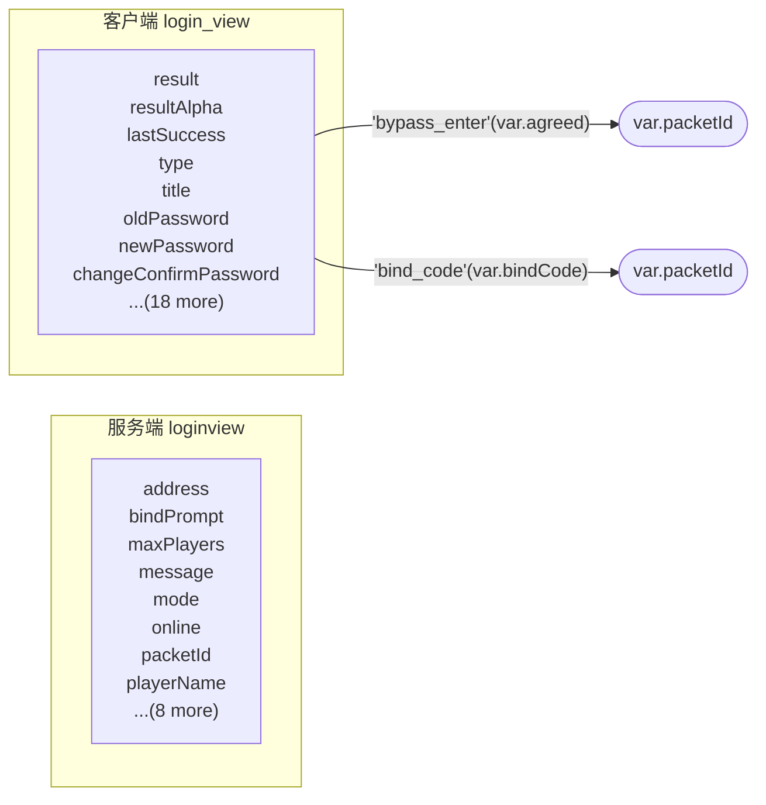
```mermaid
flowchart LR
    subgraph SRV_loginview_login_view["服务端 loginview"]
        SRVF_loginview_login_view["address<br/>bindPrompt<br/>maxPlayers<br/>message<br/>mode<br/>online<br/>packetId<br/>playerName<br/>...(8 more)"]
    end
    subgraph CLI_loginview_login_view["客户端 login_view"]
        CLIV_loginview_login_view["result<br/>resultAlpha<br/>lastSuccess<br/>type<br/>title<br/>oldPassword<br/>newPassword<br/>changeConfirmPassword<br/>...(18 more)"]
    end
    CLIV_loginview_login_view -->|"'bypass_enter'(var.agreed)"| SND_loginview_login_view_0(["var.packetId"])
    CLIV_loginview_login_view -->|"'bind_code'(var.bindCode)"| SND_loginview_login_view_1(["var.packetId"])
```

**接收字段（服务端 → 客户端）**

| 字段名 | 说明 |
| --- | --- |
| `address` | |
| `bindPrompt` | |
| `maxPlayers` | |
| `message` | |
| `mode` | |
| `online` | |
| `packetId` | |
| `playerName` | |
| `premiumBypass` | |
| `qqBound` | |
| `registered` | |
| `serverName` | |
| `success` | |
| `time` | |
| `title` | |
| `type` | |

**发送调用（客户端 → 服务端）**

| 目标路由 | Action | 参数 |
| --- | --- | --- |
| `var.packetId` | `'bypass_enter'` | `var.agreed` |
| `var.packetId` | `'bind_code'` | `var.bindCode` |

**本地变量（action.load / action.open 默认值）**

| 变量名 | 默认值 |
| --- | --- |
| `var.result` | `packet['message']` |
| `var.resultAlpha` | `TwoLerp(1, 1, 0, 2000, 1000)` |
| `var.lastSuccess` | `packet['success']` |
| `var.type` | `= 'change') {` |
| `var.title` | `'登录服务器'` |
| `var.oldPassword` | `''` |
| `var.newPassword` | `''` |
| `var.changeConfirmPassword` | `''` |
| `var.packetId` | `packet['packetId']` |
| `var.mode` | `packet['mode']` |
| `var.registered` | `packet['registered']` |
| `var.playerName` | `packet['playerName']` |
| `var.serverName` | `packet['serverName']` |
| `var.online` | `packet['online']` |
| `var.maxPlayers` | `packet['maxPlayers']` |
| `var.address` | `packet['address']` |
| `var.time` | `packet['time']` |
| `var.premiumBypass` | `packet['premiumBypass']` |
| `var.qqBound` | `packet['qqBound']` |
| `var.bindPrompt` | `packet['bindPrompt']` |
| ... | 共 26 个变量 |

---

### login_view_menu

**PacketHandler 事件**：`init`, `result`, `close`, `load`

```mermaid
flowchart LR
    subgraph SRV_loginview_login_view_menu["服务端 loginview"]
        SRVF_loginview_login_view_menu["address<br/>bindPrompt<br/>maxPlayers<br/>message<br/>mode<br/>online<br/>packetId<br/>playerName<br/>...(9 more)"]
    end
    subgraph CLI_loginview_login_view_menu["客户端 login_view_menu"]
        CLIV_loginview_login_view_menu["packetId<br/>type<br/>title<br/>mode<br/>registered<br/>playerName<br/>serverName<br/>online<br/>...(17 more)"]
    end
    CLIV_loginview_login_view_menu -->|"'bypass_enter'(var.agreed)"| SND_loginview_login_view_menu_0(["var.packetId"])
    CLIV_loginview_login_view_menu -->|"'bind_code'(var.bindCode)"| SND_loginview_login_view_menu_1(["var.packetId"])
```

**接收字段（服务端 → 客户端）**

| 字段名 | 说明 |
| --- | --- |
| `address` | |
| `bindPrompt` | |
| `maxPlayers` | |
| `message` | |
| `mode` | |
| `online` | |
| `packetId` | |
| `playerName` | |
| `premiumBypass` | |
| `qqBound` | |
| `registered` | |
| `requireTerms` | |
| `serverName` | |
| `success` | |
| `time` | |
| `title` | |
| `type` | |

**发送调用（客户端 → 服务端）**

| 目标路由 | Action | 参数 |
| --- | --- | --- |
| `var.packetId` | `'bypass_enter'` | `var.agreed` |
| `var.packetId` | `'bind_code'` | `var.bindCode` |

**本地变量（action.load / action.open 默认值）**

| 变量名 | 默认值 |
| --- | --- |
| `var.packetId` | `packet['packetId']` |
| `var.type` | `packet['type']` |
| `var.title` | `packet['title']` |
| `var.mode` | `packet['mode']` |
| `var.registered` | `packet['registered']` |
| `var.playerName` | `packet['playerName']` |
| `var.serverName` | `packet['serverName']` |
| `var.online` | `packet['online']` |
| `var.maxPlayers` | `packet['maxPlayers']` |
| `var.address` | `packet['address']` |
| `var.time` | `packet['time']` |
| `var.premiumBypass` | `packet['premiumBypass']` |
| `var.qqBound` | `packet['qqBound']` |
| `var.bindPrompt` | `packet['bindPrompt']` |
| `var.result` | `packet['message']` |
| `var.password` | `''` |
| `var.confirmPassword` | `''` |
| `var.oldPassword` | `''` |
| `var.newPassword` | `''` |
| `var.changeConfirmPassword` | `''` |
| ... | 共 25 个变量 |

---

## lottery

### lottery_case

```mermaid
flowchart LR
    subgraph SRV_lottery_lottery_case["服务端 lottery"]
        SRVF_lottery_lottery_case["无下发字段"]
    end
    subgraph CLI_lottery_lottery_case["客户端 lottery_case"]
        CLIV_lottery_lottery_case["rarityColors<br/>random<br/>V<br/>r"]
    end
```

**本地变量（action.load / action.open 默认值）**

| 变量名 | 默认值 |
| --- | --- |
| `var.rarityColors` | `{}` |
| `var.random` | `0.8 + Math.random() * 0.01` |
| `var.V` | `TwoLerp(1, 3, 0.5, 2000, 6000)` |
| `var.r` | `self.parent['奖品槽位'].getItemText('rarity')` |

---

### lottery_gacha

**PacketHandler 事件**：`init`, `update`, `load`, `open`, `tick`

```mermaid
flowchart LR
    subgraph SRV_lottery_lottery_gacha["服务端 lottery"]
        SRVF_lottery_lottery_gacha["currentPoolIndex<br/>fateCount<br/>guaranteeDesc<br/>packetId<br/>pity4<br/>pity5<br/>poolBanner<br/>poolList<br/>...(8 more)"]
    end
    subgraph CLI_lottery_lottery_gacha["客户端 lottery_gacha"]
        CLIV_lottery_lottery_gacha["packetId<br/>poolName<br/>poolType<br/>poolBanner<br/>upItemName<br/>upItemStar<br/>upItemDesc<br/>guaranteeDesc<br/>...(10 more)"]
    end
    CLIV_lottery_lottery_gacha -->|"'switch_pool'(self.index)"| SND_lottery_lottery_gacha_0(["var.packetId"])
    CLIV_lottery_lottery_gacha -->|"'exchange'"| SND_lottery_lottery_gacha_1(["var.packetId"])
    CLIV_lottery_lottery_gacha -->|"'details'"| SND_lottery_lottery_gacha_2(["var.packetId"])
    CLIV_lottery_lottery_gacha -->|"'history'"| SND_lottery_lottery_gacha_3(["var.packetId"])
    CLIV_lottery_lottery_gacha -->|"'pull'(1)"| SND_lottery_lottery_gacha_4(["var.packetId"])
```

**接收字段（服务端 → 客户端）**

| 字段名 | 说明 |
| --- | --- |
| `currentPoolIndex` | |
| `fateCount` | |
| `guaranteeDesc` | |
| `packetId` | |
| `pity4` | |
| `pity5` | |
| `poolBanner` | |
| `poolList` | |
| `poolName` | |
| `poolType` | |
| `primogemCount` | |
| `remainingTime` | |
| `stardustCount` | |
| `upItemDesc` | |
| `upItemName` | |
| `upItemStar` | |

**发送调用（客户端 → 服务端）**

| 目标路由 | Action | 参数 |
| --- | --- | --- |
| `var.packetId` | `'switch_pool'` | `self.index` |
| `var.packetId` | `'exchange'` | `—` |
| `var.packetId` | `'details'` | `—` |
| `var.packetId` | `'history'` | `—` |
| `var.packetId` | `'pull'` | `1` |
| `var.packetId` | `'pull'` | `10` |

**本地变量（action.load / action.open 默认值）**

| 变量名 | 默认值 |
| --- | --- |
| `var.packetId` | `packet['packetId']` |
| `var.poolName` | `packet['poolName']` |
| `var.poolType` | `packet['poolType']` |
| `var.poolBanner` | `packet['poolBanner']` |
| `var.upItemName` | `packet['upItemName']` |
| `var.upItemStar` | `packet['upItemStar']` |
| `var.upItemDesc` | `packet['upItemDesc']` |
| `var.guaranteeDesc` | `packet['guaranteeDesc']` |
| `var.remainingTime` | `packet['remainingTime']` |
| `var.fateCount` | `packet['fateCount']` |
| `var.primogemCount` | `packet['primogemCount']` |
| `var.stardustCount` | `packet['stardustCount']` |
| `var.pity4` | `packet['pity4']` |
| `var.pity5` | `packet['pity5']` |
| `var.poolList` | `packet['poolList']` |
| `var.currentPoolIndex` | `packet['currentPoolIndex']` |
| `var.rarityColors` | `{}` |
| `var.r` | `self.parent['十连槽位'].getItemText('rarity')` |

---

## mail

### mail_admin

**PacketHandler 事件**：`list`, `result`

```mermaid
flowchart LR
    subgraph SRV_mail_mail_admin["服务端 mail"]
        SRVF_mail_mail_admin["body<br/>claimCommands<br/>claimConditions<br/>currencyAttachments<br/>displayName<br/>enabled<br/>expiresAfterDays<br/>found<br/>...(7 more)"]
    end
    subgraph CLI_mail_mail_admin["客户端 mail_admin"]
        CLIV_mail_mail_admin["presets<br/>total<br/>editId<br/>editEnabled<br/>editDisplayName<br/>editSubject<br/>editBody<br/>editExpiresDays<br/>...(8 more)"]
    end
    CLIV_mail_mail_admin -->|"'admin-preset-list'"| SND_mail_mail_admin_0(["'AXS_MAIL'"])
    CLIV_mail_mail_admin -->|"'admin-preset-new'"| SND_mail_mail_admin_1(["'AXS_MAIL'"])
    CLIV_mail_mail_admin -->|"'admin-preset-get'(self.parent.entry['id'])"| SND_mail_mail_admin_2(["'AXS_MAIL'"])
    CLIV_mail_mail_admin -->|"'admin-preset-delete'(self.parent.entry['id'])"| SND_mail_mail_admin_3(["'AXS_MAIL'"])
    CLIV_mail_mail_admin -->|"'admin-preset-cancel'"| SND_mail_mail_admin_4(["'AXS_MAIL'"])
```

**接收字段（服务端 → 客户端）**

| 字段名 | 说明 |
| --- | --- |
| `body` | |
| `claimCommands` | |
| `claimConditions` | |
| `currencyAttachments` | |
| `displayName` | |
| `enabled` | |
| `expiresAfterDays` | |
| `found` | |
| `id` | |
| `itemAttachmentCount` | |
| `message` | |
| `presets` | |
| `subject` | |
| `success` | |
| `total` | |

**发送调用（客户端 → 服务端）**

| 目标路由 | Action | 参数 |
| --- | --- | --- |
| `'AXS_MAIL'` | `'admin-preset-list'` | `—` |
| `'AXS_MAIL'` | `'admin-preset-new'` | `—` |
| `'AXS_MAIL'` | `'admin-preset-get'` | `self.parent.entry['id']` |
| `'AXS_MAIL'` | `'admin-preset-delete'` | `self.parent.entry['id']` |
| `'AXS_MAIL'` | `'admin-preset-cancel'` | `—` |

**本地变量（action.load / action.open 默认值）**

| 变量名 | 默认值 |
| --- | --- |
| `var.presets` | `packet['presets']` |
| `var.total` | `packet['total']` |
| `var.editId` | `packet['id']` |
| `var.editEnabled` | `packet['enabled']` |
| `var.editDisplayName` | `packet['displayName']` |
| `var.editSubject` | `packet['subject']` |
| `var.editBody` | `packet['body']` |
| `var.editExpiresDays` | `packet['expiresAfterDays']` |
| `var.editCurrencies` | `packet['currencyAttachments']` |
| `var.editItemCount` | `packet['itemAttachmentCount'].round()` |
| `var.editCommands` | `packet['claimCommands']` |
| `var.editConditions` | `packet['claimConditions']` |
| `var.editFound` | `packet['found']` |
| `var.view` | `'edit'` |
| `var.resultMsg` | `''` |
| `var.maxPresetCount` | `100` |

---

### mail_compose

**PacketHandler 事件**：`init`, `update`

```mermaid
flowchart LR
    subgraph SRV_mail_mail_compose["服务端 mail"]
        SRVF_mail_mail_compose["allow_vault<br/>attachment_count<br/>base_fee<br/>body_max<br/>item_fee<br/>max_attachments<br/>quote_message<br/>quote_success<br/>...(4 more)"]
    end
    subgraph CLI_mail_mail_compose["客户端 mail_compose"]
        CLIV_mail_mail_compose["sessionId<br/>baseFee<br/>vaultTaxRate<br/>allowVault<br/>quoteSuccess<br/>quoteMessage<br/>itemFee<br/>totalFee<br/>...(8 more)"]
    end
```

**接收字段（服务端 → 客户端）**

| 字段名 | 说明 |
| --- | --- |
| `allow_vault` | |
| `attachment_count` | |
| `base_fee` | |
| `body_max` | |
| `item_fee` | |
| `max_attachments` | |
| `quote_message` | |
| `quote_success` | |
| `session_id` | |
| `subject_max` | |
| `total_fee` | |
| `vault_tax_rate` | |

**本地变量（action.load / action.open 默认值）**

| 变量名 | 默认值 |
| --- | --- |
| `var.sessionId` | `packet['session_id']` |
| `var.baseFee` | `packet['base_fee']` |
| `var.vaultTaxRate` | `packet['vault_tax_rate']` |
| `var.allowVault` | `packet['allow_vault']` |
| `var.quoteSuccess` | `packet['quote_success']` |
| `var.quoteMessage` | `packet['quote_message']` |
| `var.itemFee` | `packet['item_fee']` |
| `var.totalFee` | `packet['total_fee']` |
| `var.maxAttachments` | `packet['max_attachments']` |
| `var.attachmentCount` | `packet['attachment_count']` |
| `var.subjectMax` | `packet['subject_max']` |
| `var.bodyMax` | `packet['body_max']` |
| `var.composeRecipient` | `''` |
| `var.composeSubject` | `''` |
| `var.composeBody` | `''` |
| `var.composeVault` | `'0'` |

---

### mail_inbox

**PacketHandler 事件**：`init`, `update`

```mermaid
flowchart LR
    subgraph SRV_mail_mail_inbox["服务端 mail"]
        SRVF_mail_mail_inbox["claimable_count<br/>messages<br/>selected_attachment_summary<br/>selected_body<br/>selected_claimable<br/>selected_created_at<br/>selected_expires_at<br/>selected_id<br/>...(6 more)"]
    end
    subgraph CLI_mail_mail_inbox["客户端 mail_inbox"]
        CLIV_mail_mail_inbox["messages<br/>filterMode<br/>totalCount<br/>unreadCount<br/>claimableCount<br/>selectedId<br/>selectedSubject<br/>selectedSenderName<br/>...(9 more)"]
    end
    CLIV_mail_mail_inbox -->|"'select'(self.entry['id'])"| SND_mail_mail_inbox_0(["'AXS_MAIL'"])
    CLIV_mail_mail_inbox -->|"'logs'"| SND_mail_mail_inbox_1(["'AXS_MAIL'"])
    CLIV_mail_mail_inbox -->|"'compose'"| SND_mail_mail_inbox_2(["'AXS_MAIL'"])
    CLIV_mail_mail_inbox -->|"'claim'(var.selectedId)"| SND_mail_mail_inbox_3(["'AXS_MAIL'"])
    CLIV_mail_mail_inbox -->|"'delete'(var.selectedId)"| SND_mail_mail_inbox_4(["'AXS_MAIL'"])
    CLIV_mail_mail_inbox -->|"'claimall'"| SND_mail_mail_inbox_5(["'AXS_MAIL'"])
    CLIV_mail_mail_inbox -->|"'deleteall'"| SND_mail_mail_inbox_6(["'AXS_MAIL'"])
    CLIV_mail_mail_inbox -->|"'cdk'(var.cdkCode)"| SND_mail_mail_inbox_7(["'AXS_MAIL'"])
    CLIV_mail_mail_inbox -->|"'refresh'"| SND_mail_mail_inbox_8(["'AXS_MAIL'"])
```

**接收字段（服务端 → 客户端）**

| 字段名 | 说明 |
| --- | --- |
| `claimable_count` | |
| `messages` | |
| `selected_attachment_summary` | |
| `selected_body` | |
| `selected_claimable` | |
| `selected_created_at` | |
| `selected_expires_at` | |
| `selected_id` | |
| `selected_sender_name` | |
| `selected_source_text` | |
| `selected_status_text` | |
| `selected_subject` | |
| `total_count` | |
| `unread_count` | |

**发送调用（客户端 → 服务端）**

| 目标路由 | Action | 参数 |
| --- | --- | --- |
| `'AXS_MAIL'` | `'select'` | `self.entry['id']` |
| `'AXS_MAIL'` | `'logs'` | `—` |
| `'AXS_MAIL'` | `'compose'` | `—` |
| `'AXS_MAIL'` | `'claim'` | `var.selectedId` |
| `'AXS_MAIL'` | `'delete'` | `var.selectedId` |
| `'AXS_MAIL'` | `'claimall'` | `—` |
| `'AXS_MAIL'` | `'deleteall'` | `—` |
| `'AXS_MAIL'` | `'cdk'` | `var.cdkCode` |
| `'AXS_MAIL'` | `'refresh'` | `—` |

**本地变量（action.load / action.open 默认值）**

| 变量名 | 默认值 |
| --- | --- |
| `var.messages` | `packet['messages']` |
| `var.filterMode` | `'all'` |
| `var.totalCount` | `packet['total_count']` |
| `var.unreadCount` | `packet['unread_count']` |
| `var.claimableCount` | `packet['claimable_count']` |
| `var.selectedId` | `packet['selected_id']` |
| `var.selectedSubject` | `packet['selected_subject']` |
| `var.selectedSenderName` | `packet['selected_sender_name']` |
| `var.selectedSourceText` | `packet['selected_source_text']` |
| `var.selectedStatusText` | `packet['selected_status_text']` |
| `var.selectedCreatedAt` | `packet['selected_created_at']` |
| `var.selectedExpiresAt` | `packet['selected_expires_at']` |
| `var.selectedBody` | `packet['selected_body']` |
| `var.selectedAttachmentSummary` | `packet['selected_attachment_summary']` |
| `var.selectedClaimable` | `packet['selected_claimable']` |
| `var.cdkCode` | `''` |
| `var.maxMailCount` | `10` |

---

### mail_logs

**PacketHandler 事件**：`init`, `update`

```mermaid
flowchart LR
    subgraph SRV_mail_mail_logs["服务端 mail"]
        SRVF_mail_mail_logs["logs<br/>max_page<br/>page<br/>total_count"]
    end
    subgraph CLI_mail_mail_logs["客户端 mail_logs"]
        CLIV_mail_mail_logs["logs<br/>page<br/>maxPage<br/>totalCount<br/>maxLogCount"]
    end
    CLIV_mail_mail_logs -->|"'open'"| SND_mail_mail_logs_0(["'AXS_MAIL'"])
    CLIV_mail_mail_logs -->|"'logs-prev'"| SND_mail_mail_logs_1(["'AXS_MAIL'"])
    CLIV_mail_mail_logs -->|"'logs-next'"| SND_mail_mail_logs_2(["'AXS_MAIL'"])
```

**接收字段（服务端 → 客户端）**

| 字段名 | 说明 |
| --- | --- |
| `logs` | |
| `max_page` | |
| `page` | |
| `total_count` | |

**发送调用（客户端 → 服务端）**

| 目标路由 | Action | 参数 |
| --- | --- | --- |
| `'AXS_MAIL'` | `'open'` | `—` |
| `'AXS_MAIL'` | `'logs-prev'` | `—` |
| `'AXS_MAIL'` | `'logs-next'` | `—` |

**本地变量（action.load / action.open 默认值）**

| 变量名 | 默认值 |
| --- | --- |
| `var.logs` | `packet['logs']` |
| `var.page` | `packet['page']` |
| `var.maxPage` | `packet['max_page']` |
| `var.totalCount` | `packet['total_count']` |
| `var.maxLogCount` | `20` |

---

## map

### map_hud

**PacketHandler 事件**：`init`, `update`, `load`

```mermaid
flowchart LR
    subgraph SRV_map_map_hud["服务端 map"]
        SRVF_map_map_hud["clippedPlayerX<br/>clippedPlayerZ<br/>hudSize<br/>hudZoom<br/>imageHeight<br/>imageWidth<br/>packetId<br/>playerYaw<br/>...(4 more)"]
    end
    subgraph CLI_map_map_hud["客户端 map_hud"]
        CLIV_map_map_hud["packetId<br/>visible<br/>worldId<br/>texture<br/>imageWidth<br/>imageHeight<br/>hudZoom<br/>hudSize<br/>...(4 more)"]
    end
    CLIV_map_map_hud -->|"'open_menu'"| SND_map_map_hud_0(["var.packetId"])
```

**接收字段（服务端 → 客户端）**

| 字段名 | 说明 |
| --- | --- |
| `clippedPlayerX` | |
| `clippedPlayerZ` | |
| `hudSize` | |
| `hudZoom` | |
| `imageHeight` | |
| `imageWidth` | |
| `packetId` | |
| `playerYaw` | |
| `texture` | |
| `trackingText` | |
| `visible` | |
| `worldId` | |

**发送调用（客户端 → 服务端）**

| 目标路由 | Action | 参数 |
| --- | --- | --- |
| `var.packetId` | `'open_menu'` | `—` |

**本地变量（action.load / action.open 默认值）**

| 变量名 | 默认值 |
| --- | --- |
| `var.packetId` | `packet['packetId']` |
| `var.visible` | `packet['visible']` |
| `var.worldId` | `packet['worldId']` |
| `var.texture` | `packet['texture']` |
| `var.imageWidth` | `packet['imageWidth']` |
| `var.imageHeight` | `packet['imageHeight']` |
| `var.hudZoom` | `packet['hudZoom']` |
| `var.hudSize` | `packet['hudSize']` |
| `var.clippedPlayerX` | `packet['clippedPlayerX']` |
| `var.clippedPlayerZ` | `packet['clippedPlayerZ']` |
| `var.playerYaw` | `packet['playerYaw']` |
| `var.trackingText` | `packet['trackingText']` |

---

### map_menu

**PacketHandler 事件**：`init`, `update`, `open`

```mermaid
flowchart LR
    subgraph SRV_map_map_menu["服务端 map"]
        SRVF_map_map_menu["anchorRows<br/>canCreateWaypoint<br/>clearTrackVisible<br/>detailCanCreateWaypoint<br/>detailCanDeleteWaypoint<br/>detailCanTeleport<br/>detailCanTrackAnchor<br/>detailCanTrackExternal<br/>...(21 more)"]
    end
    subgraph CLI_map_map_menu["客户端 map_menu"]
        CLIV_map_map_menu["packetId<br/>selectedWorldId<br/>selectedWorldName<br/>worldRows<br/>anchorRows<br/>waypointRows<br/>externalTargetRows<br/>waypointLimit<br/>...(25 more)"]
    end
    CLIV_map_map_menu -->|"'open_world'(self.entry['id'])"| SND_map_map_menu_0(["var.packetId"])
    CLIV_map_map_menu -->|"'select_anchor'(self.entry['id'])"| SND_map_map_menu_1(["var.packetId"])
    CLIV_map_map_menu -->|"'select_waypoint'(self.entry['id'])"| SND_map_map_menu_2(["var.packetId"])
    CLIV_map_map_menu -->|"'select_external'(self.entry['id'])"| SND_map_map_menu_3(["var.packetId"])
    CLIV_map_map_menu -->|"'unlock_anchor'(var.detailSelectedId)"| SND_map_map_menu_4(["var.packetId"])
    CLIV_map_map_menu -->|"'teleport_anchor'(var.detailSelectedId)"| SND_map_map_menu_5(["var.packetId"])
    CLIV_map_map_menu -->|"'track_anchor'(var.detailSelectedId)"| SND_map_map_menu_6(["var.packetId"])
    CLIV_map_map_menu -->|"'track_waypoint'(var.detailSelectedId)"| SND_map_map_menu_7(["var.packetId"])
    CLIV_map_map_menu -->|"'track_external'(var.detailSelectedId)"| SND_map_map_menu_8(["var.packetId"])
    CLIV_map_map_menu -->|"'delete_waypoint'(var.detailSelectedId)"| SND_map_map_menu_9(["var.packetId"])
    CLIV_map_map_menu -->|"'create_waypoint'"| SND_map_map_menu_10(["var.packetId"])
    CLIV_map_map_menu -->|"'clear_track'"| SND_map_map_menu_11(["var.packetId"])
```

**接收字段（服务端 → 客户端）**

| 字段名 | 说明 |
| --- | --- |
| `anchorRows` | |
| `canCreateWaypoint` | |
| `clearTrackVisible` | |
| `detailCanCreateWaypoint` | |
| `detailCanDeleteWaypoint` | |
| `detailCanTeleport` | |
| `detailCanTrackAnchor` | |
| `detailCanTrackExternal` | |
| `detailCanTrackWaypoint` | |
| `detailCanUnlock` | |
| `detailClearTrackVisible` | |
| `detailDescription` | |
| `detailExternalTarget` | |
| `detailSelectedId` | |
| `detailSelectedType` | |
| `detailTeleportCostText` | |
| `detailTitle` | |
| `detailTrackingText` | |
| `detailUnlockCostText` | |
| `detailUnlocked` | |
| `externalTargetRows` | |
| `packetId` | |
| `selectedWorldId` | |
| `selectedWorldName` | |
| `trackingText` | |
| `waypointCount` | |
| `waypointLimit` | |
| `waypointRows` | |
| `worldRows` | |

**发送调用（客户端 → 服务端）**

| 目标路由 | Action | 参数 |
| --- | --- | --- |
| `var.packetId` | `'open_world'` | `self.entry['id']` |
| `var.packetId` | `'select_anchor'` | `self.entry['id']` |
| `var.packetId` | `'select_waypoint'` | `self.entry['id']` |
| `var.packetId` | `'select_external'` | `self.entry['id']` |
| `var.packetId` | `'unlock_anchor'` | `var.detailSelectedId` |
| `var.packetId` | `'teleport_anchor'` | `var.detailSelectedId` |
| `var.packetId` | `'track_anchor'` | `var.detailSelectedId` |
| `var.packetId` | `'track_waypoint'` | `var.detailSelectedId` |
| `var.packetId` | `'track_external'` | `var.detailSelectedId` |
| `var.packetId` | `'delete_waypoint'` | `var.detailSelectedId` |
| `var.packetId` | `'create_waypoint'` | `—` |
| `var.packetId` | `'clear_track'` | `—` |

**本地变量（action.load / action.open 默认值）**

| 变量名 | 默认值 |
| --- | --- |
| `var.packetId` | `packet['packetId']` |
| `var.selectedWorldId` | `packet['selectedWorldId']` |
| `var.selectedWorldName` | `packet['selectedWorldName']` |
| `var.worldRows` | `packet['worldRows']` |
| `var.anchorRows` | `packet['anchorRows']` |
| `var.waypointRows` | `packet['waypointRows']` |
| `var.externalTargetRows` | `packet['externalTargetRows']` |
| `var.waypointLimit` | `packet['waypointLimit']` |
| `var.waypointCount` | `packet['waypointCount']` |
| `var.canCreateWaypoint` | `packet['canCreateWaypoint']` |
| `var.clearTrackVisible` | `packet['clearTrackVisible']` |
| `var.trackingText` | `packet['trackingText']` |
| `var.detailSelectedType` | `packet['detailSelectedType']` |
| `var.detailSelectedId` | `packet['detailSelectedId']` |
| `var.detailTitle` | `packet['detailTitle']` |
| `var.detailDescription` | `packet['detailDescription']` |
| `var.detailUnlocked` | `packet['detailUnlocked']` |
| `var.detailUnlockCostText` | `packet['detailUnlockCostText']` |
| `var.detailTeleportCostText` | `packet['detailTeleportCostText']` |
| `var.detailExternalTarget` | `packet['detailExternalTarget']` |
| ... | 共 33 个变量 |

---

## market

### market_auction

**PacketHandler 事件**：`init`, `update`, `open`

```mermaid
flowchart LR
    subgraph SRV_market_market_auction["服务端 market"]
        SRVF_market_market_auction["categories<br/>categoryTexts<br/>currentCategory<br/>listingTexts<br/>listings<br/>packetId<br/>page<br/>pageText<br/>...(1 more)"]
    end
    subgraph CLI_market_market_auction["客户端 market_auction"]
        CLIV_market_market_auction["packetId<br/>page<br/>totalPages<br/>pageText<br/>currentCategory<br/>categories<br/>categoryTexts<br/>listings<br/>...(8 more)"]
    end
    CLIV_market_market_auction -->|"'auction_sell_ui_open'"| SND_market_market_auction_0(["var.packetId"])
    CLIV_market_market_auction -->|"'auction_buy'(self.entry['id'] + '')"| SND_market_market_auction_1(["var.packetId"])
    CLIV_market_market_auction -->|"'auction_cancel'(self.parent.parent.entry['id'])"| SND_market_market_auction_3(["var.packetId"])
    CLIV_market_market_auction -->|"'auction_list'((var.page - 1)"| SND_market_market_auction_4(["var.packetId"])
```

**接收字段（服务端 → 客户端）**

| 字段名 | 说明 |
| --- | --- |
| `categories` | |
| `categoryTexts` | |
| `currentCategory` | |
| `listingTexts` | |
| `listings` | |
| `packetId` | |
| `page` | |
| `pageText` | |
| `totalPages` | |

**发送调用（客户端 → 服务端）**

| 目标路由 | Action | 参数 |
| --- | --- | --- |
| `var.packetId` | `'auction_sell_ui_open'` | `—` |
| `var.packetId` | `'auction_buy'` | `self.entry['id'] + ''` |
| `var.packetId` | `'auction_buy'` | `self.parent.parent.entry['id'] + ''` |
| `var.packetId` | `'auction_cancel'` | `self.parent.parent.entry['id'] + ''` |
| `var.packetId` | `'auction_list'` | `(var.page - 1` |
| `var.packetId` | `'auction_list'` | `(var.page + 1` |

**本地变量（action.load / action.open 默认值）**

| 变量名 | 默认值 |
| --- | --- |
| `var.packetId` | `packet['packetId']` |
| `var.page` | `packet['page']` |
| `var.totalPages` | `packet['totalPages']` |
| `var.pageText` | `packet['pageText']` |
| `var.currentCategory` | `packet['currentCategory']` |
| `var.categories` | `packet['categories']` |
| `var.categoryTexts` | `packet['categoryTexts']` |
| `var.listings` | `packet['listings']` |
| `var.listingTexts` | `packet['listingTexts']` |
| `var.itemJsons` | `{}` |
| `var.search` | `''` |
| `var.categoryScrollRatio` | `0` |
| `var.listingScrollRatio` | `0` |
| `var.emptyItemJson` | `'{"id":"minecraft:air","Count":1b}'` |
| `var.maxCategoryCount` | `32` |
| `var.maxListingCount` | `20` |

---

### market_auction_sell

**PacketHandler 事件**：`init`, `update`, `load`, `open`

```mermaid
flowchart LR
    subgraph SRV_market_market_auction_sell["服务端 market"]
        SRVF_market_market_auction_sell["backpackItems<br/>packetId"]
    end
    subgraph CLI_market_market_auction_sell["客户端 market_auction_sell"]
        CLIV_market_market_auction_sell["packetId<br/>backpackItems<br/>itemJsons<br/>emptyItemJson<br/>maxBackpackCount<br/>selectedSlot<br/>selectedPrice<br/>selectedMessage<br/>...(1 more)"]
    end
    CLIV_market_market_auction_sell -->|"'auction_sell_open'"| SND_market_market_auction_sell_0(["var.packetId"])
```

**接收字段（服务端 → 客户端）**

| 字段名 | 说明 |
| --- | --- |
| `backpackItems` | |
| `packetId` | |

**发送调用（客户端 → 服务端）**

| 目标路由 | Action | 参数 |
| --- | --- | --- |
| `var.packetId` | `'auction_sell_open'` | `—` |

**本地变量（action.load / action.open 默认值）**

| 变量名 | 默认值 |
| --- | --- |
| `var.packetId` | `packet['packetId']` |
| `var.backpackItems` | `packet['backpackItems']` |
| `var.itemJsons` | `{}` |
| `var.emptyItemJson` | `'{"id":"minecraft:air","Count":1b}'` |
| `var.maxBackpackCount` | `36` |
| `var.selectedSlot` | `null` |
| `var.selectedPrice` | `''` |
| `var.selectedMessage` | `''` |
| `var.selectedDuration` | `86400` |

---

### market_history

**PacketHandler 事件**：`init`, `update`, `open`

```mermaid
flowchart LR
    subgraph SRV_market_market_history["服务端 market"]
        SRVF_market_market_history["packetId<br/>page<br/>records<br/>totalPages"]
    end
    subgraph CLI_market_market_history["客户端 market_history"]
        CLIV_market_market_history["packetId<br/>page<br/>totalPages<br/>records<br/>itemJsons<br/>scrollRatio<br/>emptyItemJson<br/>maxRecordCount"]
    end
    CLIV_market_market_history -->|"'history_list'('0')"| SND_market_market_history_0(["var.packetId"])
```

**接收字段（服务端 → 客户端）**

| 字段名 | 说明 |
| --- | --- |
| `packetId` | |
| `page` | |
| `records` | |
| `totalPages` | |

**发送调用（客户端 → 服务端）**

| 目标路由 | Action | 参数 |
| --- | --- | --- |
| `var.packetId` | `'history_list'` | `'0'` |
| `var.packetId` | `'history_list'` | `(var.page - 1` |
| `var.packetId` | `'history_list'` | `(var.page + 1` |

**本地变量（action.load / action.open 默认值）**

| 变量名 | 默认值 |
| --- | --- |
| `var.packetId` | `packet['packetId']` |
| `var.page` | `packet['page']` |
| `var.totalPages` | `packet['totalPages']` |
| `var.records` | `packet['records']` |
| `var.itemJsons` | `{}` |
| `var.scrollRatio` | `0` |
| `var.emptyItemJson` | `'{"id":"minecraft:air","Count":1b}'` |
| `var.maxRecordCount` | `20` |

---

### market_recycle

**PacketHandler 事件**：`init`, `update`, `open`

```mermaid
flowchart LR
    subgraph SRV_market_market_recycle["服务端 market"]
        SRVF_market_market_recycle["currency<br/>multiplier<br/>packetId<br/>recyclables<br/>totalValue"]
    end
    subgraph CLI_market_market_recycle["客户端 market_recycle"]
        CLIV_market_market_recycle["packetId<br/>totalValue<br/>currency<br/>multiplier<br/>recyclables<br/>itemJsons<br/>scrollRatio<br/>emptyItemJson<br/>...(1 more)"]
    end
    CLIV_market_market_recycle -->|"'recycle_preview'"| SND_market_market_recycle_0(["var.packetId"])
    CLIV_market_market_recycle -->|"'recycle_single'(self.parent.parent.entry['slot)"| SND_market_market_recycle_3(["var.packetId"])
    CLIV_market_market_recycle -->|"'recycle_all'"| SND_market_market_recycle_4(["var.packetId"])
```

**接收字段（服务端 → 客户端）**

| 字段名 | 说明 |
| --- | --- |
| `currency` | |
| `multiplier` | |
| `packetId` | |
| `recyclables` | |
| `totalValue` | |

**发送调用（客户端 → 服务端）**

| 目标路由 | Action | 参数 |
| --- | --- | --- |
| `var.packetId` | `'recycle_preview'` | `—` |
| `var.packetId` | `'recycle_single'` | `self.parent.parent.entry['slot'] + ''` |
| `var.packetId` | `'recycle_all'` | `—` |

**本地变量（action.load / action.open 默认值）**

| 变量名 | 默认值 |
| --- | --- |
| `var.packetId` | `packet['packetId']` |
| `var.totalValue` | `packet['totalValue']` |
| `var.currency` | `packet['currency']` |
| `var.multiplier` | `packet['multiplier']` |
| `var.recyclables` | `packet['recyclables']` |
| `var.itemJsons` | `{}` |
| `var.scrollRatio` | `0` |
| `var.emptyItemJson` | `'{"id":"minecraft:air","Count":1b}'` |
| `var.maxRecycleCount` | `36` |

---

### market_shop

**PacketHandler 事件**：`init`, `update`, `open`

```mermaid
flowchart LR
    subgraph SRV_market_market_shop["服务端 market"]
        SRVF_market_market_shop["items<br/>packetId<br/>shopId<br/>shopName<br/>shopTexts<br/>shops"]
    end
    subgraph CLI_market_market_shop["客户端 market_shop"]
        CLIV_market_market_shop["packetId<br/>shopId<br/>shopName<br/>shops<br/>shopTexts<br/>items<br/>itemJsons<br/>shopScrollRatio<br/>...(4 more)"]
    end
    CLIV_market_market_shop -->|"'shop_list'('')"| SND_market_market_shop_0(["var.packetId"])
```

**接收字段（服务端 → 客户端）**

| 字段名 | 说明 |
| --- | --- |
| `items` | |
| `packetId` | |
| `shopId` | |
| `shopName` | |
| `shopTexts` | |
| `shops` | |

**发送调用（客户端 → 服务端）**

| 目标路由 | Action | 参数 |
| --- | --- | --- |
| `var.packetId` | `'shop_list'` | `''` |
| `var.packetId` | `'shop_list'` | `self.entry['id']` |

**本地变量（action.load / action.open 默认值）**

| 变量名 | 默认值 |
| --- | --- |
| `var.packetId` | `packet['packetId']` |
| `var.shopId` | `packet['shopId']` |
| `var.shopName` | `packet['shopName']` |
| `var.shops` | `packet['shops']` |
| `var.shopTexts` | `packet['shopTexts']` |
| `var.items` | `packet['items']` |
| `var.itemJsons` | `{}` |
| `var.shopScrollRatio` | `0` |
| `var.itemScrollRatio` | `0` |
| `var.emptyItemJson` | `'{"id":"minecraft:air","Count":1b}'` |
| `var.maxShopCount` | `32` |
| `var.maxItemCount` | `100` |

---

## menu

### menu_esc

**PacketHandler 事件**：`init`, `update`, `close`, `open`, `tick`, `keyPress`, `load`

```mermaid
flowchart LR
    subgraph SRV_menu_menu_esc["服务端 menu"]
        SRVF_menu_menu_esc["buttonCount<br/>buttonRows<br/>footerCount<br/>footerRows<br/>menuId<br/>packetId<br/>pageCount<br/>pageIndex<br/>...(2 more)"]
    end
    subgraph CLI_menu_menu_esc["客户端 menu_esc"]
        CLIV_menu_menu_esc["packetId<br/>menuId<br/>title<br/>pageTitle<br/>pageIndex<br/>pageCount<br/>buttonRows<br/>buttonCount<br/>...(6 more)"]
    end
    CLIV_menu_menu_esc -->|"'esc_open'"| SND_menu_menu_esc_0(["'AXS_MENU'"])
    CLIV_menu_menu_esc -->|"'click'(self.entry['id'])"| SND_menu_menu_esc_3(["var.packetId"])
    CLIV_menu_menu_esc -->|"'footer'(self.entry['id'])"| SND_menu_menu_esc_4(["var.packetId"])
```

**接收字段（服务端 → 客户端）**

| 字段名 | 说明 |
| --- | --- |
| `buttonCount` | |
| `buttonRows` | |
| `footerCount` | |
| `footerRows` | |
| `menuId` | |
| `packetId` | |
| `pageCount` | |
| `pageIndex` | |
| `pageTitle` | |
| `title` | |

**发送调用（客户端 → 服务端）**

| 目标路由 | Action | 参数 |
| --- | --- | --- |
| `'AXS_MENU'` | `'esc_open'` | `—` |
| `var.packetId` | `'click'` | `self.entry['id']` |
| `var.packetId` | `'footer'` | `self.entry['id']` |

**本地变量（action.load / action.open 默认值）**

| 变量名 | 默认值 |
| --- | --- |
| `var.packetId` | `packet['packetId']` |
| `var.menuId` | `packet['menuId']` |
| `var.title` | `packet['title']` |
| `var.pageTitle` | `packet['pageTitle']` |
| `var.pageIndex` | `packet['pageIndex']` |
| `var.pageCount` | `packet['pageCount']` |
| `var.buttonRows` | `packet['buttonRows']` |
| `var.buttonCount` | `packet['buttonCount']` |
| `var.footerRows` | `packet['footerRows']` |
| `var.footerCount` | `packet['footerCount']` |
| `var.animation` | `TwoLerp(1, 1, 0, 300, 300)` |
| `var.yaw` | `server.player_yaw` |
| `var.maxButtonCount` | `128` |
| `var.maxFooterCount` | `8` |

---

### menu_panel

**PacketHandler 事件**：`init`, `update`, `close`, `open`

```mermaid
flowchart LR
    subgraph SRV_menu_menu_panel["服务端 menu"]
        SRVF_menu_menu_panel["buttonCount<br/>buttonRows<br/>columns<br/>footerCount<br/>footerRows<br/>hasNext<br/>hasPrev<br/>layout<br/>...(7 more)"]
    end
    subgraph CLI_menu_menu_panel["客户端 menu_panel"]
        CLIV_menu_menu_panel["packetId<br/>menuId<br/>layout<br/>title<br/>pageId<br/>pageTitle<br/>pageIndex<br/>pageCount<br/>...(9 more)"]
    end
    CLIV_menu_menu_panel -->|"'click'(self.entry['id'])"| SND_menu_menu_panel_0(["var.packetId"])
    CLIV_menu_menu_panel -->|"'footer'(self.entry['id'])"| SND_menu_menu_panel_1(["var.packetId"])
```

**接收字段（服务端 → 客户端）**

| 字段名 | 说明 |
| --- | --- |
| `buttonCount` | |
| `buttonRows` | |
| `columns` | |
| `footerCount` | |
| `footerRows` | |
| `hasNext` | |
| `hasPrev` | |
| `layout` | |
| `menuId` | |
| `packetId` | |
| `pageCount` | |
| `pageId` | |
| `pageIndex` | |
| `pageTitle` | |
| `title` | |

**发送调用（客户端 → 服务端）**

| 目标路由 | Action | 参数 |
| --- | --- | --- |
| `var.packetId` | `'click'` | `self.entry['id']` |
| `var.packetId` | `'footer'` | `self.entry['id']` |

**本地变量（action.load / action.open 默认值）**

| 变量名 | 默认值 |
| --- | --- |
| `var.packetId` | `packet['packetId']` |
| `var.menuId` | `packet['menuId']` |
| `var.layout` | `packet['layout']` |
| `var.title` | `packet['title']` |
| `var.pageId` | `packet['pageId']` |
| `var.pageTitle` | `packet['pageTitle']` |
| `var.pageIndex` | `packet['pageIndex']` |
| `var.pageCount` | `packet['pageCount']` |
| `var.columns` | `packet['columns']` |
| `var.hasPrev` | `packet['hasPrev']` |
| `var.hasNext` | `packet['hasNext']` |
| `var.buttonRows` | `packet['buttonRows']` |
| `var.buttonCount` | `packet['buttonCount']` |
| `var.footerRows` | `packet['footerRows']` |
| `var.footerCount` | `packet['footerCount']` |
| `var.maxButtonCount` | `128` |
| `var.maxFooterCount` | `8` |

---

## onlinerewards

### online_rewards_menu

**PacketHandler 事件**：`init`, `update`, `open`

```mermaid
flowchart LR
    subgraph SRV_onlinerewards_online_rewards_menu["服务端 onlinerewards"]
        SRVF_onlinerewards_online_rewards_menu["calendarCount<br/>calendarMonthOffset<br/>calendarMonthText<br/>calendarRows<br/>completed<br/>dailyTimeText<br/>makeupCardCount<br/>monthlyTimeText<br/>...(23 more)"]
    end
    subgraph CLI_onlinerewards_online_rewards_menu["客户端 online_rewards_menu"]
        CLIV_onlinerewards_online_rewards_menu["packetId<br/>dailyTimeText<br/>weeklyTimeText<br/>monthlyTimeText<br/>totalTimeText<br/>progress<br/>progressPercent<br/>progressPercentText<br/>...(25 more)"]
    end
    CLIV_onlinerewards_online_rewards_menu -->|"'refresh'"| SND_onlinerewards_online_rewards_menu_0(["var.packetId"])
    CLIV_onlinerewards_online_rewards_menu -->|"'signin'"| SND_onlinerewards_online_rewards_menu_1(["var.packetId"])
    CLIV_onlinerewards_online_rewards_menu -->|"'makeup'(var.selectedDateText)"| SND_onlinerewards_online_rewards_menu_2(["var.packetId"])
    CLIV_onlinerewards_online_rewards_menu -->|"'calendar_prev'"| SND_onlinerewards_online_rewards_menu_3(["var.packetId"])
    CLIV_onlinerewards_online_rewards_menu -->|"'calendar_today'"| SND_onlinerewards_online_rewards_menu_4(["var.packetId"])
    CLIV_onlinerewards_online_rewards_menu -->|"'calendar_next'"| SND_onlinerewards_online_rewards_menu_5(["var.packetId"])
    CLIV_onlinerewards_online_rewards_menu -->|"'preview_day'(self.entry['date'])"| SND_onlinerewards_online_rewards_menu_6(["var.packetId"])
```

**接收字段（服务端 → 客户端）**

| 字段名 | 说明 |
| --- | --- |
| `calendarCount` | |
| `calendarMonthOffset` | |
| `calendarMonthText` | |
| `calendarRows` | |
| `completed` | |
| `dailyTimeText` | |
| `makeupCardCount` | |
| `monthlyTimeText` | |
| `packetId` | |
| `progress` | |
| `progressPercent` | |
| `progressPercentText` | |
| `progressTitle` | |
| `rewardCount` | |
| `rewardRows` | |
| `rewardStage` | |
| `rewardStageText` | |
| `selectedAction` | |
| `selectedActionEnabled` | |
| `selectedActionText` | |
| `selectedCanMakeup` | |
| `selectedDateText` | |
| `selectedRewardRows` | |
| `signInButtonText` | |
| `signInRewardRows` | |
| `signInStatusText` | |
| `signInStreak` | |
| `signInTotal` | |
| `signedToday` | |
| `totalTimeText` | |
| `weeklyTimeText` | |

**发送调用（客户端 → 服务端）**

| 目标路由 | Action | 参数 |
| --- | --- | --- |
| `var.packetId` | `'refresh'` | `—` |
| `var.packetId` | `'signin'` | `—` |
| `var.packetId` | `'makeup'` | `var.selectedDateText` |
| `var.packetId` | `'calendar_prev'` | `—` |
| `var.packetId` | `'calendar_today'` | `—` |
| `var.packetId` | `'calendar_next'` | `—` |
| `var.packetId` | `'preview_day'` | `self.entry['date']` |

**本地变量（action.load / action.open 默认值）**

| 变量名 | 默认值 |
| --- | --- |
| `var.packetId` | `packet['packetId']` |
| `var.dailyTimeText` | `packet['dailyTimeText']` |
| `var.weeklyTimeText` | `packet['weeklyTimeText']` |
| `var.monthlyTimeText` | `packet['monthlyTimeText']` |
| `var.totalTimeText` | `packet['totalTimeText']` |
| `var.progress` | `packet['progress']` |
| `var.progressPercent` | `packet['progressPercent']` |
| `var.progressPercentText` | `packet['progressPercentText']` |
| `var.progressTitle` | `packet['progressTitle']` |
| `var.completed` | `packet['completed']` |
| `var.rewardStage` | `packet['rewardStage']` |
| `var.rewardCount` | `packet['rewardCount']` |
| `var.rewardStageText` | `packet['rewardStageText']` |
| `var.signedToday` | `packet['signedToday']` |
| `var.signInStatusText` | `packet['signInStatusText']` |
| `var.signInButtonText` | `packet['signInButtonText']` |
| `var.signInStreak` | `packet['signInStreak']` |
| `var.signInTotal` | `packet['signInTotal']` |
| `var.makeupCardCount` | `packet['makeupCardCount']` |
| `var.calendarMonthText` | `packet['calendarMonthText']` |
| ... | 共 33 个变量 |

---

## pickup

### loot_interact

```mermaid
flowchart LR
    subgraph SRV_pickup_loot_interact["服务端 pickup"]
        SRVF_pickup_loot_interact["无下发字段"]
    end
    subgraph CLI_pickup_loot_interact["客户端 loot_interact"]
        CLIV_pickup_loot_interact["无本地变量"]
    end
    CLIV_pickup_loot_interact -->|"'close_menu'"| SND_pickup_loot_interact_0(["'pickup'"])
    CLIV_pickup_loot_interact -->|"'scroll_up'"| SND_pickup_loot_interact_1(["'pickup'"])
    CLIV_pickup_loot_interact -->|"'scroll_down'"| SND_pickup_loot_interact_2(["'pickup'"])
```

**发送调用（客户端 → 服务端）**

| 目标路由 | Action | 参数 |
| --- | --- | --- |
| `'pickup'` | `'close_menu'` | `—` |
| `'pickup'` | `'scroll_up'` | `—` |
| `'pickup'` | `'scroll_down'` | `—` |

---

### loot_panel

**PacketHandler 事件**：`update`, `select`, `load`, `tick`, `keyPress`, `wheel`

```mermaid
flowchart LR
    subgraph SRV_pickup_loot_panel["服务端 pickup"]
        SRVF_pickup_loot_panel["count<br/>item0Amount<br/>item0ItemJson<br/>item0Visible<br/>item1Amount<br/>item1ItemJson<br/>item1Visible<br/>item2Amount<br/>...(18 more)"]
    end
    subgraph CLI_pickup_loot_panel["客户端 loot_panel"]
        CLIV_pickup_loot_panel["count<br/>selectedIndex<br/>item0Visible<br/>item0Amount<br/>item0ItemJson<br/>item1Visible<br/>item1Amount<br/>item1ItemJson<br/>...(19 more)"]
    end
    CLIV_pickup_loot_panel -->|"'open_menu'"| SND_pickup_loot_panel_0(["'pickup'"])
    CLIV_pickup_loot_panel -->|"'scroll_up'"| SND_pickup_loot_panel_1(["'pickup'"])
    CLIV_pickup_loot_panel -->|"'scroll_down'"| SND_pickup_loot_panel_2(["'pickup'"])
    CLIV_pickup_loot_panel -->|"'pick'"| SND_pickup_loot_panel_6(["'pickup'"])
    CLIV_pickup_loot_panel -->|"'pick_0'"| SND_pickup_loot_panel_7(["'pickup'"])
    CLIV_pickup_loot_panel -->|"'pick_1'"| SND_pickup_loot_panel_8(["'pickup'"])
    CLIV_pickup_loot_panel -->|"'pick_2'"| SND_pickup_loot_panel_9(["'pickup'"])
    CLIV_pickup_loot_panel -->|"'pick_3'"| SND_pickup_loot_panel_10(["'pickup'"])
    CLIV_pickup_loot_panel -->|"'pick_4'"| SND_pickup_loot_panel_11(["'pickup'"])
    CLIV_pickup_loot_panel -->|"'pick_5'"| SND_pickup_loot_panel_12(["'pickup'"])
    CLIV_pickup_loot_panel -->|"'pick_6'"| SND_pickup_loot_panel_13(["'pickup'"])
    CLIV_pickup_loot_panel -->|"'pick_7'"| SND_pickup_loot_panel_14(["'pickup'"])
```

**接收字段（服务端 → 客户端）**

| 字段名 | 说明 |
| --- | --- |
| `count` | |
| `item0Amount` | |
| `item0ItemJson` | |
| `item0Visible` | |
| `item1Amount` | |
| `item1ItemJson` | |
| `item1Visible` | |
| `item2Amount` | |
| `item2ItemJson` | |
| `item2Visible` | |
| `item3Amount` | |
| `item3ItemJson` | |
| `item3Visible` | |
| `item4Amount` | |
| `item4ItemJson` | |
| `item4Visible` | |
| `item5Amount` | |
| `item5ItemJson` | |
| `item5Visible` | |
| `item6Amount` | |
| `item6ItemJson` | |
| `item6Visible` | |
| `item7Amount` | |
| `item7ItemJson` | |
| `item7Visible` | |
| `selectedIndex` | |

**发送调用（客户端 → 服务端）**

| 目标路由 | Action | 参数 |
| --- | --- | --- |
| `'pickup'` | `'open_menu'` | `—` |
| `'pickup'` | `'scroll_up'` | `—` |
| `'pickup'` | `'scroll_down'` | `—` |
| `'pickup'` | `'pick'` | `—` |
| `'pickup'` | `'pick_0'` | `—` |
| `'pickup'` | `'pick_1'` | `—` |
| `'pickup'` | `'pick_2'` | `—` |
| `'pickup'` | `'pick_3'` | `—` |
| `'pickup'` | `'pick_4'` | `—` |
| `'pickup'` | `'pick_5'` | `—` |
| `'pickup'` | `'pick_6'` | `—` |
| `'pickup'` | `'pick_7'` | `—` |

**本地变量（action.load / action.open 默认值）**

| 变量名 | 默认值 |
| --- | --- |
| `var.count` | `packet['count']` |
| `var.selectedIndex` | `packet['selectedIndex']` |
| `var.item0Visible` | `packet['item0Visible']` |
| `var.item0Amount` | `packet['item0Amount']` |
| `var.item0ItemJson` | `packet['item0ItemJson']` |
| `var.item1Visible` | `packet['item1Visible']` |
| `var.item1Amount` | `packet['item1Amount']` |
| `var.item1ItemJson` | `packet['item1ItemJson']` |
| `var.item2Visible` | `packet['item2Visible']` |
| `var.item2Amount` | `packet['item2Amount']` |
| `var.item2ItemJson` | `packet['item2ItemJson']` |
| `var.item3Visible` | `packet['item3Visible']` |
| `var.item3Amount` | `packet['item3Amount']` |
| `var.item3ItemJson` | `packet['item3ItemJson']` |
| `var.item4Visible` | `packet['item4Visible']` |
| `var.item4Amount` | `packet['item4Amount']` |
| `var.item4ItemJson` | `packet['item4ItemJson']` |
| `var.item5Visible` | `packet['item5Visible']` |
| `var.item5Amount` | `packet['item5Amount']` |
| `var.item5ItemJson` | `packet['item5ItemJson']` |
| ... | 共 27 个变量 |

---

### pickup_hud

**PacketHandler 事件**：`pick`, `load`, `tick`

```mermaid
flowchart LR
    subgraph SRV_pickup_pickup_hud["服务端 pickup"]
        SRVF_pickup_pickup_hud["amount<br/>itemJson"]
    end
    subgraph CLI_pickup_pickup_hud["客户端 pickup_hud"]
        CLIV_pickup_pickup_hud["now<br/>entry4Visible<br/>entry4CreatedAt<br/>entry4Amount<br/>entry4ItemJson<br/>entry4IconDirty<br/>entry3Visible<br/>entry3CreatedAt<br/>...(14 more)"]
    end
```

**接收字段（服务端 → 客户端）**

| 字段名 | 说明 |
| --- | --- |
| `amount` | |
| `itemJson` | |

**本地变量（action.load / action.open 默认值）**

| 变量名 | 默认值 |
| --- | --- |
| `var.now` | `Time.currentTime()` |
| `var.entry4Visible` | `var.entry3Visible` |
| `var.entry4CreatedAt` | `var.entry3CreatedAt` |
| `var.entry4Amount` | `var.entry3Amount` |
| `var.entry4ItemJson` | `var.entry3ItemJson` |
| `var.entry4IconDirty` | `true` |
| `var.entry3Visible` | `var.entry2Visible` |
| `var.entry3CreatedAt` | `var.entry2CreatedAt` |
| `var.entry3Amount` | `var.entry2Amount` |
| `var.entry3ItemJson` | `var.entry2ItemJson` |
| `var.entry3IconDirty` | `true` |
| `var.entry2Visible` | `var.entry1Visible` |
| `var.entry2CreatedAt` | `var.entry1CreatedAt` |
| `var.entry2Amount` | `var.entry1Amount` |
| `var.entry2ItemJson` | `var.entry1ItemJson` |
| `var.entry2IconDirty` | `true` |
| `var.entry1Visible` | `true` |
| `var.entry1CreatedAt` | `var.now` |
| `var.entry1Amount` | `packet['amount']` |
| `var.entry1ItemJson` | `packet['itemJson']` |
| ... | 共 22 个变量 |

---

## qqbot

### qqbot_admin

**PacketHandler 事件**：`init`, `update`, `bindings`, `cmd_result`, `load`

```mermaid
flowchart LR
    subgraph SRV_qqbot_qqbot_admin["服务端 qqbot"]
        SRVF_qqbot_qqbot_admin["bindTotal<br/>bindings<br/>botConnected<br/>cmd<br/>groups<br/>maxPlayers<br/>onlinePlayers<br/>packetId<br/>...(5 more)"]
    end
    subgraph CLI_qqbot_qqbot_admin["客户端 qqbot_admin"]
        CLIV_qqbot_qqbot_admin["packetId<br/>botConnected<br/>totalBindings<br/>onlinePlayers<br/>maxPlayers<br/>groups<br/>bindings<br/>bindPage<br/>...(6 more)"]
    end
    CLIV_qqbot_qqbot_admin -->|"'fetch_bindings'(var.bindPage)"| SND_qqbot_qqbot_admin_0(["var.packetId"])
    CLIV_qqbot_qqbot_admin -->|"'refresh'"| SND_qqbot_qqbot_admin_1(["var.packetId"])
    CLIV_qqbot_qqbot_admin -->|"'search_binding'(var.searchInput)"| SND_qqbot_qqbot_admin_2(["var.packetId"])
    CLIV_qqbot_qqbot_admin -->|"'admin_unbind'(self.parent.entry['name'])"| SND_qqbot_qqbot_admin_3(["var.packetId"])
    CLIV_qqbot_qqbot_admin -->|"'exec_command'(var.cmdInput)"| SND_qqbot_qqbot_admin_6(["var.packetId"])
```

**接收字段（服务端 → 客户端）**

| 字段名 | 说明 |
| --- | --- |
| `bindTotal` | |
| `bindings` | |
| `botConnected` | |
| `cmd` | |
| `groups` | |
| `maxPlayers` | |
| `onlinePlayers` | |
| `packetId` | |
| `page` | |
| `result` | |
| `time` | |
| `total` | |
| `totalBindings` | |

**发送调用（客户端 → 服务端）**

| 目标路由 | Action | 参数 |
| --- | --- | --- |
| `var.packetId` | `'fetch_bindings'` | `var.bindPage` |
| `var.packetId` | `'refresh'` | `—` |
| `var.packetId` | `'search_binding'` | `var.searchInput` |
| `var.packetId` | `'admin_unbind'` | `self.parent.entry['name']` |
| `var.packetId` | `'fetch_bindings'` | `var.bindPage - 1` |
| `var.packetId` | `'fetch_bindings'` | `var.bindPage + 1` |
| `var.packetId` | `'exec_command'` | `var.cmdInput` |

**本地变量（action.load / action.open 默认值）**

| 变量名 | 默认值 |
| --- | --- |
| `var.packetId` | `packet['packetId']` |
| `var.botConnected` | `packet['botConnected']` |
| `var.totalBindings` | `packet['totalBindings']` |
| `var.onlinePlayers` | `packet['onlinePlayers']` |
| `var.maxPlayers` | `packet['maxPlayers']` |
| `var.groups` | `packet['groups']` |
| `var.bindings` | `packet['bindings']` |
| `var.bindPage` | `0` |
| `var.bindTotal` | `packet['bindTotal']` |
| `var.cmdHistory` | `[]` |
| `var.cmdResult` | `''` |
| `var.tab` | `'dashboard'` |
| `var.cmdInput` | `''` |
| `var.searchInput` | `''` |

---

### qqbot_bind

**PacketHandler 事件**：`init`, `update`, `code`, `messages`, `result`, `load`

```mermaid
flowchart LR
    subgraph SRV_qqbot_qqbot_bind["服务端 qqbot"]
        SRVF_qqbot_qqbot_bind["bindTime<br/>bound<br/>code<br/>expire<br/>message<br/>messages<br/>msgCount<br/>packetId<br/>...(3 more)"]
    end
    subgraph CLI_qqbot_qqbot_bind["客户端 qqbot_bind"]
        CLIV_qqbot_qqbot_bind["packetId<br/>bound<br/>qqId<br/>playerName<br/>bindTime<br/>code<br/>codeExpire<br/>result<br/>...(5 more)"]
    end
    CLIV_qqbot_qqbot_bind -->|"'fetch_messages'"| SND_qqbot_qqbot_bind_0(["var.packetId"])
    CLIV_qqbot_qqbot_bind -->|"'request_code'"| SND_qqbot_qqbot_bind_1(["var.packetId"])
    CLIV_qqbot_qqbot_bind -->|"'unbind'"| SND_qqbot_qqbot_bind_2(["var.packetId"])
    CLIV_qqbot_qqbot_bind -->|"'send_message'(var.replyText)"| SND_qqbot_qqbot_bind_3(["var.packetId"])
```

**接收字段（服务端 → 客户端）**

| 字段名 | 说明 |
| --- | --- |
| `bindTime` | |
| `bound` | |
| `code` | |
| `expire` | |
| `message` | |
| `messages` | |
| `msgCount` | |
| `packetId` | |
| `playerName` | |
| `qqId` | |
| `type` | |

**发送调用（客户端 → 服务端）**

| 目标路由 | Action | 参数 |
| --- | --- | --- |
| `var.packetId` | `'fetch_messages'` | `—` |
| `var.packetId` | `'request_code'` | `—` |
| `var.packetId` | `'unbind'` | `—` |
| `var.packetId` | `'send_message'` | `var.replyText` |

**本地变量（action.load / action.open 默认值）**

| 变量名 | 默认值 |
| --- | --- |
| `var.packetId` | `packet['packetId']` |
| `var.bound` | `packet['bound']` |
| `var.qqId` | `packet['qqId']` |
| `var.playerName` | `packet['playerName']` |
| `var.bindTime` | `packet['bindTime']` |
| `var.code` | `''` |
| `var.codeExpire` | `0` |
| `var.result` | `''` |
| `var.resultType` | `''` |
| `var.tab` | `'status'` |
| `var.messages` | `packet['messages']` |
| `var.msgCount` | `packet['msgCount']` |
| `var.replyText` | `''` |

---

### qqbot_notify

**PacketHandler 事件**：`notify`, `clear`, `load`, `tick`

```mermaid
flowchart LR
    subgraph SRV_qqbot_qqbot_notify["服务端 qqbot"]
        SRVF_qqbot_qqbot_notify["msg<br/>nick<br/>time"]
    end
    subgraph CLI_qqbot_qqbot_notify["客户端 qqbot_notify"]
        CLIV_qqbot_qqbot_notify["showCount<br/>notifications<br/>maxDisplay<br/>displayDuration<br/>now<br/>toRemove<br/>item<br/>elapsed"]
    end
```

**接收字段（服务端 → 客户端）**

| 字段名 | 说明 |
| --- | --- |
| `msg` | |
| `nick` | |
| `time` | |

**本地变量（action.load / action.open 默认值）**

| 变量名 | 默认值 |
| --- | --- |
| `var.showCount` | `var.notifications.size()` |
| `var.notifications` | `[]` |
| `var.maxDisplay` | `4` |
| `var.displayDuration` | `8000` |
| `var.now` | `Time.now()` |
| `var.toRemove` | `[]` |
| `var.item` | `var.notifications[i]` |
| `var.elapsed` | `var.now - var.item['born']` |

---

## questgps

### questgps_guide

**PacketHandler 事件**：`init`, `update`, `load`

```mermaid
flowchart LR
    subgraph SRV_questgps_questgps_guide["服务端 questgps"]
        SRVF_questgps_questgps_guide["active<br/>completedCount<br/>hasNav<br/>navWorld<br/>navX<br/>navY<br/>navZ<br/>packetId<br/>...(5 more)"]
    end
    subgraph CLI_questgps_questgps_guide["客户端 questgps_guide"]
        CLIV_questgps_questgps_guide["packetId<br/>active<br/>questName<br/>completedCount<br/>totalCount<br/>progressText<br/>tasks<br/>taskCount<br/>...(5 more)"]
    end
    CLIV_questgps_questgps_guide -->|"'clear_track'"| SND_questgps_questgps_guide_0(["var.packetId"])
```

**接收字段（服务端 → 客户端）**

| 字段名 | 说明 |
| --- | --- |
| `active` | |
| `completedCount` | |
| `hasNav` | |
| `navWorld` | |
| `navX` | |
| `navY` | |
| `navZ` | |
| `packetId` | |
| `progressText` | |
| `questName` | |
| `taskCount` | |
| `tasks` | Map，任务目标（最多展示 3 条）；`{id, text, description, completed, status}` |
| `totalCount` | |

**发送调用（客户端 → 服务端）**

| 目标路由 | Action | 参数 |
| --- | --- | --- |
| `var.packetId` | `'clear_track'` | `—` |

**本地变量（action.load / action.open 默认值）**

| 变量名 | 默认值 |
| --- | --- |
| `var.packetId` | `packet['packetId']` |
| `var.active` | `packet['active']` |
| `var.questName` | `packet['questName']` |
| `var.completedCount` | `packet['completedCount']` |
| `var.totalCount` | `packet['totalCount']` |
| `var.progressText` | `packet['progressText']` |
| `var.tasks` | `packet['tasks']` |
| `var.taskCount` | `packet['taskCount']` |
| `var.navWorld` | `packet['navWorld']` |
| `var.navX` | `packet['navX']` |
| `var.navY` | `packet['navY']` |
| `var.navZ` | `packet['navZ']` |
| `var.hasNav` | `packet['hasNav']` |

---

### questgps_menu

**PacketHandler 事件**：`init`, `update`, `close`, `load`

```mermaid
flowchart LR
    subgraph SRV_questgps_questgps_menu["服务端 questgps"]
        SRVF_questgps_questgps_menu["categories<br/>pages<br/>quests<br/>tasks<br/>rewards<br/>categoryId<br/>...(24 more)"]
    end
    subgraph CLI_questgps_questgps_menu["客户端 questgps_menu"]
        CLIV_questgps_questgps_menu["categories<br/>pages<br/>quests<br/>tasks<br/>rewards<br/>categoryId<br/>pageId<br/>...(24 more)"]
    end
    CLIV_questgps_questgps_menu -->|"'switch_category'(self.entry['id'])"| SND_questgps_questgps_menu_0(["var.packetId"])
    CLIV_questgps_questgps_menu -->|"'switch_page'('available')"| SND_questgps_questgps_menu_3(["var.packetId"])
    CLIV_questgps_questgps_menu -->|"'select_quest'(self.entry['id'])"| SND_questgps_questgps_menu_6(["var.packetId"])
    CLIV_questgps_questgps_menu -->|"'clear_track'"| SND_questgps_questgps_menu_7(["var.packetId"])
    CLIV_questgps_questgps_menu -->|"'accept_quest'(var.selectedQuestId)"| SND_questgps_questgps_menu_8(["var.packetId"])
    CLIV_questgps_questgps_menu -->|"'abandon_quest'(var.selectedQuestId)"| SND_questgps_questgps_menu_9(["var.packetId"])
    CLIV_questgps_questgps_menu -->|"'track_quest'(var.selectedQuestId)"| SND_questgps_questgps_menu_10(["var.packetId"])
```

**接收字段（服务端 → 客户端）**

| 字段名 | 说明 |
| --- | --- |
| `activeCount` | 进行中任务数 |
| `availableCount` | 可接取任务数 |
| `canAbandon` | 是否可放弃 |
| `canAccept` | 是否可接取 |
| `canClearTrack` | 是否可清除导航 |
| `canTrackQuest` | 是否可追踪任务 |
| `canTrackTask` | 是否可追踪子目标 |
| `categories` | Map，分类 Tab：`{id, name, sort_order, selected}` |
| `pages` | Map，页签：`{id, name, count, selected}` |
| `quests` | Map，当前页任务行：`{id, name, summary, state, trackable, selected}` |
| `tasks` | Map，选中任务目标：`{id, text, status, completed, trackable, tracked}` |
| `rewards` | Map，选中任务奖励预览 |
| `categoryId` | 当前分类 ID |
| `categoryName` | 当前分类显示名 |
| `completedCount` | 已完成任务数 |
| `navigationReady` | 导航是否就绪 |
| `packetId` | 包 ID |
| `pageId` | 当前页签 ID |
| `pageName` | 当前页签名 |
| `questCount` | 当前页任务数 |
| `questTracked` | 当前任务是否正在追踪 |
| `rewardCount` | 奖励预览条数 |
| `selectedQuestDescriptionText` | 选中任务描述（多行文本） |
| `selectedQuestId` | 选中任务 ID |
| `selectedQuestName` | 选中任务名 |
| `selectedQuestPath` | Chemdah 模板 path |
| `selectedQuestState` | 选中任务状态文案 |
| `taskCount` | 目标条数 |
| `trackSummary` | 当前追踪摘要 |

**发送调用（客户端 → 服务端）**

| 目标路由 | Action | 参数 |
| --- | --- | --- |
| `var.packetId` | `'switch_category'` | `self.entry['id']`（动态分类 ID） |
| `var.packetId` | `'switch_page'` | `'available'` / `'active'` / `'completed'` |
| `var.packetId` | `'select_quest'` | `self.entry['id']` |
| `var.packetId` | `'track_task'` | `var.selectedQuestId`, `self.parent.entry['id']` |
| `var.packetId` | `'clear_track'` | `—` |
| `var.packetId` | `'accept_quest'` | `var.selectedQuestId` |
| `var.packetId` | `'abandon_quest'` | `var.selectedQuestId` |
| `var.packetId` | `'track_quest'` | `var.selectedQuestId` |

**本地变量（action.load / action.open 默认值）**

| 变量名 | 默认值 |
| --- | --- |
| `var.packetId` | `packet['packetId']` |
| `var.categories` | `packet['categories']` |
| `var.pages` | `packet['pages']` |
| `var.quests` | `packet['quests']` |
| `var.tasks` | `packet['tasks']` |
| `var.rewards` | `packet['rewards']` |
| `var.categoryId` | `packet['categoryId']` |
| `var.pageId` | `packet['pageId']` |
| `var.categoryName` | `packet['categoryName']` |
| `var.pageName` | `packet['pageName']` |
| `var.availableCount` | `packet['availableCount']` |
| `var.activeCount` | `packet['activeCount']` |
| `var.completedCount` | `packet['completedCount']` |
| `var.questCount` | `packet['questCount']` |
| `var.selectedQuestId` | `packet['selectedQuestId']` |
| `var.selectedQuestName` | `packet['selectedQuestName']` |
| `var.selectedQuestState` | `packet['selectedQuestState']` |
| `var.selectedQuestPath` | `packet['selectedQuestPath']` |
| `var.selectedQuestDescriptionText` | `packet['selectedQuestDescriptionText']` |
| `var.trackSummary` | `packet['trackSummary']` |
| `var.canAccept` | `packet['canAccept']` |
| `var.canAbandon` | `packet['canAbandon']` |
| `var.canTrackQuest` | `packet['canTrackQuest']` |
| `var.canTrackTask` | `packet['canTrackTask']` |
| `var.canClearTrack` | `packet['canClearTrack']` |
| `var.questTracked` | `packet['questTracked']` |
| `var.navigationReady` | `packet['navigationReady']` |
| `var.taskCount` | `packet['taskCount']` |
| `var.rewardCount` | `packet['rewardCount']` |

---

## regions

### regions_admin

**PacketHandler 事件**：`init`

```mermaid
flowchart LR
    subgraph SRV_regions_regions_admin["服务端 regions"]
        SRVF_regions_regions_admin["packetId<br/>page<br/>regionCount<br/>regions<br/>selFlags<br/>selId<br/>selMax<br/>selMembers<br/>...(5 more)"]
    end
    subgraph CLI_regions_regions_admin["客户端 regions_admin"]
        CLIV_regions_regions_admin["page<br/>packetId<br/>regions<br/>regionCount<br/>selId<br/>selWorld<br/>selPriority<br/>selParent<br/>...(5 more)"]
    end
    CLIV_regions_regions_admin -->|"'navigate'('regions')"| SND_regions_regions_admin_0(["var.packetId"])
    CLIV_regions_regions_admin -->|"'select_region'(self.parent.entry['id'])"| SND_regions_regions_admin_1(["var.packetId"])
    CLIV_regions_regions_admin -->|"'delete_region'(self.parent.entry['id'])"| SND_regions_regions_admin_2(["var.packetId"])
```

**接收字段（服务端 → 客户端）**

| 字段名 | 说明 |
| --- | --- |
| `packetId` | |
| `page` | |
| `regionCount` | |
| `regions` | |
| `selFlags` | |
| `selId` | |
| `selMax` | |
| `selMembers` | |
| `selMin` | |
| `selParent` | |
| `selPriority` | |
| `selVolume` | |
| `selWorld` | |

**发送调用（客户端 → 服务端）**

| 目标路由 | Action | 参数 |
| --- | --- | --- |
| `var.packetId` | `'navigate'` | `'regions'` |
| `var.packetId` | `'select_region'` | `self.parent.entry['id']` |
| `var.packetId` | `'delete_region'` | `self.parent.entry['id']` |

**本地变量（action.load / action.open 默认值）**

| 变量名 | 默认值 |
| --- | --- |
| `var.page` | `packet['page']` |
| `var.packetId` | `packet['packetId']` |
| `var.regions` | `packet['regions']` |
| `var.regionCount` | `packet['regionCount']` |
| `var.selId` | `packet['selId']` |
| `var.selWorld` | `packet['selWorld']` |
| `var.selPriority` | `packet['selPriority']` |
| `var.selParent` | `packet['selParent']` |
| `var.selMin` | `packet['selMin']` |
| `var.selMax` | `packet['selMax']` |
| `var.selVolume` | `packet['selVolume']` |
| `var.selFlags` | `packet['selFlags']` |
| `var.selMembers` | `packet['selMembers']` |

---

### regions_menu

**PacketHandler 事件**：`init`

```mermaid
flowchart LR
    subgraph SRV_regions_regions_menu["服务端 regions"]
        SRVF_regions_regions_menu["currentFlags<br/>currentMembers<br/>currentOwners<br/>currentPriority<br/>currentRegion<br/>currentWorld<br/>flags<br/>members<br/>...(12 more)"]
    end
    subgraph CLI_regions_regions_menu["客户端 regions_menu"]
        CLIV_regions_regions_menu["page<br/>packetId<br/>currentRegion<br/>currentWorld<br/>currentPriority<br/>currentOwners<br/>currentMembers<br/>currentFlags<br/>...(12 more)"]
    end
    CLIV_regions_regions_menu -->|"'navigate'('current')"| SND_regions_regions_menu_0(["var.packetId"])
    CLIV_regions_regions_menu -->|"'select_region'(self.entry['id'])"| SND_regions_regions_menu_2(["var.packetId"])
```

**接收字段（服务端 → 客户端）**

| 字段名 | 说明 |
| --- | --- |
| `currentFlags` | |
| `currentMembers` | |
| `currentOwners` | |
| `currentPriority` | |
| `currentRegion` | |
| `currentWorld` | |
| `flags` | |
| `members` | |
| `myRegionCount` | |
| `myRegions` | |
| `owners` | |
| `packetId` | |
| `page` | |
| `regionId` | |
| `regionMax` | |
| `regionMin` | |
| `regionParent` | |
| `regionPriority` | |
| `regionVolume` | |
| `regionWorld` | |

**发送调用（客户端 → 服务端）**

| 目标路由 | Action | 参数 |
| --- | --- | --- |
| `var.packetId` | `'navigate'` | `'current'` |
| `var.packetId` | `'navigate'` | `'my'` |
| `var.packetId` | `'select_region'` | `self.entry['id']` |

**本地变量（action.load / action.open 默认值）**

| 变量名 | 默认值 |
| --- | --- |
| `var.page` | `packet['page']` |
| `var.packetId` | `packet['packetId']` |
| `var.currentRegion` | `packet['currentRegion']` |
| `var.currentWorld` | `packet['currentWorld']` |
| `var.currentPriority` | `packet['currentPriority']` |
| `var.currentOwners` | `packet['currentOwners']` |
| `var.currentMembers` | `packet['currentMembers']` |
| `var.currentFlags` | `packet['currentFlags']` |
| `var.myRegions` | `packet['myRegions']` |
| `var.myRegionCount` | `packet['myRegionCount']` |
| `var.regionId` | `packet['regionId']` |
| `var.regionWorld` | `packet['regionWorld']` |
| `var.regionPriority` | `packet['regionPriority']` |
| `var.regionMin` | `packet['regionMin']` |
| `var.regionMax` | `packet['regionMax']` |
| `var.regionVolume` | `packet['regionVolume']` |
| `var.regionParent` | `packet['regionParent']` |
| `var.flags` | `packet['flags']` |
| `var.owners` | `packet['owners']` |
| `var.members` | `packet['members']` |

---

## tab

### tab-arena

**PacketHandler 事件**：`tab`

```mermaid
flowchart LR
    subgraph SRV_tab_tab_arena["服务端 tab"]
        SRVF_tab_tab_arena["get<br/>size"]
    end
    subgraph CLI_tab_tab_arena["客户端 tab-arena"]
        CLIV_tab_tab_arena["无本地变量"]
    end
    CLIV_tab_tab_arena -->|""update""| SND_tab_tab_arena_0([""TAB""])
```

**接收字段（服务端 → 客户端）**

| 字段名 | 说明 |
| --- | --- |
| `get` | |
| `size` | |

**发送调用（客户端 → 服务端）**

| 目标路由 | Action | 参数 |
| --- | --- | --- |
| `"TAB"` | `"update"` | `—` |

---

### tab-rich

**PacketHandler 事件**：`tab`

```mermaid
flowchart LR
    subgraph SRV_tab_tab_rich["服务端 tab"]
        SRVF_tab_tab_rich["get<br/>size"]
    end
    subgraph CLI_tab_tab_rich["客户端 tab-rich"]
        CLIV_tab_tab_rich["无本地变量"]
    end
    CLIV_tab_tab_rich -->|""update""| SND_tab_tab_rich_0([""TAB""])
```

**接收字段（服务端 → 客户端）**

| 字段名 | 说明 |
| --- | --- |
| `get` | |
| `size` | |

**发送调用（客户端 → 服务端）**

| 目标路由 | Action | 参数 |
| --- | --- | --- |
| `"TAB"` | `"update"` | `—` |

---

### tab

**PacketHandler 事件**：`tab`

```mermaid
flowchart LR
    subgraph SRV_tab_tab["服务端 tab"]
        SRVF_tab_tab["get<br/>size"]
    end
    subgraph CLI_tab_tab["客户端 tab"]
        CLIV_tab_tab["无本地变量"]
    end
    CLIV_tab_tab -->|""update""| SND_tab_tab_0([""TAB""])
```

**接收字段（服务端 → 客户端）**

| 字段名 | 说明 |
| --- | --- |
| `get` | |
| `size` | |

**发送调用（客户端 → 服务端）**

| 目标路由 | Action | 参数 |
| --- | --- | --- |
| `"TAB"` | `"update"` | `—` |

---

## title

### title_menu

**PacketHandler 事件**：`init`, `update`

```mermaid
flowchart LR
    subgraph SRV_title_title_menu["服务端 title"]
        SRVF_title_title_menu["titles<br/>groups<br/>qualities<br/>filter_modes<br/>selected_id<br/>equipped_summary<br/>equipped_count<br/>equipped_by_group<br/>owned_count<br/>hidden_count<br/>sets<br/>selected_*<br/>*_attributes_text<br/>display_title_*"]
    end
    subgraph CLI_title_title_menu["客户端 title_menu"]
        CLIV_title_title_menu["titles<br/>groups<br/>qualities<br/>filterModes<br/>equippedByGroup<br/>selectedId<br/>filterMode<br/>filterGroup<br/>filterQuality<br/>selected*<br/>..."]
    end
    CLIV_title_title_menu -->|"'select'(self.entryKey)"| SND_title_title_menu_0(["'AXS_TITLE_MENU'"])
    CLIV_title_title_menu -->|"'equip'(var.selectedId)"| SND_title_title_menu_1(["'AXS_TITLE_MENU'"])
    CLIV_title_title_menu -->|"'unequip_group'(var.selectedGroupId)"| SND_title_title_menu_2(["'AXS_TITLE_MENU'"])
    CLIV_title_title_menu -->|"'unequip_all'"| SND_title_title_menu_3(["'AXS_TITLE_MENU'"])
    CLIV_title_title_menu -->|"'hide'(var.selectedId)"| SND_title_title_menu_4(["'AXS_TITLE_MENU'"])
    CLIV_title_title_menu -->|"'unhide'(var.selectedId)"| SND_title_title_menu_5(["'AXS_TITLE_MENU'"])
    CLIV_title_title_menu -->|"'set_display'(var.selectedId)"| SND_title_title_menu_6(["'AXS_TITLE_MENU'"])
    CLIV_title_title_menu -->|"'refresh'"| SND_title_title_menu_7(["'AXS_TITLE_MENU'"])
```

**接收字段（服务端 → 客户端）**

| 字段名 | 说明 |
| --- | --- |
| `titles` | 全部称号字典 |
| `groups` | 分组筛选字典（含 `all`） |
| `qualities` | 品质筛选字典（含 `all`） |
| `filter_modes` | 模式筛选字典（`all` / `owned` / `hidden`） |
| `selected_id` | 当前选中称号 ID |
| `equipped_summary` | 已装备汇总文本（兼容） |
| `equipped_count` | 已装备分组数量 |
| `equipped_by_group` | 按组装备状态字典 |
| `owned_count` | 已拥有称号数量 |
| `hidden_count` | 已隐藏称号数量 |
| `sets` | 套装进度字典 |
| `selected_display_name` | 当前选中称号展示名 |
| `selected_kind` | 当前选中称号类型 |
| `selected_chat_prefix` | 当前选中称号聊天前缀 |
| `selected_chat_suffix` | 当前选中称号聊天后缀 |
| `selected_tab_prefix` | 当前选中称号 Tab 前缀 |
| `selected_tab_suffix` | 当前选中称号 Tab 后缀 |
| `selected_group_id` | 当前选中称号分组 ID |
| `selected_group_equipped_name` | 当前选中分组已装备名（兼容） |
| `selected_group_name` | 当前选中分组名 |
| `selected_quality_name` | 当前选中品质名 |
| `selected_description` | 当前选中称号介绍 |
| `selected_source` | 当前选中称号来源 |
| `selected_owned` | 当前选中称号是否已拥有 |
| `selected_hidden` | 当前选中称号是否已隐藏 |
| `selected_remaining_text` | 当前选中称号剩余时间 |
| `selected_can_equip` | 当前选中称号是否可装备 |
| `selected_is_equipped` | 当前选中称号是否已装备 |
| `selected_display_attributes_text` | 当前选中称号佩戴属性 |
| `selected_collection_attributes_text` | 当前选中称号收集属性 |
| `display_attributes_text` | 当前装备汇总佩戴属性 |
| `collection_attributes_text` | 当前收藏汇总收集属性 |
| `total_attributes_text` | 总属性 |
| `set_bonus_attributes_text` | 套装加成属性 |
| `display_title_id` | 当前主展示称号 ID |
| `display_title_name` | 当前主展示称号名 |
| `display_title_chat_prefix` | 主展示聊天前缀 |
| `display_title_chat_suffix` | 主展示聊天后缀 |
| `display_title_tab_prefix` | 主展示 Tab 前缀 |
| `display_title_tab_suffix` | 主展示 Tab 后缀 |
| `selected_display_title_id` | 玩家已选主展示称号 ID |
| `selected_is_display_title` | 当前选中是否为主展示 |

**发送调用（客户端 → 服务端）**

| 目标路由 | Action | 参数 |
| --- | --- | --- |
| `'AXS_TITLE_MENU'` | `'select'` | `self.entryKey` |
| `'AXS_TITLE_MENU'` | `'equip'` | `var.selectedId` |
| `'AXS_TITLE_MENU'` | `'unequip_group'` | `var.selectedGroupId` |
| `'AXS_TITLE_MENU'` | `'unequip_all'` | `—` |
| `'AXS_TITLE_MENU'` | `'hide'` | `var.selectedId` |
| `'AXS_TITLE_MENU'` | `'unhide'` | `var.selectedId` |
| `'AXS_TITLE_MENU'` | `'set_display'` | `var.selectedId` |
| `'AXS_TITLE_MENU'` | `'refresh'` | `—` |

**本地变量（action.load / action.open 默认值）**

| 变量名 | 默认值 |
| --- | --- |
| `var.titles` | `packet['titles']` |
| `var.groups` | `packet['groups']` |
| `var.qualities` | `packet['qualities']` |
| `var.filterModes` | `packet['filter_modes']` |
| `var.sets` | `packet['sets']` |
| `var.equippedByGroup` | `packet['equipped_by_group']` |
| `var.selectedId` | `packet['selected_id']` |
| `var.selectedCanEquip` | `packet['selected_can_equip']` |
| `var.selectedIsEquipped` | `packet['selected_is_equipped']` |
| `var.selectedName` | `packet['selected_display_name']` |
| `var.selectedKind` | `packet['selected_kind']` |
| `var.selectedKindText` | `var.selectedKind == 'text' ? '文本称号' : (var.selectedKind == 'icon' ? '贴图称号' : '')` |
| `var.selectedChatPrefix` | `packet['selected_chat_prefix']` |
| `var.selectedChatSuffix` | `packet['selected_chat_suffix']` |
| `var.selectedTabPrefix` | `packet['selected_tab_prefix']` |
| `var.selectedTabSuffix` | `packet['selected_tab_suffix']` |
| `var.selectedGroupId` | `packet['selected_group_id']` |
| `var.selectedGroupName` | `packet['selected_group_name']` |
| `var.selectedQualityName` | `packet['selected_quality_name']` |
| `var.selectedDescription` | `packet['selected_description']` |
| `var.selectedSource` | `packet['selected_source']` |
| `var.selectedOwned` | `packet['selected_owned']` |
| `var.selectedHidden` | `packet['selected_hidden']` |
| `var.selectedRemainingText` | `packet['selected_remaining_text']` |
| `var.selectedDisplayAttributesText` | `packet['selected_display_attributes_text']` |
| `var.selectedCollectionAttributesText` | `packet['selected_collection_attributes_text']` |
| `var.displayAttributesText` | `packet['display_attributes_text']` |
| `var.collectionAttributesText` | `packet['collection_attributes_text']` |
| `var.totalAttributesText` | `packet['total_attributes_text']` |
| `var.setBonusAttributesText` | `packet['set_bonus_attributes_text']` |
| `var.displayTitleName` | `packet['display_title_name']` |
| `var.displayTitleId` | `packet['display_title_id']` |
| `var.selectedIsDisplayTitle` | `packet['selected_is_display_title']` |
| `var.ownedCount` | `packet['owned_count']` |
| `var.hiddenCount` | `packet['hidden_count']` |
| `var.equippedCount` | `packet['equipped_count']` |
| `var.filterMode` | `'all'` |
| `var.filterGroup` | `'all'` |
| `var.filterQuality` | `'all'` |
| `var.titleListScrollRatio` | `0` |
| `var.groupScrollRatio` | `0` |
| `var.qualityScrollRatio` | `0` |
| `var.detailScrollRatio` | `0` |
| `var.rightScrollRatio` | `0` |

---

## warehouse

### warehouse_bank

**PacketHandler 事件**：`init`, `update`, `load`, `open`

```mermaid
flowchart LR
    subgraph SRV_warehouse_warehouse_bank["服务端 warehouse"]
        SRVF_warehouse_warehouse_bank["balanceTexts<br/>balances<br/>fixedDepositTexts<br/>fixedDeposits<br/>hasPassword<br/>packetId<br/>productTexts<br/>products<br/>...(2 more)"]
    end
    subgraph CLI_warehouse_warehouse_bank["客户端 warehouse_bank"]
        CLIV_warehouse_warehouse_bank["packetId<br/>warehouseName<br/>balances<br/>balanceTexts<br/>products<br/>productTexts<br/>fixedDeposits<br/>fixedDepositTexts<br/>...(9 more)"]
    end
    CLIV_warehouse_warehouse_bank -->|"'refresh'"| SND_warehouse_warehouse_bank_0(["var.packetId"])
    CLIV_warehouse_warehouse_bank -->|"'storage'"| SND_warehouse_warehouse_bank_3(["var.packetId"])
    CLIV_warehouse_warehouse_bank -->|"'manage'"| SND_warehouse_warehouse_bank_4(["var.packetId"])
    CLIV_warehouse_warehouse_bank -->|"'password_unlock'(var.passwordText)"| SND_warehouse_warehouse_bank_5(["var.packetId"])
    CLIV_warehouse_warehouse_bank -->|"'password_set'(var.passwordText)"| SND_warehouse_warehouse_bank_6(["var.packetId"])
    CLIV_warehouse_warehouse_bank -->|"'fixed_claim'(self.entry['id'])"| SND_warehouse_warehouse_bank_7(["var.packetId"])
```

**接收字段（服务端 → 客户端）**

| 字段名 | 说明 |
| --- | --- |
| `balanceTexts` | |
| `balances` | |
| `fixedDepositTexts` | |
| `fixedDeposits` | |
| `hasPassword` | |
| `packetId` | |
| `productTexts` | |
| `products` | |
| `unlocked` | |
| `warehouseName` | |

**发送调用（客户端 → 服务端）**

| 目标路由 | Action | 参数 |
| --- | --- | --- |
| `var.packetId` | `'refresh'` | `—` |
| `var.packetId` | `'storage'` | `—` |
| `var.packetId` | `'manage'` | `—` |
| `var.packetId` | `'password_unlock'` | `var.passwordText` |
| `var.packetId` | `'password_set'` | `var.passwordText` |
| `var.packetId` | `'fixed_claim'` | `self.entry['id']` |

**本地变量（action.load / action.open 默认值）**

| 变量名 | 默认值 |
| --- | --- |
| `var.packetId` | `packet['packetId']` |
| `var.warehouseName` | `packet['warehouseName']` |
| `var.balances` | `packet['balances']` |
| `var.balanceTexts` | `packet['balanceTexts']` |
| `var.products` | `packet['products']` |
| `var.productTexts` | `packet['productTexts']` |
| `var.fixedDeposits` | `packet['fixedDeposits']` |
| `var.fixedDepositTexts` | `packet['fixedDepositTexts']` |
| `var.unlocked` | `packet['unlocked']` |
| `var.hasPassword` | `packet['hasPassword']` |
| `var.passwordText` | `''` |
| `var.selectedCurrency` | `'money'` |
| `var.selectedProduct` | `''` |
| `var.bankAmount` | `''` |
| `var.maxBalanceCount` | `16` |
| `var.maxProductCount` | `32` |
| `var.maxFixedCount` | `64` |

---

### warehouse_manage

**PacketHandler 事件**：`init`, `update`, `open`

```mermaid
flowchart LR
    subgraph SRV_warehouse_warehouse_manage["服务端 warehouse"]
        SRVF_warehouse_warehouse_manage["autoPickup<br/>autoPickupMythic<br/>autoPickupNotify<br/>canUpgrade<br/>capacityText<br/>hasPassword<br/>level<br/>lockOwner<br/>...(26 more)"]
    end
    subgraph CLI_warehouse_warehouse_manage["客户端 warehouse_manage"]
        CLIV_warehouse_warehouse_manage["packetId<br/>ownerType<br/>ownerId<br/>warehouseId<br/>warehouseName<br/>personalWarehouses<br/>personalWarehouseTexts<br/>manageWarehouses<br/>...(36 more)"]
    end
    CLIV_warehouse_warehouse_manage -->|"'refresh'"| SND_warehouse_warehouse_manage_0(["var.packetId"])
    CLIV_warehouse_warehouse_manage -->|"'storage'"| SND_warehouse_warehouse_manage_3(["var.packetId"])
    CLIV_warehouse_warehouse_manage -->|"'bank'"| SND_warehouse_warehouse_manage_4(["var.packetId"])
    CLIV_warehouse_warehouse_manage -->|"'toggle_auto_pickup'"| SND_warehouse_warehouse_manage_5(["var.packetId"])
    CLIV_warehouse_warehouse_manage -->|"'toggle_auto_mythic'"| SND_warehouse_warehouse_manage_6(["var.packetId"])
    CLIV_warehouse_warehouse_manage -->|"'toggle_auto_notify'"| SND_warehouse_warehouse_manage_7(["var.packetId"])
    CLIV_warehouse_warehouse_manage -->|"'shared_create'(var.sharedName)"| SND_warehouse_warehouse_manage_8(["var.packetId"])
    CLIV_warehouse_warehouse_manage -->|"'shared'(var.manageWarehouseTargets[sel)"| SND_warehouse_warehouse_manage_9(["var.packetId"])
    CLIV_warehouse_warehouse_manage -->|"'warehouse'(var.manageWarehouseTargets[sel)"| SND_warehouse_warehouse_manage_10(["var.packetId"])
    CLIV_warehouse_warehouse_manage -->|"'shared_showcase_toggle'(var.ownerId)"| SND_warehouse_warehouse_manage_11(["var.packetId"])
    CLIV_warehouse_warehouse_manage -->|"'personal_showcase_toggle'(var.warehouseId)"| SND_warehouse_warehouse_manage_12(["var.packetId"])
    CLIV_warehouse_warehouse_manage -->|"'password_unlock'(var.passwordText)"| SND_warehouse_warehouse_manage_13(["var.packetId"])
    CLIV_warehouse_warehouse_manage -->|"'password_set'(var.passwordText)"| SND_warehouse_warehouse_manage_14(["var.packetId"])
    CLIV_warehouse_warehouse_manage -->|"'password_lock'"| SND_warehouse_warehouse_manage_15(["var.packetId"])
    CLIV_warehouse_warehouse_manage -->|"'warehouse_upgrade'"| SND_warehouse_warehouse_manage_16(["var.packetId"])
```

**接收字段（服务端 → 客户端）**

| 字段名 | 说明 |
| --- | --- |
| `autoPickup` | |
| `autoPickupMythic` | |
| `autoPickupNotify` | |
| `canUpgrade` | |
| `capacityText` | |
| `hasPassword` | |
| `level` | |
| `lockOwner` | |
| `manageWarehouseSelected` | |
| `manageWarehouseTargets` | |
| `manageWarehouseTexts` | |
| `manageWarehouseTypes` | |
| `manageWarehouses` | |
| `nextUpgradeText` | |
| `ownerId` | |
| `ownerType` | |
| `packetId` | |
| `personalWarehouseTexts` | |
| `personalWarehouses` | |
| `readOnly` | |
| `sharedCreateCostText` | |
| `sharedMemberNames` | |
| `sharedMemberRoles` | |
| `sharedMemberTexts` | |
| `sharedMembers` | |
| `sharedRoleMemberName` | |
| `sharedRoleOwnerName` | |
| `sharedRoleViewerName` | |
| `sharedWarehouseManageTexts` | |
| `sharedWarehouses` | |
| `showcaseEnabled` | |
| `unlocked` | |
| `warehouseId` | |
| `warehouseName` | |

**发送调用（客户端 → 服务端）**

| 目标路由 | Action | 参数 |
| --- | --- | --- |
| `var.packetId` | `'refresh'` | `—` |
| `var.packetId` | `'storage'` | `—` |
| `var.packetId` | `'bank'` | `—` |
| `var.packetId` | `'toggle_auto_pickup'` | `—` |
| `var.packetId` | `'toggle_auto_mythic'` | `—` |
| `var.packetId` | `'toggle_auto_notify'` | `—` |
| `var.packetId` | `'shared_create'` | `var.sharedName` |
| `var.packetId` | `'shared'` | `var.manageWarehouseTargets[self.entryKey]` |
| `var.packetId` | `'warehouse'` | `var.manageWarehouseTargets[self.entryKey]` |
| `var.packetId` | `'shared_showcase_toggle'` | `var.ownerId` |
| `var.packetId` | `'personal_showcase_toggle'` | `var.warehouseId` |
| `var.packetId` | `'password_unlock'` | `var.passwordText` |
| `var.packetId` | `'password_set'` | `var.passwordText` |
| `var.packetId` | `'password_lock'` | `—` |
| `var.packetId` | `'warehouse_upgrade'` | `—` |

**本地变量（action.load / action.open 默认值）**

| 变量名 | 默认值 |
| --- | --- |
| `var.packetId` | `packet['packetId']` |
| `var.ownerType` | `packet['ownerType']` |
| `var.ownerId` | `packet['ownerId']` |
| `var.warehouseId` | `packet['warehouseId']` |
| `var.warehouseName` | `packet['warehouseName']` |
| `var.personalWarehouses` | `packet['personalWarehouses']` |
| `var.personalWarehouseTexts` | `packet['personalWarehouseTexts']` |
| `var.manageWarehouses` | `packet['manageWarehouses']` |
| `var.manageWarehouseTexts` | `packet['manageWarehouseTexts']` |
| `var.manageWarehouseTypes` | `packet['manageWarehouseTypes']` |
| `var.manageWarehouseTargets` | `packet['manageWarehouseTargets']` |
| `var.manageWarehouseSelected` | `packet['manageWarehouseSelected']` |
| `var.sharedWarehouses` | `packet['sharedWarehouses']` |
| `var.sharedWarehouseManageTexts` | `packet['sharedWarehouseManageTexts']` |
| `var.sharedCreateCostText` | `packet['sharedCreateCostText']` |
| `var.sharedRoleOwnerName` | `packet['sharedRoleOwnerName']` |
| `var.sharedRoleMemberName` | `packet['sharedRoleMemberName']` |
| `var.sharedRoleViewerName` | `packet['sharedRoleViewerName']` |
| `var.sharedMembers` | `packet['sharedMembers']` |
| `var.sharedMemberTexts` | `packet['sharedMemberTexts']` |
| ... | 共 44 个变量 |

---

### warehouse_menu

**PacketHandler 事件**：`init`, `update`, `load`, `open`

```mermaid
flowchart LR
    subgraph SRV_warehouse_warehouse_menu["服务端 warehouse"]
        SRVF_warehouse_warehouse_menu["backpack<br/>canUpgrade<br/>capacity<br/>capacityText<br/>categories<br/>categoryId<br/>categoryTexts<br/>hasPassword<br/>...(24 more)"]
    end
    subgraph CLI_warehouse_warehouse_menu["客户端 warehouse_menu"]
        CLIV_warehouse_warehouse_menu["packetId<br/>ownerType<br/>ownerId<br/>warehouseId<br/>warehouseName<br/>categoryId<br/>search<br/>categories<br/>...(40 more)"]
    end
    CLIV_warehouse_warehouse_menu -->|"'refresh'"| SND_warehouse_warehouse_menu_0(["var.packetId"])
    CLIV_warehouse_warehouse_menu -->|"'shared_mode'('readonly')"| SND_warehouse_warehouse_menu_3(["var.packetId"])
    CLIV_warehouse_warehouse_menu -->|"'showcase'"| SND_warehouse_warehouse_menu_5(["var.packetId"])
    CLIV_warehouse_warehouse_menu -->|"'bank'"| SND_warehouse_warehouse_menu_6(["var.packetId"])
    CLIV_warehouse_warehouse_menu -->|"'manage'"| SND_warehouse_warehouse_menu_7(["var.packetId"])
    CLIV_warehouse_warehouse_menu -->|"'warehouse'(self.entry['id'])"| SND_warehouse_warehouse_menu_9(["var.packetId"])
    CLIV_warehouse_warehouse_menu -->|"'shared'(self.entry['id'])"| SND_warehouse_warehouse_menu_10(["var.packetId"])
    CLIV_warehouse_warehouse_menu -->|"'search'(var.search)"| SND_warehouse_warehouse_menu_11(["var.packetId"])
    CLIV_warehouse_warehouse_menu -->|"'category'(self.entry['id'])"| SND_warehouse_warehouse_menu_14(["var.packetId"])
    CLIV_warehouse_warehouse_menu -->|"'withdraw_all'(self.entryKey)"| SND_warehouse_warehouse_menu_15(["var.packetId"])
    CLIV_warehouse_warehouse_menu -->|"'select'(self.entryKey)"| SND_warehouse_warehouse_menu_16(["var.packetId"])
    CLIV_warehouse_warehouse_menu -->|"'page'(var.page - 1)"| SND_warehouse_warehouse_menu_17(["var.packetId"])
    CLIV_warehouse_warehouse_menu -->|"'deposit_all_backpack'"| SND_warehouse_warehouse_menu_19(["var.packetId"])
    CLIV_warehouse_warehouse_menu -->|"'password_unlock'(var.passwordText)"| SND_warehouse_warehouse_menu_21(["var.packetId"])
    CLIV_warehouse_warehouse_menu -->|"'password_set'(var.passwordText)"| SND_warehouse_warehouse_menu_22(["var.packetId"])
    CLIV_warehouse_warehouse_menu -->|"'password_lock'"| SND_warehouse_warehouse_menu_23(["var.packetId"])
```

**接收字段（服务端 → 客户端）**

| 字段名 | 说明 |
| --- | --- |
| `backpack` | |
| `canUpgrade` | |
| `capacity` | |
| `capacityText` | |
| `categories` | |
| `categoryId` | |
| `categoryTexts` | |
| `hasPassword` | |
| `level` | |
| `lockOwner` | |
| `nextUpgradeText` | |
| `ownerId` | |
| `ownerType` | |
| `packetId` | |
| `page` | |
| `pageText` | |
| `pageTotal` | |
| `personalWarehouseTexts` | |
| `personalWarehouses` | |
| `readOnly` | |
| `search` | |
| `selectedItem` | |
| `selectedSlot` | |
| `sharedCanEdit` | |
| `sharedEditMode` | |
| `sharedWarehouseStorageTexts` | |
| `sharedWarehouses` | |
| `slots` | |
| `unlocked` | |
| `used` | |
| `warehouseId` | |
| `warehouseName` | |

**发送调用（客户端 → 服务端）**

| 目标路由 | Action | 参数 |
| --- | --- | --- |
| `var.packetId` | `'refresh'` | `—` |
| `var.packetId` | `'shared_mode'` | `'readonly'` |
| `var.packetId` | `'shared_mode'` | `'edit'` |
| `var.packetId` | `'showcase'` | `—` |
| `var.packetId` | `'bank'` | `—` |
| `var.packetId` | `'manage'` | `—` |
| `var.packetId` | `'warehouse'` | `self.entry['id']` |
| `var.packetId` | `'shared'` | `self.entry['id']` |
| `var.packetId` | `'search'` | `var.search` |
| `var.packetId` | `'search'` | `''` |
| `var.packetId` | `'category'` | `self.entry['id']` |
| `var.packetId` | `'withdraw_all'` | `self.entryKey` |
| `var.packetId` | `'select'` | `self.entryKey` |
| `var.packetId` | `'page'` | `var.page - 1` |
| `var.packetId` | `'page'` | `var.page + 1` |
| `var.packetId` | `'deposit_all_backpack'` | `—` |
| `var.packetId` | `'withdraw_all'` | `var.selectedSlot` |
| `var.packetId` | `'password_unlock'` | `var.passwordText` |
| `var.packetId` | `'password_set'` | `var.passwordText` |
| `var.packetId` | `'password_lock'` | `—` |

**本地变量（action.load / action.open 默认值）**

| 变量名 | 默认值 |
| --- | --- |
| `var.packetId` | `packet['packetId']` |
| `var.ownerType` | `packet['ownerType']` |
| `var.ownerId` | `packet['ownerId']` |
| `var.warehouseId` | `packet['warehouseId']` |
| `var.warehouseName` | `packet['warehouseName']` |
| `var.categoryId` | `packet['categoryId']` |
| `var.search` | `packet['search']` |
| `var.categories` | `packet['categories']` |
| `var.categoryTexts` | `packet['categoryTexts']` |
| `var.personalWarehouses` | `packet['personalWarehouses']` |
| `var.personalWarehouseTexts` | `packet['personalWarehouseTexts']` |
| `var.sharedWarehouses` | `packet['sharedWarehouses']` |
| `var.sharedWarehouseStorageTexts` | `packet['sharedWarehouseStorageTexts']` |
| `var.slots` | `packet['slots']` |
| `var.selectedSlot` | `packet['selectedSlot']` |
| `var.selectedItem` | `packet['selectedItem']` |
| `var.backpack` | `packet['backpack']` |
| `var.unlocked` | `packet['unlocked']` |
| `var.hasPassword` | `packet['hasPassword']` |
| `var.readOnly` | `packet['readOnly']` |
| ... | 共 48 个变量 |

---

